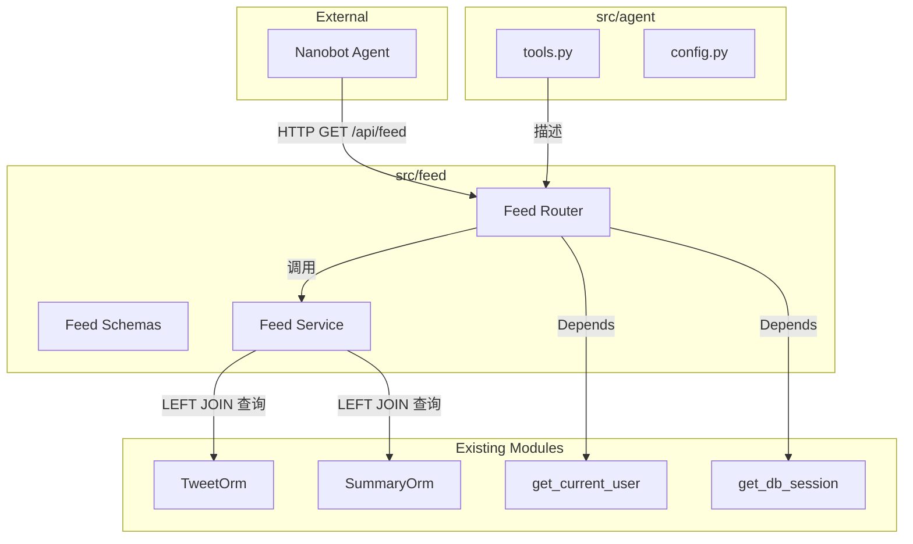

# Feed API 技术设计文档

## 概述

**目标**: 为外部 Agent（nanobot）提供按时间区间查询推文的 HTTP 接口，支持增量数据拉取。

**用户**: 运行 nanobot 的科技公司高管，通过 Agent 每天 4 次获取新推文并推送至 Telegram 等渠道。

**影响**: 在现有系统中新增 `src/feed/` 模块和 `GET /api/feed` 端点，不修改任何现有 API 行为。

### 目标
- 提供基于 `db_created_at` 时间区间过滤的推文查询端点
- 一次返回推文完整内容（含摘要和翻译），无需二次请求
- 通过 `limit` + `has_more` 机制控制响应大小
- 为 nanobot 提供工具元数据定义

### 非目标
- 消息投递（Telegram 等）— 由 Agent 框架自身负责
- 客户端状态管理（last_checked）— 由 nanobot 维护
- 分页机制 — 当前使用 `limit` + `has_more`，暂不实现游标分页
- 用户级个性化过滤 — 未来扩展

## 架构

### 现有架构分析

当前系统采用六边形架构 + 模块化设计（`.kiro/steering/structure.md`）：
- 各模块独立：scraper, deduplication, summarization, preference, user
- 每模块遵循 API → Service → Domain → Infrastructure 分层
- 认证：`src/user/api/auth.py` 提供统一的 API Key + JWT 认证

Feed API 作为现有数据的**只读查询视图**，与 tweets/summaries 模块的关系是消费者，不引入新的数据写入。

### 架构模式与边界图



**架构集成**:
- **选择模式**: 新建独立模块（方案 B），理由见 `research.md`
- **领域边界**: Feed 模块仅含 API + Service 层，无自有 Domain/Infrastructure（YAGNI）
- **现有模式保持**: 路由注册、依赖注入、错误处理格式均与现有模块一致
- **新组件理由**: Feed 端点的响应结构、参数设计与现有 tweets API 完全不同（增量拉取 vs 分页浏览）

### 技术栈

| 层级 | 选择/版本 | 在本功能中的角色 | 备注 |
|------|-----------|-----------------|------|
| 后端框架 | FastAPI（现有） | Feed API 路由 | 复用 |
| 数据验证 | Pydantic 2.5+（现有） | 请求/响应模型 | 复用 |
| ORM | SQLAlchemy 2.0+（现有） | 推文+摘要联合查询 | 复用 TweetOrm, SummaryOrm |
| 数据库 | SQLite/PostgreSQL（现有） | 数据存储 | 需新增 `db_created_at` 索引 |
| 数据库迁移 | Alembic（现有） | 添加索引 | 新增迁移文件 |
| 认证 | API Key + JWT（现有） | Feed API 认证 | 复用 `get_current_user` |

## 需求追溯

| 需求 | 概要 | 组件 | 接口 |
|------|------|------|------|
| 1.1, 1.2, 1.3, 1.5 | 时间区间查询 + 排序 | FeedService, FeedRouter | API Contract |
| 1.4 | since 必填验证 | FeedRouter | API Contract (422) |
| 2.1, 2.2, 2.3, 2.4 | 完整内容 + 摘要加载 | FeedService, FeedSchemas | Service Interface |
| 3.1, 3.2, 3.3, 3.4 | 响应格式 + 元数据 | FeedSchemas | API Contract |
| 4.1, 4.2, 4.3, 4.4 | 数量控制 | FeedService, Settings | Service Interface |
| 5.1, 5.2, 5.3 | 认证 | FeedRouter (Depends) | 复用 get_current_user |
| 6.1, 6.2, 6.3 | Agent 工具定义 | AgentTools, AgentConfig | — |
| 7.1, 7.2, 7.3, 7.4 | 错误处理 | FeedRouter | API Contract (422, 500) |

## 组件与接口

| 组件 | 层级 | 职责 | 需求覆盖 | 关键依赖 | 契约 |
|------|------|------|----------|----------|------|
| FeedRouter | API | 路由定义、参数验证、认证 | 1.4, 5.1-5.3, 7.1-7.4 | get_current_user (P0), FeedService (P0) | API |
| FeedSchemas | API | 请求/响应 Pydantic 模型 | 2.1, 3.1-3.4 | — | — |
| FeedService | Service | 数据库查询编排 | 1.1-1.3, 1.5, 2.2-2.4, 4.1-4.4 | AsyncSession (P0), TweetOrm (P0), SummaryOrm (P1) | Service |
| Settings 扩展 | Config | feed_max_tweets 配置 | 4.2 | — | — |
| AgentTools | Agent | 工具元数据定义 | 6.1-6.3 | — | — |
| Alembic Migration | Infra | db_created_at 索引 | 1.1 (性能) | — | — |

### API 层

#### FeedRouter

| 字段 | 详情 |
|------|------|
| 职责 | 处理 `GET /api/feed` 请求，参数验证，调用 FeedService |
| 需求 | 1.4, 5.1-5.3, 7.1-7.4 |

**依赖**
- Inbound: Nanobot Agent — HTTP 请求 (P0)
- Outbound: FeedService — 查询编排 (P0)
- Outbound: get_current_user — 认证 (P0)
- Outbound: get_db_session — 数据库会话 (P0)

**契约**: API [x]

##### API 契约

| 方法 | 端点 | 请求参数 | 响应 | 错误 |
|------|------|----------|------|------|
| GET | /api/feed | since (必填), until, limit, include_summary | FeedResponse | 401, 422, 500 |

**请求参数详情**:

| 参数 | 类型 | 必填 | 默认值 | 说明 |
|------|------|------|--------|------|
| since | datetime (ISO 8601) | 是 | — | 起始时间，过滤 `db_created_at >= since` |
| until | datetime (ISO 8601) | 否 | 当前服务器时间 | 截止时间，过滤 `db_created_at < until` |
| limit | int (1-200) | 否 | FEED_MAX_TWEETS | 最大返回条数 |
| include_summary | bool | 否 | true | 是否包含摘要/翻译 |

**实现备注**
- 参数验证: FastAPI Query 类型注解自动处理 ISO 8601 解析和类型校验（422）
- since > until 的自定义验证需在路由函数中手动检查
- 认证: `Depends(get_current_user)` 从 `src/user/api/auth.py` 导入

#### FeedSchemas

| 字段 | 详情 |
|------|------|
| 职责 | 定义 Feed API 的响应数据模型 |
| 需求 | 2.1, 3.1-3.4 |

**文件**: `src/feed/api/schemas.py`

**FeedTweetItem** — 单条推文响应:

| 字段 | 类型 | 说明 |
|------|------|------|
| tweet_id | str | 推文唯一 ID |
| text | str | 推文正文 |
| author_username | str | 作者用户名 |
| author_display_name | str \| None | 作者显示名 |
| created_at | datetime | 推文原始发布时间 |
| db_created_at | datetime | 入库时间 |
| reference_type | str \| None | 引用类型 |
| referenced_tweet_id | str \| None | 引用推文 ID |
| media | list[dict] \| None | 媒体附件 |
| summary_text | str \| None | 中文摘要（include_summary=true 时） |
| translation_text | str \| None | 中文翻译（include_summary=true 时） |

**FeedResponse** — Feed 响应:

| 字段 | 类型 | 说明 |
|------|------|------|
| items | list[FeedTweetItem] | 推文列表 |
| count | int | 本次返回条数 |
| total | int | 满足条件的总条数 |
| since | datetime | 实际起始时间 |
| until | datetime | 实际截止时间 |
| has_more | bool | 是否还有更多推文 |

**ErrorResponse** — 复用 `src/api/routes/tweets.py` 中已定义的 `ErrorResponse`。

### Service 层

#### FeedService

| 字段 | 详情 |
|------|------|
| 职责 | 构建并执行推文+摘要联合查询，返回结构化结果 |
| 需求 | 1.1-1.3, 1.5, 2.2-2.4, 4.1-4.4 |

**依赖**
- Inbound: FeedRouter — 查询请求 (P0)
- Outbound: AsyncSession — 数据库访问 (P0)
- External: TweetOrm — 推文表 (P0)
- External: SummaryOrm — 摘要表 (P1)

**契约**: Service [x]

##### Service 接口

```python
class FeedService:
    def __init__(self, session: AsyncSession) -> None: ...

    async def get_feed(
        self,
        since: datetime,
        until: datetime,
        limit: int,
        include_summary: bool = True,
    ) -> FeedResult: ...
```

**FeedResult** (内部数据类):

```python
@dataclass
class FeedResult:
    items: list[dict]   # 推文+摘要数据字典列表
    count: int           # 返回条数
    total: int           # 满足条件的总数
    has_more: bool       # count < total
```

- **前置条件**: `since < until`，`limit > 0`
- **后置条件**: `len(items) <= limit`，`has_more == (count < total)`
- **不变量**: 返回结果按 `created_at` 倒序排列

**查询策略**:

1. **COUNT 查询**: `SELECT COUNT(*) FROM tweets WHERE db_created_at >= :since AND db_created_at < :until` → 得到 `total`
2. **数据查询** (include_summary=true):
   ```sql
   SELECT tweets.*, summaries.summary_text, summaries.translation_text
   FROM tweets
   LEFT JOIN summaries ON tweets.tweet_id = summaries.tweet_id
   WHERE tweets.db_created_at >= :since AND tweets.db_created_at < :until
   ORDER BY tweets.created_at DESC
   LIMIT :limit
   ```
3. **数据查询** (include_summary=false):
   ```sql
   SELECT tweets.*
   FROM tweets
   WHERE tweets.db_created_at >= :since AND tweets.db_created_at < :until
   ORDER BY tweets.created_at DESC
   LIMIT :limit
   ```

**实现备注**
- 参考 `src/api/routes/tweets.py:101-119` 的 `.outerjoin()` 模式
- `include_summary=false` 时省略 LEFT JOIN，减少查询开销

### Config 层

#### Settings 扩展

**文件**: `src/config.py`

新增字段:

| 字段 | 类型 | 默认值 | 说明 |
|------|------|--------|------|
| feed_max_tweets | int | 200 | Feed API 单次最大返回推文数，`ge=1, le=1000` |

### Agent 层

#### AgentTools

| 字段 | 详情 |
|------|------|
| 职责 | 定义 Feed API 的工具元数据，供 nanobot 注册使用 |
| 需求 | 6.1-6.3 |

**文件**: `src/agent/tools.py`

工具列表:
- `fetch_feed`: 描述 `GET /api/feed` 端点及其参数
- `fetch_tweet_detail`: 描述 `GET /api/tweets/{tweet_id}` 端点

同时更新 `src/agent/config.py` 的 `SYSTEM_PROMPT`。

### 数据库层

#### Alembic Migration

**新增迁移**: 为 `tweets.db_created_at` 添加索引

```python
# upgrade
op.create_index("ix_tweets_db_created_at", "tweets", ["db_created_at"])

# downgrade
op.drop_index("ix_tweets_db_created_at", table_name="tweets")
```

## 数据模型

### 领域模型

Feed 模块无自有领域模型。复用:
- `TweetOrm` (`src/scraper/infrastructure/models.py`): tweet_id, text, created_at, author_username, author_display_name, referenced_tweet_id, reference_type, media, db_created_at
- `SummaryOrm` (`src/summarization/infrastructure/models.py`): tweet_id, summary_text, translation_text

### 物理数据模型

**变更**: 仅新增索引

| 表 | 操作 | 索引名 | 列 |
|----|------|--------|-----|
| tweets | CREATE INDEX | ix_tweets_db_created_at | db_created_at |

### 数据契约

**API 响应 JSON 示例**:

```json
{
  "items": [
    {
      "tweet_id": "1234567890",
      "text": "Original tweet text...",
      "author_username": "elonmusk",
      "author_display_name": "Elon Musk",
      "created_at": "2025-01-15T10:30:00Z",
      "db_created_at": "2025-01-15T10:35:00Z",
      "reference_type": null,
      "referenced_tweet_id": null,
      "media": null,
      "summary_text": "中文摘要内容...",
      "translation_text": "中文翻译内容..."
    }
  ],
  "count": 1,
  "total": 1,
  "since": "2025-01-15T00:00:00Z",
  "until": "2025-01-16T00:00:00Z",
  "has_more": false
}
```

## 错误处理

### 错误类别与响应

| 场景 | HTTP 状态码 | 响应体 | 需求 |
|------|------------|--------|------|
| 缺少 since 参数 | 422 | `{"detail": "since 参数为必填项"}` | 1.4 |
| since/until 格式错误 | 422 | FastAPI 自动验证错误 | 7.1 |
| since >= until | 422 | `{"detail": "时间区间无效: since 必须早于 until"}` | 7.2 |
| 未认证/认证失败 | 401 | `{"detail": "无效的 API Key"}` | 5.2 |
| 数据库查询异常 | 500 | `{"detail": "服务器内部错误"}` | 7.3 |

### 监控

- 使用 `loguru` 记录查询参数和耗时（INFO 级别）
- 数据库异常记录完整堆栈（ERROR 级别）
- 复用现有 Prometheus 中间件自动收集请求指标

## 测试策略

### 单元测试
- FeedService.get_feed(): 时间过滤正确性、include_summary 切换、limit 截断、空结果
- FeedSchemas: Pydantic 模型序列化/反序列化
- limit 上限逻辑: 客户端 limit > 系统配置时的钳位行为

### 集成测试
- Feed API 完整调用链: HTTP 请求 → 认证 → 查询 → 响应
- 认证失败场景: 无 API Key、无效 API Key
- 时间区间边界: since == until、无匹配数据

### 测试基础设施
- 复用 `tests/conftest.py` 的 `async_session` 和 `async_client` fixtures
- 测试目录: `tests/feed/`
