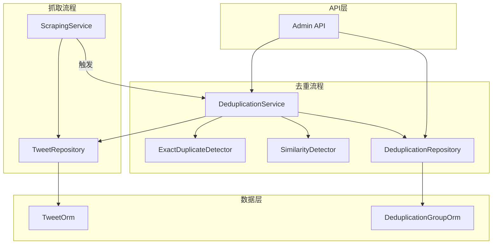
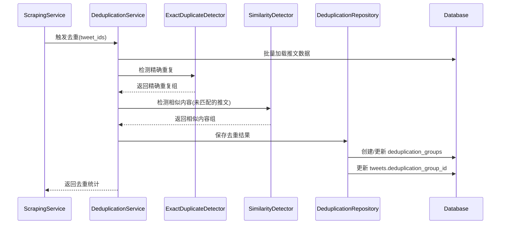
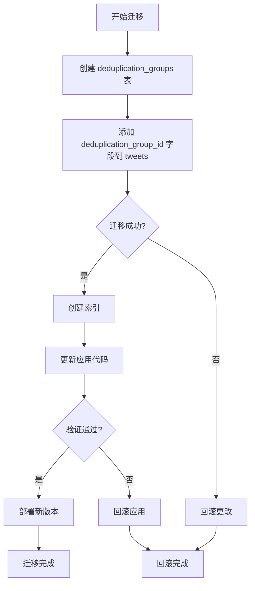

# Design Document

---

**Purpose**: 提供足够的实现细节，确保不同开发者实现的一致性。

**Approach**:
- 包含直接影响实现决策的核心章节
- 省略可选章节（除非对防止实现错误至关重要）
- 根据功能复杂度调整细节级别
- 使用图表和表格代替冗长叙述

---

## Overview

新闻去重模块（News Deduplicator）是 X-watcher 的核心组件，负责在推文抓取完成后自动识别和合并重复或相似的内容。该模块作为现有抓取系统的扩展，通过异步后台任务处理新抓取的推文，确保用户接收到的新闻流具有高信噪比。

**用户群体**: 技术公司高管将通过新闻流界面间接使用此功能，无需手动操作。

**影响**: 将当前抓取流程从"直接展示所有推文"变为"展示去重后的高质量推文"，减少信息噪音，提升阅读效率。

### Goals
- 自动识别精确重复（转发）和相似内容（相同新闻的不同表述）
- 在抓取后异步执行，不阻塞抓取流程
- 保留原始数据，支持去重决策审计和撤销
- 提供可配置的去重策略以适应不同用户需求

### Non-Goals
- 实时去重（抓取完成后处理即可）
- 跨数据源去重（仅针对推文数据）
- 自动删除重复推文（仅标记，由查询层过滤）
- 智能合并内容（去重但不合并文本）

## Architecture

### Existing Architecture Analysis

当前系统采用**分层架构 + 模块化设计**，核心模式包括：
- **Service-Repository 模式**: 业务逻辑与数据访问分离
- **Pydantic 数据验证**: 所有数据模型使用 Pydantic 定义
- **Result 类型错误处理**: 使用 `returns` 库的 Result 类型
- **依赖注入**: 组件支持依赖注入便于测试
- **异步优先**: 使用 asyncio 实现并发处理

现有抓取服务 (`ScrapingService`) 在保存推文后直接返回，此时是触发去重的理想时机。

### Architecture Pattern & Boundary Map



**Architecture Integration**:
- **Selected pattern**: Service-Repository 扩展模式
- **Domain/feature boundaries**:
  - 去重服务独立于抓取服务，通过事件/调用触发
  - 检测算法作为独立组件，便于升级和替换
  - 数据访问层与现有模式保持一致
- **Existing patterns preserved**:
  - Service-Repository 分层
  - Pydantic 数据验证
  - Result 类型错误处理
  - 异步处理模式
- **New components rationale**:
  - `DeduplicationService`: 编排去重流程
  - `ExactDuplicateDetector`: 精确重复检测
  - `SimilarityDetector`: 相似度检测
  - `DeduplicationRepository`: 去重结果持久化
- **Steering compliance**:
  - 遵循 YAGNI 原则（初期使用 TF-IDF）
  - 单职责（每个检测器只负责一种检测）
  - 易演进（检测器独立，便于替换）

### Technology Stack

| Layer | Choice / Version | Role in Feature | Notes |
|-------|------------------|-----------------|-------|
| Backend / Services | Python 3.11+ | 去重服务实现 | 与现有技术栈一致 |
| Text Processing | scikit-learn 1.8+ | TF-IDF 向量化、余弦相似度 | 成熟稳定，无额外 API 成本 |
| Database | SQLAlchemy + AsyncSession | 去重结果存储 | 扩展现有数据模型 |
| Web Framework | FastAPI | API 端点 | 与现有 API 一致 |

## System Flows



**流程说明**:
1. 精确重复检测优先执行（O(n) 复杂度）
2. 相似度检测仅对未匹配的推文执行
3. 去重结果使用事务确保一致性
4. 支持部分失败（相似度检测失败不影响精确重复结果）

## Requirements Traceability

| Requirement | Summary | Components | Interfaces | Flows |
|-------------|---------|------------|------------|-------|
| 1 | 精确重复检测 | ExactDuplicateDetector, DeduplicationService | Service | 去重流程 |
| 2 | 相似内容检测 | SimilarityDetector, DeduplicationService | Service | 去重流程 |
| 3 | 去重结果存储 | DeduplicationRepository, DeduplicationGroupOrm | Service, Data | 去重流程 |
| 4 | 批量去重处理 | DeduplicationService | Service | 去重流程 |
| 5 | 去重策略配置 | DeduplicationConfig, DeduplicationService | Config | - |
| 6 | API 集成 | Admin API, DeduplicationService | API, Service | - |
| 7 | 性能要求 | DeduplicationService, SimilarityDetector | Service | - |

## Components and Interfaces

| Component | Domain/Layer | Intent | Req Coverage | Key Dependencies (P0/P1) | Contracts |
|-----------|--------------|--------|--------------|--------------------------|-----------|
| DeduplicationService | Service | 编排去重流程 | 1, 2, 3, 4, 7 | TweetRepository (P0), ExactDuplicateDetector (P0), SimilarityDetector (P1) | Service |
| ExactDuplicateDetector | Domain | 检测精确重复 | 1 | - | Service |
| SimilarityDetector | Domain | 计算文本相似度 | 2, 7 | scikit-learn (P0) | Service |
| DeduplicationRepository | Infrastructure | 持久化去重结果 | 3 | DeduplicationGroupOrm (P0) | Service |
| DeduplicationConfig | Config | 去重策略配置 | 5 | - | State |
| Admin API | API | 去重 API 端点 | 6 | DeduplicationService (P0) | API |

### Domain Layer

#### ExactDuplicateDetector

| Field | Detail |
|-------|--------|
| Intent | 检测推文之间的精确重复关系 |
| Requirements | 1 |
| Owner / Reviewers | Backend Team |

**Responsibilities & Constraints**
- 检测文本完全相同的推文
- 检测转发关系（referenced_tweet_id + reference_type=retweeted）
- 选择最早创建的推文作为主记录
- 时间复杂度 O(n)，使用哈希表实现

**Dependencies**
- Inbound: DeduplicationService — 调用检测 (Critical)
- Outbound: 无
- External: 无

**Contracts**: Service [x]

##### Service Interface
```python
class ExactDuplicateDetector:
    def detect_duplicates(self, tweets: list[Tweet]) -> list[DuplicateGroup]:
        """检测精确重复组。

        Args:
            tweets: 待检测的推文列表

        Returns:
            重复组列表，每组包含重复的推文和主记录
        """
```
- Preconditions: 输入推文列表非空
- Postconditions: 每条推文最多属于一个重复组
- Invariants: 主记录总是组中最早创建的推文

**Implementation Notes**
- Integration: 在 DeduplicationService 中首先调用
- Validation: 输入推文必须包含 tweet_id, text, created_at
- Risks: 大量推文时内存消耗较高

#### SimilarityDetector

| Field | Detail |
|-------|--------|
| Intent | 计算推文之间的文本相似度 |
| Requirements | 2, 7 |
| Owner / Reviewers | Backend Team |

**Responsibilities & Constraints**
- 文本预处理（移除 URL、提及、空格）
- TF-IDF 向量化
- 余弦相似度计算
- 支持可配置的相似度阈值
- 预留嵌入模型接口

**Dependencies**
- Inbound: DeduplicationService — 调用检测 (Critical)
- Outbound: 无
- External: scikit-learn — TF-IDF 和余弦相似度计算 (Critical)

**Contracts**: Service [x]

##### Service Interface
```python
class SimilarityDetector:
    def detect_similar(
        self,
        tweets: list[Tweet],
        threshold: float = 0.85
    ) -> list[SimilarGroup]:
        """检测相似内容组。

        Args:
            tweets: 待检测的推文列表
            threshold: 相似度阈值（0-1）

        Returns:
            相似组列表，包含相似度分数
        """
```
- Preconditions: threshold 在 [0, 1] 范围内
- Postconditions: 返回的相似度分数 >= threshold
- Invariants: 相似关系具有对称性（若 A 相似于 B，则 B 相似于 A）

**Implementation Notes**
- Integration: 仅对未匹配精确重复的推文调用
- Validation: 使用 scikit-learn 的 TfidfVectorizer 和 cosine_similarity
- Risks:
  - TF-IDF 对短文本可能不够准确
  - 大规模数据时计算开销较高
  - 后续可升级到嵌入模型

### Service Layer

#### DeduplicationService

| Field | Detail |
|-------|--------|
| Intent | 编排完整的去重流程 |
| Requirements | 1, 2, 3, 4, 7 |
| Owner / Reviewers | Backend Team |

**Responsibilities & Constraints**
- 协调精确重复和相似度检测
- 管理去重结果持久化
- 批量处理支持（分批处理超量数据）
- 生成去重统计报告
- 事务管理确保数据一致性

**Dependencies**
- Inbound: ScrapingService, Admin API — 触发去重 (Critical)
- Outbound: TweetRepository, DeduplicationRepository — 数据操作 (Critical)
- External: 无

**Contracts**: Service [x], Batch [x]

##### Service Interface
```python
class DeduplicationService:
    async def deduplicate_tweets(
        self,
        tweet_ids: list[str],
        config: DeduplicationConfig | None = None
    ) -> DeduplicationResult:
        """对指定推文执行去重。

        Args:
            tweet_ids: 推文 ID 列表
            config: 去重策略配置（为 None 时使用默认配置）

        Returns:
            DeduplicationResult: 去重结果统计
        """
```
- Preconditions: tweet_ids 非空，数据库中存在对应推文
- Postconditions: 所有去重组已持久化，tweets 表已更新
- Invariants: 已去重的推文不会重复处理

##### Batch Contract
- Trigger: 抓取服务保存推文后调用
- Input / validation: 验证 tweet_ids 格式，检查推文是否存在
- Output / destination: deduplication_groups 表 + tweets 表更新
- Idempotency & recovery: 支持重试，已去重的推文会跳过

**Implementation Notes**
- Integration:
  - 作为 ScrapingService 的后处理步骤
  - 通过 FastAPI BackgroundTasks 异步执行
  - 支持手动触发（API 调用）
- Validation:
  - 验证配置参数有效性
  - 检查推文是否已去重
- Risks:
  - 大批量处理可能超时
  - 相似度检测失败时的降级策略

### Infrastructure Layer

#### DeduplicationRepository

| Field | Detail |
|-------|--------|
| Intent | 管理去重结果的持久化 |
| Requirements | 3 |
| Owner / Reviewers | Backend Team |

**Responsibilities & Constraints**
- 创建和更新去重组
- 关联推文到去重组
- 查询去重结果
- 删除去重关联（撤销）
- 使用事务确保一致性

**Dependencies**
- Inbound: DeduplicationService — 调用持久化 (Critical)
- Outbound: DeduplicationGroupOrm — ORM 操作 (Critical)
- External: 无

**Contracts**: Service [x]

##### Service Interface
```python
class DeduplicationRepository:
    async def save_groups(self, groups: list[DeduplicationGroup]) -> None:
        """保存去重组。

        Args:
            groups: 去重组列表

        Raises:
            DatabaseError: 保存失败时抛出
        """

    async def get_group(self, group_id: str) -> DeduplicationGroup | None:
        """查询去重组。

        Args:
            group_id: 去重组 ID

        Returns:
            DeduplicationGroup 或 None
        """

    async def delete_group(self, group_id: str) -> None:
        """删除去重组（撤销去重）。

        Args:
            group_id: 去重组 ID

        Raises:
            NotFoundError: 去重组不存在
        """
```
- Preconditions: 数据库连接有效
- Postconditions: 事务提交后数据持久化
- Invariants: 删除去重组时自动清理推文关联

**Implementation Notes**
- Integration: 使用 SQLAlchemy AsyncSession
- Validation: 验证 group_id 格式
- Risks:
  - 并发更新冲突
  - 外键约束失败

### Config Layer

#### DeduplicationConfig

| Field | Detail |
|-------|--------|
| Intent | 去重策略配置 |
| Requirements | 5 |
| Owner / Reviewers | Backend Team |

**Responsibilities & Constraints**
- 定义可配置的去重参数
- 提供默认配置
- 支持按用户覆盖

**Dependencies**
- Inbound: DeduplicationService — 读取配置 (Critical)
- Outbound: 无
- External: 无

**Contracts**: State [x]

##### State Management
- State model: Pydantic BaseModel，不可变
- Persistence & consistency: 从环境变量或数据库加载
- Concurrency strategy: 只读配置，无需锁

```python
class DeduplicationConfig(BaseModel):
    similarity_threshold: float = 0.85
    enable_exact_duplicate: bool = True
    enable_similar_content: bool = True
    deduplication_method: Literal["auto", "manual", "hybrid"] = "auto"
    use_embedding_model: bool = False
    embedding_model: str | None = None  # 预留，如 "text-embedding-3-small"
    batch_size: int = 1000  # 分批处理大小
```

### API Layer

#### Admin API - 去重端点

| Field | Detail |
|-------|--------|
| Intent | 提供去重相关的 HTTP API |
| Requirements | 6 |
| Owner / Reviewers | Backend Team |

**Responsibilities & Constraints**
- 接收去重请求
- 返回去重结果
- 支持查询和撤销操作

**Dependencies**
- Inbound: 客户端 HTTP 请求 (Critical)
- Outbound: DeduplicationService — 调用去重 (Critical)
- External: 无

**Contracts**: API [x]

##### API Contract
| Method | Endpoint | Request | Response | Errors |
|--------|----------|---------|----------|--------|
| POST | /api/deduplicate/batch | `{tweet_ids: list[str], config?: DeduplicationConfig}` | `{task_id: str, status: str}` | 400, 404, 500 |
| GET | /api/deduplicate/groups/{group_id} | - | DeduplicationGroup | 404 |
| GET | /api/deduplicate/tweets/{tweet_id} | - | DeduplicationGroup | 404 |
| DELETE | /api/deduplicate/groups/{group_id} | - | `{success: bool}` | 404, 409 |

**Implementation Notes**
- Integration: 使用 FastAPI 路由
- Validation: Pydantic 模型验证请求
- Risks:
  - 长时间运行的任务超时
  - 并发去重冲突

## Data Models

### Domain Model

**Aggregates and transactional boundaries**:
- `DeduplicationGroup`: 去重组聚合根，包含一组重复/相似的推文
- `DuplicateGroup`: 精确重复组（值对象）
- `SimilarGroup`: 相似内容组（值对象，包含相似度分数）

**Entities, value objects, domain events**:
- Entity: `DeduplicationGroup` (有唯一标识 group_id)
- Value Objects: `DuplicateGroup`, `SimilarGroup`
- Domain Events: `DeduplicationCompletedEvent` (可选，用于事件驱动架构)

**Business rules & invariants**:
- 每条推文最多属于一个去重组
- 去重组必须有且仅有一个主记录（representative）
- 相似度分数必须在 [0, 1] 范围内

### Logical Data Model

**Structure Definition**:
```
tweets (1) ----< (N) deduplication_groups
    |
    deduplication_group_id (FK)
```

**Attributes and their types**:
- `tweets.deduplication_group_id`: UUID | NULL，外键关联到去重组
- `deduplication_groups.group_id`: UUID，主键
- `deduplication_groups.representative_tweet_id`: String，外键关联到 tweets.tweet_id
- `deduplication_groups.deduplication_type`: Enum("exact_duplicate", "similar_content")
- `deduplication_groups.similarity_score`: Float | NULL
- `deduplication_groups.tweet_ids`: JSON(Array)，存储组内所有推文 ID
- `deduplication_groups.created_at`: DateTime

**Consistency & Integrity**:
- Transaction boundaries: 每个去重操作在一个事务中完成
- Cascading rules: 删除去重组时将 tweets.deduplication_group_id 设为 NULL
- Temporal aspects: 记录创建时间，支持按时间范围查询

### Physical Data Model

**Table definitions with data types**:

```sql
-- 新增表：去重组
CREATE TABLE deduplication_groups (
    group_id UUID PRIMARY KEY,
    representative_tweet_id VARCHAR(255) NOT NULL,
    deduplication_type VARCHAR(20) NOT NULL,
    similarity_score FLOAT,
    tweet_ids JSON NOT NULL,
    created_at TIMESTAMP WITH TIME ZONE NOT NULL DEFAULT NOW(),
    CONSTRAINT fk_representant
        FOREIGN KEY (representative_tweet_id)
        REFERENCES tweets(tweet_id)
        ON DELETE CASCADE
);

-- 修改表：添加去重关联字段
ALTER TABLE tweets ADD COLUMN deduplication_group_id UUID;
ALTER TABLE tweets ADD CONSTRAINT fk_deduplication_group
    FOREIGN KEY (deduplication_group_id)
    REFERENCES deduplication_groups(group_id)
    ON DELETE SET NULL;

-- 索引：优化查询性能
CREATE INDEX idx_tweets_deduplication_group
    ON tweets(deduplication_group_id)
    WHERE deduplication_group_id IS NOT NULL;

CREATE INDEX idx_deduplication_groups_type
    ON deduplication_groups(deduplication_type);

CREATE INDEX idx_deduplication_groups_created
    ON deduplication_groups(created_at DESC);
```

**Indexes and performance optimizations**:
- `tweets(deduplication_group_id)`: 部分索引，仅索引已去重的推文
- `deduplication_groups(deduplication_type)`: 按类型查询
- `deduplication_groups(created_at)`: 按时间排序查询

## Error Handling

### Error Strategy

| Error Type | Detection | Recovery Strategy |
|------------|-----------|-------------------|
| 无效输入 | Pydantic 验证 | 返回 400 错误，说明具体字段 |
| 推文不存在 | 数据库查询 | 返回 404 错误，建议检查 tweet_id |
| 相似度计算失败 | try-catch | 降级为仅精确重复检测 |
| 数据库事务失败 | SQLAlchemy 异常 | 回滚事务，返回 500 错误 |
| 配置无效 | 配置验证 | 使用默认配置，记录警告 |

### Error Categories and Responses

**User Errors** (4xx):
- 无效输入 → 字段级验证错误，期望格式说明
- 推文不存在 → 404，建议检查 tweet_id
- 配置参数无效 → 使用默认值，记录警告

**System Errors** (5xx):
- 数据库连接失败 → 503，建议稍后重试
- 相似度计算超时 → 降级为精确重复检测
- 事务冲突 → 409，建议重试

**Business Logic Errors** (422):
- 去重组不存在 → 404，提示检查 group_id
- 撤销正在进行的去重 → 409，提示等待完成

## Testing Strategy

### Unit Tests
- `ExactDuplicateDetector.detect_duplicates`: 测试精确重复检测逻辑
- `SimilarityDetector.detect_similar`: 测试相似度计算（使用固定向量）
- `DeduplicationConfig`: 测试配置验证和默认值

### Integration Tests
- 完整去重流程：抓取 → 保存 → 去重 → 验证数据库
- API 端点测试：POST /batch, GET /groups/{id}, DELETE /groups/{id}
- 事务回滚测试：去重失败时的数据一致性

### Performance Tests
- 100 条推文去重时间 < 5 秒
- 1000 条推文去重时间 < 30 秒
- 内存占用 < 500MB（1000 条推文）
- 分批处理测试（超过 1000 条）

## Performance & Scalability

- **Target metrics**:
  - 100 条推文: < 5 秒
  - 1000 条推文: < 30 秒
  - 内存占用: < 500MB (1000 条)

- **Scaling approaches**:
  - 初期: 单机处理，使用 asyncio 并发
  - 扩展: 分批处理，添加缓存
  - 未来: 分布式任务队列（Celery）

- **Optimization techniques**:
  - 精确重复使用哈希表（O(n)）
  - 相似度检测使用矩阵运算优化
  - 数据库索引优化查询
  - 预处理文本缓存（避免重复计算）

## Migration Strategy



**Phase breakdown**:
1. 准备阶段：编写 Alembic 迁移脚本
2. 执行阶段：创建表结构（不影响现有数据）
3. 验证阶段：测试去重功能
4. 切换阶段：启用去重服务
5. 回滚触发：验证失败或性能问题

**Rollback triggers**:
- 去重导致 API 响应时间增加 > 50%
- 数据库查询性能显著下降
- 发现数据一致性问题
