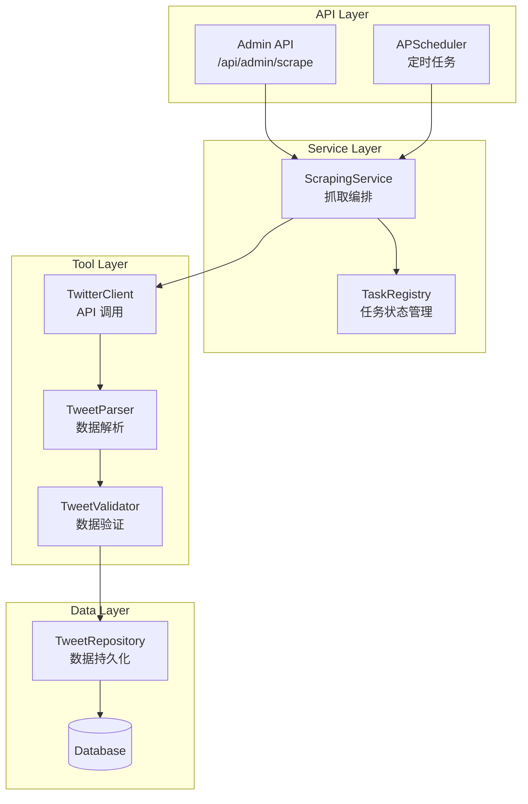
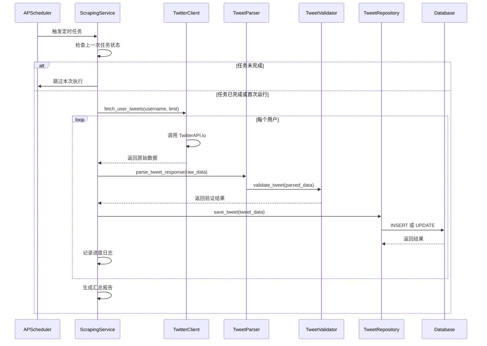
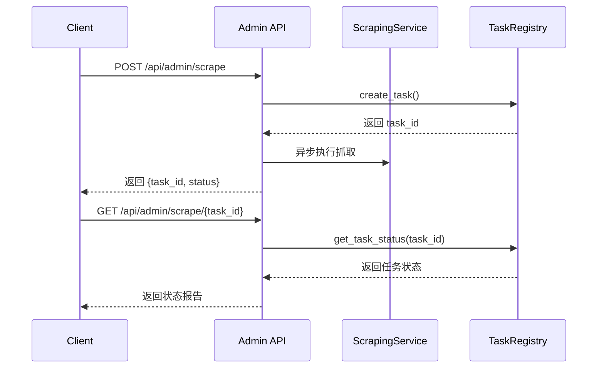
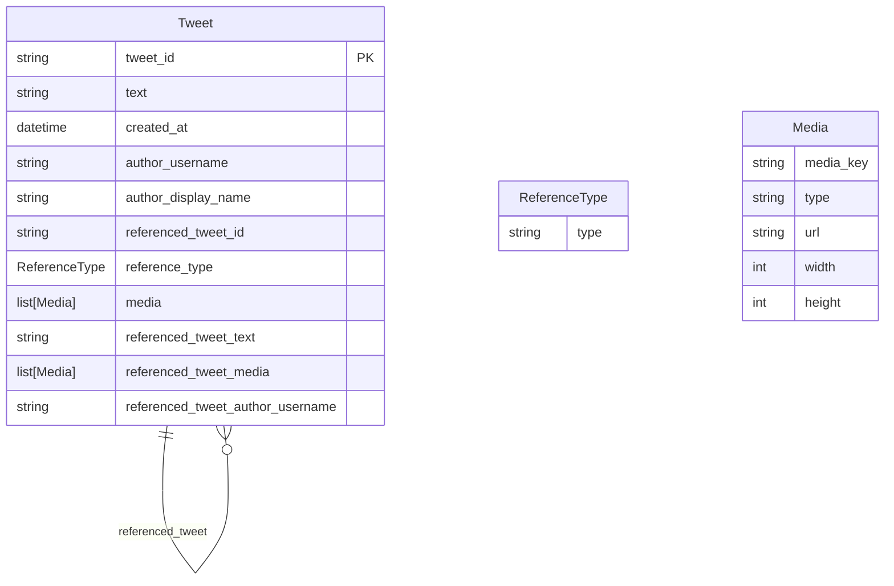

# Design Document

---

**Purpose**: Provide sufficient detail to ensure implementation consistency across different implementers, preventing interpretation drift.

**Approach**:
- Include essential sections that directly inform implementation decisions
- Omit optional sections unless critical to preventing implementation errors
- Match detail level to feature complexity
- Use diagrams and tables over lengthy prose

---

## Overview

news-scraper 是 X-watcher 系统的数据采集组件，负责从 X（Twitter）平台抓取指定用户的推文数据。该组件通过 TwitterAPI.io 服务商调用 X 平台 API v2，实现定时抓取、数据解析、持久化存储和手动触发等功能。

**Purpose**: 本功能为系统提供原始新闻数据，是后续分析、去重、摘要和翻译流程的基础。

**Users**: 系统管理员通过 API 手动触发抓取；运维人员通过日志监控抓取状态；系统通过定时任务自动更新数据。

**Impact**: 新增数据采集能力，使系统具备从 X 平台获取实时新闻数据的能力。

### Goals
- 从 X 平台可靠抓取指定用户的推文数据
- 支持定时抓取和手动触发两种模式
- 实现数据去重和持久化存储
- 提供完整的错误处理和重试机制
- 输出结构化的日志和进度报告

### Non-Goals
- 不支持多个抓取服务商切换（当前仅支持 TwitterAPI.io）
- 不实现推文实时推送（仅定时拉取）
- 不包含推文内容分析、摘要或翻译功能（由其他组件处理）
- 不实现用户关注列表管理（由配置文件提供）

## Architecture

### Existing Architecture Analysis
当前系统采用 **轻量级 Agent + 工具函数** 架构，核心组件包括：
- **FastAPI**: Web 服务和 API 端点
- **Nanobot Agent**: 意图理解和工具调度
- **Tools 层**: 独立的业务逻辑函数
- **Data 层**: SQLAlchemy ORM 和数据库

news-scraper 作为新的工具函数模块，将集成到现有架构的 Tools 层。

### Architecture Pattern & Boundary Map



**Architecture Integration**:
- **Selected pattern**: 分层架构 (Layered Architecture) - API → Service → Tool → Data
- **Domain/feature boundaries**:
  - **API 层**: 负责接收请求和返回响应
  - **Service 层**: 编排抓取流程，管理任务状态
  - **Tool 层**: 独立的业务逻辑（API 调用、解析、验证）
  - **Data 层**: 数据持久化和查询
- **Existing patterns preserved**:
  - 工具函数独立，保持无状态
  - 使用 Pydantic 进行数据验证
  - 异步操作与 FastAPI 对齐
- **New components rationale**:
  - `TwitterClient`: 封装 TwitterAPI.io 调用逻辑
  - `TweetParser`: 解析 API 响应为结构化数据
  - `ScrapingService`: 编排抓取流程，管理任务状态
  - `TaskRegistry`: 跟踪异步任务执行状态
- **Steering compliance**:
  - 遵循 YAGNI 原则，不实现服务商抽象层
  - 使用异步 httpx 客户端
  - 组件职责单一，边界清晰

### Technology Stack

| Layer | Choice / Version | Role in Feature | Notes |
|-------|------------------|-----------------|-------|
| Backend / Services | FastAPI 0.104+ | 提供 API 端点和 lifespan 管理 | 与主框架一致 |
| Task Scheduling | APScheduler 3.10+ | 定时抓取任务调度 | 使用 BackgroundScheduler |
| HTTP Client | httpx 0.25+ | 异步调用 TwitterAPI.io | 与 FastAPI 异步模型对齐 |
| Data / Storage | SQLAlchemy 2.0+ | ORM 和数据库操作 | 与主框架一致 |
| Data Validation | Pydantic v2 | 数据模型和验证 | 与主框架一致 |
| Logging | Loguru | 结构化日志输出 | 与主框架一致 |

## System Flows

### 定时抓取流程



### 手动抓取流程



## Requirements Traceability

| Requirement | Summary | Components | Interfaces | Flows |
|-------------|---------|------------|------------|-------|
| 1 | X 平台用户动态抓取 | TwitterClient, ScrapingService | Service | 定时抓取流程 |
| 2 | 推文数据解析 | TweetParser, Tweet | Service | 定时抓取流程 |
| 3 | 数据持久化存储 | TweetRepository, Tweet | Service, State | 定时抓取流程 |
| 4 | 定时任务调度 | ScrapingService, Scheduler | Batch | 定时抓取流程 |
| 5 | API 密钥管理 | TwitterClient, Config | - | - |
| 6 | 错误处理和重试 | TwitterClient, ScrapingService | Service | 定时抓取流程 |
| 7 | 抓取进度报告 | ScrapingService | - | - |
| 8 | 手动抓取 API | AdminAPI, TaskRegistry | API | 手动抓取流程 |
| 9 | 数据验证和清理 | TweetValidator, Tweet | Service | 定时抓取流程 |
| 10 | 测试和可观测性 | 所有组件 | - | - |

## Components and Interfaces

| Component | Domain/Layer | Intent | Req Coverage | Key Dependencies (P0/P1) | Contracts |
|-----------|--------------|--------|--------------|--------------------------|-----------|
| TwitterClient | Tool | 封装 TwitterAPI.io HTTP 调用 | 1, 5, 6 | httpx (P0), Config (P0) | Service |
| TweetParser | Tool | 解析 API 响应为 Pydantic 模型 | 2 | Tweet (P0) | Service |
| TweetValidator | Tool | 验证推文数据完整性和格式 | 9 | Tweet (P0) | Service |
| TweetRepository | Data | 数据库 CRUD 操作和去重 | 3 | Tweet, Database (P0) | Service, State |
| ScrapingService | Service | 编排抓取流程和进度管理 | 1, 4, 6, 7 | TwitterClient (P0), TweetParser (P0), TweetValidator (P0), TweetRepository (P0) | Service, Batch |
| TaskRegistry | Service | 异步任务状态管理 | 8 | Database (P1) | State |
| AdminAPI | API | 手动抓取端点和状态查询 | 8 | ScrapingService (P0), TaskRegistry (P0) | API |
| Scheduler | Infrastructure | 定时任务注册和生命周期 | 4 | ScrapingService (P0) | Batch |

### Tool Layer

#### TwitterClient

| Field | Detail |
|-------|--------|
| Intent | 封装 TwitterAPI.io API 调用，处理认证和重试 |
| Requirements | 1, 5, 6 |
| Owner / Reviewers | - |

**Responsibilities & Constraints**
- 调用 TwitterAPI.io API 获取用户推文
- 实现 Bearer Token 认证
- 实现指数退避重试策略
- 处理 API 错误（401, 429, 5xx）
- 在标准化 API 响应时，从嵌套的 `retweeted_tweet` 或 `quoted_tweet` 对象中提取 `referenced_tweet_text`、`referenced_tweet_media` 和 `referenced_tweet_author_username`（原作者用户名）
- 提供 `_extract_media_from_tweet_obj()` 辅助函数从推文对象中提取媒体附件列表
- 不包含业务逻辑，仅负责 HTTP 调用和响应标准化

**Dependencies**
- Inbound: ScrapingService — 获取推文数据 (P0)
- Outbound: TwitterAPI.io API — 推文数据 (P0)
- External: httpx — 异步 HTTP 客户端 (P0)

**Contracts**: Service [x] / API [ ] / Event [ ] / Batch [ ] / State [ ]

##### Service Interface
```python
class TwitterClient:
    async def fetch_user_tweets(
        self,
        username: str,
        limit: int = 100,
        since_id: str | None = None,
        max_results: int = 100
    ) -> Result[list[dict], TwitterClientError]
```
- **Preconditions**:
  - `TWITTER_BEARER_TOKEN` 环境变量已配置
  - `username` 是有效的 X 平台用户名
  - `limit` 和 `max_results` 在合理范围内（1-1000）
- **Postconditions**:
  - 成功时返回推文数据列表（dict 格式）
  - 失败时返回 `TwitterClientError`，包含错误类型和原始响应
- **Invariants**:
  - 重试次数不超过 3 次
  - 重试延迟遵循指数退避（1s, 2s, 4s, 最大 60s）

**Implementation Notes**
- **Integration**: 在 `lifespan` 中初始化 httpx.AsyncClient
- **Validation**:
  - 401 错误立即停止并告警
  - 429 错误等待后重试
  - 5xx 错误按重试策略处理
- **Risks**:
  - TwitterAPI.io 服务不可用需要监控
  - Bearer Token 泄露风险（使用环境变量）

---

#### TweetParser

| Field | Detail |
|-------|--------|
| Intent | 解析 Twitter API v2 响应格式为 Tweet 模型 |
| Requirements | 2 |
| Owner / Reviewers | - |

**Responsibilities & Constraints**
- 解析 Tweet 对象的 JSON 结构
- 处理 `includes` 中的关联数据（用户、媒体）
- 提取引用/转发关系
- 提取被引用/转发推文的完整文本和媒体附件（由 Client 预处理后传入）
- 转换为 Pydantic Tweet 模型

**Dependencies**
- Inbound: ScrapingService — 解析原始数据 (P0)
- Outbound: Tweet — 生成 Tweet 模型 (P0)
- External: Pydantic — 数据验证 (P0)

**Contracts**: Service [x] / API [ ] / Event [ ] / Batch [ ] / State [ ]

##### Service Interface
```python
class TweetParser:
    def parse_tweet_response(self, raw_data: dict) -> list[Tweet]
```
- **Preconditions**:
  - `raw_data` 符合 X 平台 API v2 响应格式
  - `data` 字段存在且为列表
- **Postconditions**:
  - 返回 `Tweet` 模型列表
  - 无效数据被跳过并记录警告
- **Invariants**:
  - 每个 `Tweet` 包含必需字段：`tweet_id`, `text`, `created_at`, `author_username`

**Implementation Notes**
- **Integration**: 无状态，纯函数实现
- **Validation**: 使用 Pydantic 自动验证
- **Risks**:
  - API 格式变化可能导致解析失败

---

#### TweetValidator

| Field | Detail |
|-------|--------|
| Intent | 验证推文数据的完整性和格式 |
| Requirements | 9 |
| Owner / Reviewers | - |

**Responsibilities & Constraints**
- 验证必需字段是否存在
- 清理推文文本（移除多余空格、换行符），MAX_TEXT_LENGTH = 25,000
- 标准化日期格式
- 截断过长文本（支持 X Premium 长文）
- 清理 `referenced_tweet_text`（如果存在，应用与主文本相同的清理规则）

**Dependencies**
- Inbound: ScrapingService — 验证推文数据 (P0)
- Outbound: Tweet — 返回验证后的数据 (P0)
- External: Pydantic — 数据验证 (P0)

**Contracts**: Service [x] / API [ ] / Event [ ] / Batch [ ] / State [ ]

##### Service Interface
```python
class TweetValidator:
    def validate_and_clean(self, tweet: Tweet) -> Result[Tweet, ValidationError]
```
- **Preconditions**:
  - `tweet` 是已解析的 Tweet 模型
- **Postconditions**:
  - 成功时返回清理后的 Tweet
  - 失败时返回 `ValidationError`，包含缺失字段列表
- **Invariants**:
  - 必需字段缺失时返回错误，不抛出异常

**Implementation Notes**
- **Integration**: 无状态，纯函数实现
- **Validation**:
  - 必需字段：`tweet_id`, `text`, `created_at`, `author_username`
  - 文本清理：移除 `\n`, `\r`, 多余空格（主文本及 `referenced_tweet_text`）
- MAX_TEXT_LENGTH = 25,000（支持 X Premium 长文）
- **Risks**:
  - 过度清理可能丢失原始信息

---

### Data Layer

#### TweetRepository

| Field | Detail |
|-------|--------|
| Intent | 数据库 CRUD 操作和去重逻辑 |
| Requirements | 3 |
| Owner / Reviewers | - |

**Responsibilities & Constraints**
- 插入新推文或跳过已存在的推文
- 基于唯一约束去重
- 事务管理确保数据一致性
- 批量操作支持

**Dependencies**
- Inbound: ScrapingService — 保存推文数据 (P0)
- Outbound: Database — 持久化存储 (P0)
- External: SQLAlchemy — ORM (P0)

**Contracts**: Service [x] / API [ ] / Event [ ] / Batch [ ] / State [ ]

##### Service Interface
```python
class TweetRepository:
    async def save_tweets(self, tweets: list[Tweet]) -> SaveResult
    async def tweet_exists(self, tweet_id: str) -> bool
    async def get_tweets_by_author(
        self, author_username: str, limit: int = 100
    ) -> list[Tweet]
```
- **Preconditions**:
  - 数据库连接已建立
  - `tweets` 列表非空
- **Postconditions**:
  - 新推文被插入，已存在推文被跳过
  - `SaveResult` 包含成功/跳过数量
- **Invariants**:
  - 单次调用在一个事务中完成
  - 去重基于 `tweet_id` 唯一约束

**Implementation Notes**
- **Integration**: 使用 SQLAlchemy 异步 session
- **Validation**:
  - 使用 `ON CONFLICT DO NOTHING` 或 `session.merge`
- **Risks**:
  - 批量插入可能导致锁竞争

---

### Service Layer

#### ScrapingService

| Field | Detail |
|-------|--------|
| Intent | 编排抓取流程，管理任务状态和进度报告 |
| Requirements | 1, 4, 6, 7 |
| Owner / Reviewers | - |

**Responsibilities & Constraints**
- 协调 TwitterClient, TweetParser, TweetValidator, TweetRepository
- 管理任务执行状态（防止并发）
- 记录实时进度日志
- 生成任务汇总报告
- 处理错误和重试
- 抓取完成后，如果 `auto_summarization_enabled=True`，异步触发摘要生成任务（`_trigger_summarization()`）
- 集成 LimitCalculator 动态计算每个用户的抓取数量

**Dependencies**
- Inbound: AdminAPI, Scheduler — 触发抓取任务 (P0)
- Outbound: TwitterClient, TweetParser, TweetValidator, TweetRepository (P0)
- External: Loguru — 日志输出 (P0)

**Contracts**: Service [x] / API [ ] / Event [ ] / Batch [x] / State [ ]

##### Service Interface
```python
class ScrapingService:
    async def scrape_users(
        self,
        usernames: list[str],
        limit: int = 100
    ) -> ScrapingResult

    async def scrape_single_user(
        self,
        username: str,
        limit: int = 100
    ) -> UserScrapingResult
```
- **Preconditions**:
  - 任务未在执行中（通过锁检查）
  - 环境变量已配置
- **Postconditions**:
  - `ScrapingResult` 包含总数、成功数、跳过数、错误数
  - 所有操作记录到日志
- **Invariants**:
  - 单用户失败不影响其他用户
  - 所有错误被捕获并记录

##### Batch / Job Contract
- **Trigger**: APScheduler 定时触发或 API 手动触发
- **Input / validation**:
  - `usernames`: 非空列表，验证用户名格式
  - `limit`: 1-1000 范围
- **Output / destination**:
  - 数据库存储
  - 日志输出
  - TaskRegistry 状态更新
- **Idempotency & recovery**:
  - 基于 `tweet_id` 去重，可安全重试
  - 任务状态记录在 TaskRegistry

**Implementation Notes**
- **Integration**:
  - 使用 `asyncio.Semaphore` 控制并发
  - 使用 `TaskRegistry` 记录任务状态
- **Validation**:
  - 检查 `is_task_running()` 防止并发
- **Risks**:
  - 长时间运行可能导致超时

---

#### TaskRegistry

| Field | Detail |
|-------|--------|
| Intent | 管理异步任务状态和查询 |
| Requirements | 8 |
| Owner / Reviewers | - |

**Responsibilities & Constraints**
- 创建任务并生成唯一 ID
- 更新任务状态（running, completed, failed）
- 存储任务结果和报告
- 提供任务状态查询

**Dependencies**
- Inbound: AdminAPI, ScrapingService — 任务状态管理 (P0)
- Outbound: Database — 持久化任务状态 (P1)
- External: None

**Contracts**: Service [x] / API [ ] / Event [ ] / Batch [ ] / State [x]

##### Service Interface
```python
class TaskRegistry:
    def create_task(self, task_type: str) -> str  # 返回 task_id
    def update_task_status(
        self, task_id: str, status: TaskStatus, result: dict | None = None
    ) -> None
    def get_task_status(self, task_id: str) -> TaskStatus | None
    def is_task_running(self, task_type: str) -> bool
```
- **Preconditions**:
  - `task_type` 是有效的任务类型
- **Postconditions**:
  - 任务状态持久化
  - `get_task_status` 返回最新状态或 None
- **Invariants**:
  - `task_id` 全局唯一

##### State Management
- **State model**: `TaskStatus` 枚举 (pending, running, completed, failed)
- **Persistence & consistency**: 内存存储（当前版本），未来可扩展到数据库
- **Concurrency strategy**: 使用 `dict` + `threading.Lock` 保护状态

**Implementation Notes**
- **Integration**: 单例模式，全局共享
- **Validation**:
  - 过期任务自动清理（TTL 24 小时）
- **Risks**:
  - 内存存储导致重启丢失状态

---

### API Layer

#### AdminAPI

| Field | Detail |
|-------|--------|
| Intent | 提供手动抓取和状态查询端点 |
| Requirements | 8 |
| Owner / Reviewers | - |

**Responsibilities & Constraints**
- 接收 POST 请求触发抓取
- 返回任务 ID 供状态查询
- 提供 GET 端点查询任务状态
- 异步执行抓取任务

**Dependencies**
- Inbound: Client — HTTP 请求 (P0)
- Outbound: ScrapingService, TaskRegistry (P0)
- External: FastAPI — Web 框架 (P0)

**Contracts**: Service [ ] / API [x] / Event [ ] / Batch [ ] / State [ ]

##### API Contract
| Method | Endpoint | Request | Response | Errors |
|--------|----------|---------|----------|--------|
| POST | /api/admin/scrape | ScrapeRequest | {task_id: str, status: str} | 400, 500 |
| GET | /api/admin/scrape/{task_id} | - | TaskStatusResponse | 404 |

**ScrapeRequest Schema**:
```python
class ScrapeRequest(BaseModel):
    usernames: str  # 逗号分隔的用户列表
    limit: int = Field(default=100, ge=1, le=1000)
```

**TaskStatusResponse Schema**:
```python
class TaskStatusResponse(BaseModel):
    task_id: str
    status: Literal["pending", "running", "completed", "failed"]
    result: dict | None = None
    created_at: datetime
    updated_at: datetime
```

**Implementation Notes**
- **Integration**: 注册到 FastAPI app
- **Validation**:
  - 解析 `usernames` 字符串为列表
  - 验证用户名格式
- **Risks**:
  - 无限制的手动触发可能导致资源耗尽

---

### Infrastructure

#### Scheduler

| Field | Detail |
|-------|--------|
| Intent | 管理定时任务生命周期和执行 |
| Requirements | 4 |
| Owner / Reviewers | - |

**Responsibilities & Constraints**
- 在应用启动时注册定时任务
- 在应用关闭时停止调度器
- 防止任务重复执行（max_instances=1）
- 支持通过环境变量配置间隔

**Dependencies**
- Inbound: FastAPI lifespan — 启动/停止信号 (P0)
- Outbound: ScrapingService — 执行抓取任务 (P0)
- External: APScheduler — 任务调度 (P0)

**Contracts**: Service [ ] / API [ ] / Event [ ] / Batch [x] / State [ ]

##### Batch / Job Contract
- **Trigger**: Cron 表达式或间隔时间
- **Input / validation**:
  - 从配置文件读取关注用户列表
  - 验证配置有效性
- **Output / destination**:
  - 调用 `ScrapingService.scrape_users()`
- **Idempotency & recovery**:
  - `max_instances=1` 防止并发
  - 任务失败不影响下次执行

**Implementation Notes**
- **Integration**:
  - 在 `lifespan` 上下文管理器中启动/停止
  - 使用 `BackgroundScheduler` 避免阻塞事件循环
- **Validation**:
  - 检查 `SCRAPER_ENABLED` 环境变量
- **Risks**:
  - 多进程部署需要数据库锁

---

## Data Models

### Domain Model



**Aggregates and transactional boundaries**:
- `Tweet` 是聚合根，包含推文的所有信息
- `referenced_tweet` 是引用关系，非聚合根
- 事务边界：单个 Tweet 的插入或批量插入

**Business rules & invariants**:
- `tweet_id` 全局唯一
- `text` 不超过 25,000 字符（支持 X Premium 长文）
- `created_at` 不可变

---

### Logical Data Model

**Structure Definition**:
- **Entities**: `Tweet`
- **Relationships**: `Tweet` 自引用（引用/转发关系），一对多
- **Attributes and types**:
  - `tweet_id`: String (PK)
  - `text`: String
  - `created_at`: DateTime
  - `author_username`: String
  - `author_display_name`: String
  - `referenced_tweet_id`: String (FK, nullable)
  - `reference_type`: Enum (retweeted, quoted, replied_to, null)
  - `media`: JSON (nullable)
- **Natural keys**: `tweet_id`
- **Referential integrity rules**:
  - `referenced_tweet_id` 引用存在的 `tweet_id`

**Consistency & Integrity**:
- **Transaction boundaries**: 单次插入操作
- **Cascading rules**: 无级联删除
- **Temporal aspects**: 记录 `created_at` 和 `updated_at`

---

### Physical Data Model

**Table Definitions**:

```sql
CREATE TABLE tweets (
    tweet_id VARCHAR(255) PRIMARY KEY,
    text TEXT NOT NULL,
    created_at TIMESTAMP NOT NULL,
    author_username VARCHAR(255) NOT NULL,
    author_display_name VARCHAR(255),
    referenced_tweet_id VARCHAR(255),
    reference_type VARCHAR(20),
    media JSON,
    referenced_tweet_text TEXT,
    referenced_tweet_media JSON,
    referenced_tweet_author_username VARCHAR(255),
    db_created_at TIMESTAMP DEFAULT CURRENT_TIMESTAMP,
    db_updated_at TIMESTAMP DEFAULT CURRENT_TIMESTAMP
    -- 注：referenced_tweet_id 不设外键约束，因为被引用推文大概率不在本库中，
    -- 保留原始 ID 优先于引用完整性
);

CREATE INDEX idx_tweets_author_created
    ON tweets(author_username, created_at DESC);

CREATE UNIQUE INDEX idx_tweets_id
    ON tweets(tweet_id);

CREATE INDEX idx_tweets_db_created_at
    ON tweets(db_created_at);
```

**Indexes and performance optimizations**:
- `idx_tweets_author_created`: 优化按作者查询最新推文
- `idx_tweets_id`: 确保去重性能
- `idx_tweets_db_created_at`: 优化按入库时间范围查询（Feed API）

---

### 抓取统计数据模型

#### FetchStats（领域模型）

```python
class FetchStats(BaseModel):
    username: str
    last_fetch_at: datetime
    last_fetched_count: int  # >= 0
    last_new_count: int  # >= 0
    total_fetches: int  # >= 0
    avg_new_rate: float  # 0.0-1.0, EMA 平滑
    consecutive_empty_fetches: int  # >= 0
```

#### scraper_fetch_stats 表

```sql
CREATE TABLE scraper_fetch_stats (
    username VARCHAR(255) PRIMARY KEY,
    last_fetch_at TIMESTAMP NOT NULL,
    last_fetched_count INTEGER NOT NULL DEFAULT 0,
    last_new_count INTEGER NOT NULL DEFAULT 0,
    total_fetches INTEGER NOT NULL DEFAULT 0,
    avg_new_rate FLOAT NOT NULL DEFAULT 0.0,
    consecutive_empty_fetches INTEGER NOT NULL DEFAULT 0,
    created_at TIMESTAMP DEFAULT CURRENT_TIMESTAMP,
    updated_at TIMESTAMP DEFAULT CURRENT_TIMESTAMP
);
```

#### LimitCalculator

| Field | Detail |
|-------|--------|
| Intent | 基于历史抓取统计动态计算每个用户的 API limit |
| Requirements | 1（扩展） |

**策略**:
1. 无历史记录：使用默认 limit（100）
2. 全量抓取（所有推文都是新的）：翻倍 limit，上限 max_limit（300）
3. 连续 3 次以上空抓取：回退至 min_limit（10）
4. 正常情况：基于 EMA 新推文率预测 + 安全系数（1.2）

**参数**:
- `default_limit`: 100
- `min_limit`: 10
- `max_limit`: 300
- `ema_alpha`: 0.3
- `safety_margin`: 1.2

**依赖**: FetchStats 领域模型、FetchStatsRepository

---

### Data Contracts & Integration

**API Data Transfer**:
- **Request/response schemas**: Pydantic 模型
- **Validation rules**: Pydantic 自动验证
- **Serialization format**: JSON

**Domain Models**:

```python
from pydantic import BaseModel, Field
from datetime import datetime
from typing import Literal, Optional
from enum import Enum

class ReferenceType(str, Enum):
    retweeted = "retweeted"
    quoted = "quoted"
    replied_to = "replied_to"

class Media(BaseModel):
    media_key: str
    type: str
    url: Optional[str] = None
    width: Optional[int] = None
    height: Optional[int] = None

class Tweet(BaseModel):
    tweet_id: str
    text: str
    created_at: datetime
    author_username: str
    author_display_name: Optional[str] = None
    referenced_tweet_id: Optional[str] = None
    reference_type: Optional[ReferenceType] = None
    media: Optional[list[Media]] = None
    referenced_tweet_text: Optional[str] = None
    referenced_tweet_media: Optional[list[Media]] = None
    referenced_tweet_author_username: Optional[str] = None

    class Config:
        json_encoders = {
            datetime: lambda v: v.isoformat()
        }
```

---

## Error Handling

### Error Strategy

| Error Type | Handling Strategy |
|------------|-------------------|
| 认证失败 (401) | 立即停止任务，发送告警 |
| 配额耗尽 (429) | 等待后重试，超过最大次数后告警 |
| 服务器错误 (5xx) | 指数退避重试（最多 3 次） |
| 网络超时 | 重试 3 次，每次延迟递增 |
| 数据验证失败 | 跳过该条推文，记录警告 |
| 数据库错误 | 回滚事务，记录错误 |

### Error Categories and Responses

**User Errors (4xx)**:
- **无效输入**: 400 Bad Request，返回字段级错误
- **认证失败**: 401 Unauthorized，提示检查 API 密钥

**System Errors (5xx)**:
- **基础设施故障**: 500 Internal Server Error，记录日志
- **超时**: 504 Gateway Timeout，建议稍后重试

**Business Logic Errors**:
- **任务冲突**: 409 Conflict，提示任务正在执行
- **配额限制**: 429 Too Many Requests，等待后重试

### Monitoring

- **Error tracking**: Loguru 记录所有异常
- **Logging**:
  - 错误日志包含：错误类型、堆栈信息、上下文数据
  - 结构化日志支持 JSON 输出
- **Health monitoring**:
  - `/health` 端点检查数据库连接
  - 任务执行失败计数器

---

## Testing Strategy

### Unit Tests
- **TwitterClient**:
  - 测试 API 调用和重试逻辑
  - Mock httpx 响应
- **TweetParser**:
  - 测试解析逻辑（正常、边界、异常）
- **TweetValidator**:
  - 测试字段验证和清理逻辑
- **TweetRepository**:
  - 测试 CRUD 操作（使用测试数据库）

### Integration Tests
- **ScrapingService**:
  - 测试完整抓取流程（Mock API）
  - 测试错误处理和重试
- **AdminAPI**:
  - 测试端点响应和状态码
  - 测试异步任务执行

### E2E Tests
- **手动抓取流程**:
  - POST 请求触发抓取
  - GET 请求查询状态
  - 验证数据库中的数据

### Performance/Load
- **并发抓取**: 测试多用户同时抓取
- **批量插入**: 测试大量推文插入性能
- **内存使用**: 监控长时间运行的内存占用

---

## Optional Sections

### Security Considerations

- **API 密钥管理**:
  - 使用环境变量存储 Bearer Token
  - 不在日志中记录敏感信息
  - `.gitignore` 排除 `.env` 文件
- **数据保护**:
  - 不存储用户敏感信息
  - 推文内容按原文存储，不过滤

### Performance & Scalability

- **目标指标**:
  - 单次抓取 100 用户 < 5 分钟
  - 数据库插入 1000 条推文 < 10 秒
- **扩展性**:
  - 使用异步 I/O 提高并发
  - 数据库索引优化查询
- **优化策略**:
  - 批量插入代替单条插入
  - 限制并发请求数

---

## Supporting References

Detailed research notes and architecture decisions are documented in `research.md`.
