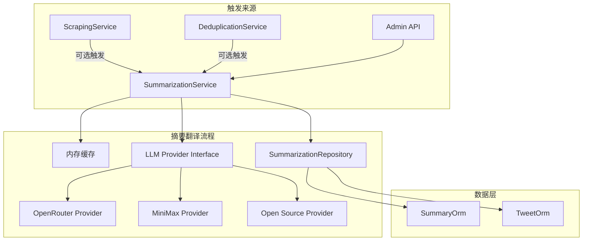
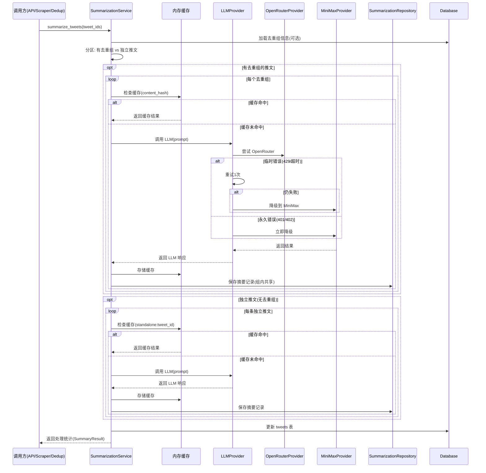
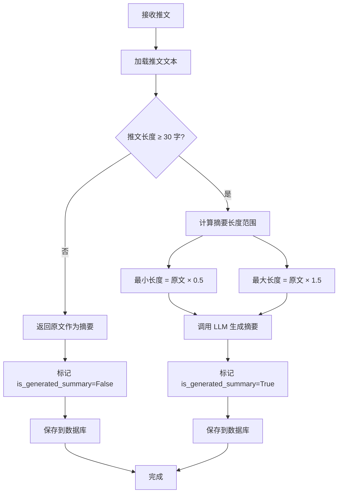
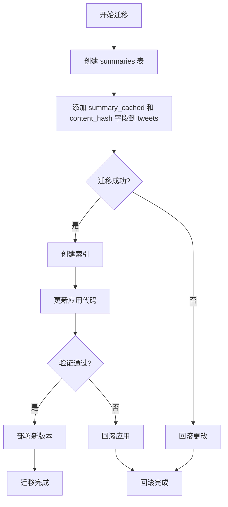

# Design Document

---

**Purpose**: 提供足够的实现细节，确保不同开发者实现的一致性。

**Approach**:
- 包含直接影响实现决策的核心章节
- 省略可选章节（除非对防止实现错误至关重要）
- 根据功能复杂度调整细节级别
- 使用图表和表格代替冗长叙述

---

## Overview

新闻摘要翻译模块（News Summarizer）是 X-watcher 的核心组件，负责对推文进行智能摘要提取和英译中翻译。该模块独立于去重服务运行，可处理任意推文（无论是否有去重组）。当推文属于去重组时，摘要服务利用去重信息优化处理（同组共享摘要）；当推文无去重组时，独立生成摘要。通过异步后台任务处理推文，确保高管用户能够快速获取推文的关键信息，并提供中文翻译以降低阅读成本。

**用户群体**: 技术公司高管将通过新闻流界面间接使用此功能，无需手动操作。

**影响**: 为推文流增加摘要和翻译能力，提升信息消费效率。去重服务可选地触发摘要，但摘要服务不依赖去重组作为前提条件。

### Goals
- 智能摘要长度策略：短推文（< 30 字）返回原文，长推文生成动态长度摘要（原文长度的 50%-150%）
- 使用 LLM 提取推文关键信息，摘要长度自适应（1-500 字）
- 将英文推文及其摘要翻译为中文
- 支持多提供商降级（OpenRouter → MiniMax 中国版 → 开源模型）
- 基于内容哈希缓存结果，避免重复 API 调用
- 批量异步处理，控制并发避免速率限制
- 记录详细的 token 使用和成本统计

### Non-Goals
- 不支持非英文推文的摘要生成（标记为"无需摘要"）
- 不实时处理（去重后异步处理即可）
- 不自动删除缓存结果（保留 7 天后失效）
- 不实现复杂的多轮对话摘要（单次摘要即可）
- 初期不使用 Redis（使用内存缓存）

## Architecture

### Existing Architecture Analysis

当前系统采用 **Service-Repository 模式**，核心模式包括：
- **Service-Repository 分层**: 业务逻辑与数据访问分离
- **Pydantic 数据验证**: 所有数据模型使用 Pydantic 定义
- **Result 类型错误处理**: 使用 `returns` 库的 Result 类型
- **依赖注入**: 组件支持依赖注入便于测试
- **异步优先**: 使用 asyncio 实现并发处理

摘要服务独立于去重服务运行。去重完成后可触发摘要处理，但摘要服务也可通过 API 或抓取流程直接调用，不依赖去重组的存在。

### Architecture Pattern & Boundary Map



**Architecture Integration**:
- **Selected pattern**: Service-Repository 扩展模式 + Strategy Pattern（多提供商）
- **Domain/feature boundaries**:
  - 摘要服务独立于去重服务，可处理有去重组和无去重组的推文
  - LLM 提供商作为独立组件，便于升级和替换
  - 缓存内聚到服务内部（初期使用内存）
  - 数据访问层与现有模式保持一致
- **Existing patterns preserved**:
  - Service-Repository 分层
  - Pydantic 数据验证
  - Result 类型错误处理
  - 异步处理模式
- **New components rationale**:
  - `SummarizationService`: 编排摘要翻译流程
  - `LLMProvider`: 统一的 LLM 调用接口
  - `OpenRouterProvider`, `MiniMaxProvider`, `OpenSourceProvider`: 具体提供商实现
  - `SummarizationRepository`: 摘要结果持久化
  - 内存缓存：内聚到服务内部，避免过度设计
- **Steering compliance**:
  - 遵循 YAGNI 原则（初期只实现 OpenRouter 和 MiniMax，内存缓存）
  - 单职责（每个组件只负责一个核心功能）
  - 易演进（提供商独立，便于新增；缓存可后期迁移到 Redis）

### Technology Stack

| Layer | Choice / Version | Role in Feature | Notes |
|-------|------------------|-----------------|-------|
| Backend / Services | Python 3.11+ | 摘要服务实现 | 与现有技术栈一致 |
| LLM Integration | OpenAI SDK 1.x+ | 统一 LLM 调用接口 | 所有提供商均兼容 |
| Cache | 内存缓存 (dict + asyncio.Lock) | 结果缓存 | 初期方案，后期可升级 Redis |
| Database | SQLAlchemy + AsyncSession | 摘要结果存储 | 扩展现有数据模型 |
| Web Framework | FastAPI | API 端点 | 与现有 API 一致 |
| Async Concurrency | asyncio | 批量并发控制 | Semaphore 控制并发数 |

## System Flows



**流程说明**:
1. 推文分为两类处理路径：有去重组的推文（组内共享摘要）和独立推文（单独生成摘要）
2. 优先检查缓存，缓存键基于内容哈希（去重组用 `dedup_type:representative_id`，独立推文用 `standalone:tweet_id`）
3. **智能摘要长度策略**：
   - 推文长度 < 30 字：直接返回原文，标记 `is_generated_summary=False`
   - 推文长度 ≥ 30 字：生成动态长度摘要（原文长度的 50%-150%）
4. LLM 调用失败时区分临时/永久错误：
   - 临时错误（429、超时）：重试 1 次后降级
   - 永久错误（401、402）：立即降级
5. 使用 Semaphore 控制并发数（默认 5）
6. 缓存使用 asyncio.Lock 保证线程安全



## Requirements Traceability

| Requirement | Summary | Components | Interfaces | Flows |
|-------------|---------|------------|------------|-------|
| 1 | 智能摘要生成 | SummarizationService, LLMProvider | Service | 摘要翻译流程 |
| 2 | 英译中翻译 | SummarizationService, LLMProvider | Service | 摘要翻译流程 |
| 3 | 多模型支持与降级策略 | LLMProvider, OpenRouterProvider, MiniMaxProvider | Service | 摘要翻译流程 |
| 4 | 结果缓存 | SummarizationService (内部) | Service | 摘要翻译流程 |
| 5 | 批量处理与并发控制 | SummarizationService | Service, Batch | 摘要翻译流程 |
| 6 | 成本统计 | SummarizationRepository | Service, Data | 摘要翻译流程 |
| 7 | 数据模型与存储 | SummarizationRepository, SummaryOrm | Data | - |
| 8 | API 集成 | Admin API, SummarizationService | API, Service | - |
| 9 | 配置管理 | LLMProviderConfig, PromptConfig | Config | - |
| 10 | 性能要求 | SummarizationService | Service | - |

## Components and Interfaces

| Component | Domain/Layer | Intent | Req Coverage | Key Dependencies (P0/P1) | Contracts |
|-----------|--------------|--------|--------------|--------------------------|-----------|
| SummarizationService | Service | 编排摘要翻译流程 | 1, 2, 3, 4, 5, 10 | TweetRepository (P0), LLMProvider (P0) | Service, Batch |
| LLMProvider | Domain | LLM 调用接口 | 1, 2, 3 | OpenAI SDK (P0) | Service |
| OpenRouterProvider | Infrastructure | OpenRouter API 适配 | 3 | OpenAI SDK (P0) | Service |
| MiniMaxProvider | Infrastructure | MiniMax API 适配 | 3 | OpenAI SDK (P0) | Service |
| SummarizationRepository | Infrastructure | 摘要结果持久化 | 6, 7 | SummaryOrm (P0) | Service |
| LLMProviderConfig | Config | 提供商配置 | 9 | - | State |
| PromptConfig | Config | Prompt 模板 | 9 | - | State |
| Admin API | API | 摘要 API 端点 | 8 | SummarizationService (P0) | API |

### Domain Layer

#### LLMProvider

| Field | Detail |
|-------|--------|
| Intent | 统一的 LLM 调用接口，支持多提供商和智能降级 |
| Requirements | 1, 2, 3 |
| Owner / Reviewers | Backend Team |

**Responsibilities & Constraints**
- 提供统一的调用接口 `complete(prompt, model)`
- 实现智能降级策略：区分临时/永久错误
  - 临时错误（429、超时）：重试 1 次后降级
  - 永久错误（401、402）：立即降级
  - 降级顺序：OpenRouter → MiniMax → OpenSource
- 处理速率限制（429）和超时
- 记录 token 使用和成本
- 支持流式和非流式响应

**Dependencies**
- Inbound: SummarizationService — 调用 LLM (Critical)
- Outbound: 无
- External: OpenAI SDK — 统一调用接口 (Critical)

**Contracts**: Service [x]

##### Service Interface
```python
from pydantic import BaseModel
from typing import Literal
from returns.result import Result

class LLMErrorType(str, Literal):
    """LLM 错误类型。"""
    temporary = "temporary"  # 临时错误：429、超时
    permanent = "permanent"  # 永久错误：401、402

class LLMResponse(BaseModel):
    content: str
    model: str
    provider: Literal["openrouter", "minimax", "open_source"]
    prompt_tokens: int
    completion_tokens: int
    total_tokens: int
    cost_usd: float

class LLMProvider(ABC):
    async def complete(
        self,
        prompt: str,
        max_tokens: int = 500,
        temperature: float = 0.7
    ) -> Result[LLMResponse, Exception]:
        """调用 LLM 生成文本。

        Args:
            prompt: 输入提示词
            max_tokens: 最大输出 token 数
            temperature: 温度参数

        Returns:
            Result[LLMResponse, Exception]: 成功返回响应，失败返回错误
        """
```
- Preconditions: API Key 已配置且有效
- Postconditions: 返回的 content 非空，token 统计准确
- Invariants: 降级顺序固定，永久错误不重试

**Implementation Notes**
- Integration: 在 SummarizationService 中调用
- Validation:
  - 验证 prompt 非空
  - 验证 max_tokens > 0
- Risks:
  - API 密钥泄露（使用环境变量）
  - 降级失败（记录所有错误）

#### SummarizationService

| Field | Detail |
|-------|--------|
| Intent | 编排完整的摘要翻译流程 |
| Requirements | 1, 2, 3, 4, 5, 10 |
| Owner / Reviewers | Backend Team |

**Responsibilities & Constraints**
- 协调缓存、LLM 调用、数据持久化
- 双路径处理：有去重组的推文（组内共享摘要）+ 独立推文（单独生成摘要）
- 批量处理支持（分批处理超量数据）
- 并发控制（Semaphore）
- 生成处理统计报告
- 事务管理确保数据一致性
- **内存缓存管理**：内聚到服务内部，使用 dict + asyncio.Lock

**Dependencies**
- Inbound: ScrapingService, DeduplicationService, Admin API — 触发处理 (Critical)
- Outbound: LLMProvider, SummarizationRepository — 核心处理 (Critical)
- External: 无

**Contracts**: Service [x], Batch [x]

##### Service Interface
```python
from pydantic import BaseModel

class SummaryResult(BaseModel):
    """摘要处理结果统计。"""
    total_tweets: int
    total_groups: int
    independent_tweets: int = 0  # 独立处理的推文数（无去重组）
    cache_hits: int
    cache_misses: int
    total_tokens: int
    total_cost_usd: float
    providers_used: dict[str, int]  # {"openrouter": 10, "minimax": 2}
    processing_time_ms: int

class SummarizationService:
    async def summarize_tweets(
        self,
        tweet_ids: list[str],
        force_refresh: bool = False
    ) -> Result[SummaryResult, Exception]:
        """对指定推文执行摘要和翻译。

        Args:
            tweet_ids: 推文 ID 列表
            force_refresh: 是否强制刷新缓存

        Returns:
            Result[SummaryResult, Exception]: 处理统计结果
        """
```
- Preconditions: tweet_ids 非空，数据库中存在对应推文
- Postconditions: 所有摘要已持久化，tweets 表已更新
- Invariants: 有去重组的推文组内共享结果；无去重组的推文独立处理

##### Batch Contract
- Trigger: API 调用、抓取流程完成后、或去重服务完成后调用
- Input / validation: 验证 tweet_ids 格式，检查推文是否存在
- Output / destination: summaries 表 + tweets 表更新
- Idempotency & recovery: 支持重试，已处理的内容会跳过或覆盖（force_refresh）

**Implementation Notes**
- Integration:
  - 可由抓取服务、去重服务或 API 直接触发
  - 通过 FastAPI BackgroundTasks 异步执行
  - 支持手动触发（API 调用）
  - 不依赖去重组的存在，独立推文也可处理
- Validation:
  - 验证输入推文列表非空
  - 自动检测推文是否有去重组（有则共享，无则独立处理）
- 内部缓存结构：
  ```python
  _cache: dict[str, LLMResponse]  # content_hash -> response
  _cache_lock: asyncio.Lock
  ```
- Risks:
  - 大批量处理可能超时
  - 内存缓存重启丢失（可接受）
  - 并发摘要冲突

### Infrastructure Layer

#### OpenRouterProvider

| Field | Detail |
|-------|--------|
| Intent | OpenRouter API 适配器 |
| Requirements | 3 |
| Owner / Reviewers | Backend Team |

**Responsibilities & Constraints**
- 封装 OpenRouter API 调用
- 使用 `anthropic/claude-sonnet-4.5` 模型
- Base URL: `https://openrouter.ai/api/v1`
- 计算成本（基于 OpenRouter 定价）
- 区分临时/永久错误

**Dependencies**
- Inbound: LLMProvider — 降级调用 (Critical)
- Outbound: 无
- External: OpenAI SDK — API 调用 (Critical), OpenRouter API (Critical)

**Contracts**: Service [x]

##### Service Interface
```python
class OpenRouterProvider:
    # 错误分类
    TEMPORARY_ERRORS = (429, 503, 504)  # 速率限制、服务不可用
    PERMANENT_ERRORS = (401, 402)      # 认证失败、余额不足

    def __init__(self, api_key: str, base_url: str = "https://openrouter.ai/api/v1"):
        self.client = AsyncOpenAI(api_key=api_key, base_url=base_url)
        self.model = "anthropic/claude-sonnet-4.5"

    async def complete(
        self,
        prompt: str,
        max_tokens: int = 500,
        temperature: float = 0.7
    ) -> Result[LLMResponse, Exception]:
        """调用 OpenRouter API 生成文本。"""
```
- Preconditions: API Key 有效且有余额
- Postconditions: 返回的 content 非空
- Invariants: 使用 Claude Sonnet 4.5 模型

**Implementation Notes**
- Integration: 作为 LLMProvider 的首选提供商
- Validation: 检查 API Key 格式
- 错误分类：
  ```python
  if status_code in self.TEMPORARY_ERRORS:
      return LLMErrorType.temporary
  elif status_code in self.PERMANENT_ERRORS:
      return LLMErrorType.permanent
  ```
- Risks:
  - API 余额不足
  - 速率限制（429）
  - 模型不可用

#### MiniMaxProvider

| Field | Detail |
|-------|--------|
| Intent | MiniMax 中国版 API 适配器 |
| Requirements | 3 |
| Owner / Reviewers | Backend Team |

**Responsibilities & Constraints**
- 封装 MiniMax 中国版 API 调用
- 使用 M2.1 模型
- Base URL: `https://api.minimaxi.com`（中国版）
- 计算成本（基于 MiniMax 定价）
- 区分临时/永久错误

**Dependencies**
- Inbound: LLMProvider — 降级调用 (Critical)
- Outbound: 无
- External: OpenAI SDK — API 调用 (Critical), MiniMax API (Critical)

**Contracts**: Service [x]

##### Service Interface
```python
class MiniMaxProvider:
    TEMPORARY_ERRORS = (429, 503, 504)
    PERMANENT_ERRORS = (401, 402)

    def __init__(self, api_key: str, base_url: str = "https://api.minimaxi.com"):
        self.client = AsyncOpenAI(api_key=api_key, base_url=base_url)
        self.model = "m2.1"

    async def complete(
        self,
        prompt: str,
        max_tokens: int = 500,
        temperature: float = 0.7
    ) -> Result[LLMResponse, Exception]:
        """调用 MiniMax API 生成文本。"""
```
- Preconditions: API Key 有效且有余额
- Postconditions: 返回的 content 非空
- Invariants: 使用国内版 Base URL

**Implementation Notes**
- Integration: 作为 LLMProvider 的后备提供商
- Validation: 检查 API Key 格式
- 错误分类：同 OpenRouterProvider
- Risks:
  - API 余额不足
  - 国内网络问题
  - 模型不可用

#### SummarizationRepository

| Field | Detail |
|-------|--------|
| Intent | 管理摘要结果的持久化 |
| Requirements | 6, 7 |
| Owner / Reviewers | Backend Team |

**Responsibilities & Constraints**
- 创建和更新摘要记录
- 关联推文到摘要
- 查询摘要结果
- 删除摘要记录
- 使用事务确保一致性

**Dependencies**
- Inbound: SummarizationService — 调用持久化 (Critical)
- Outbound: SummaryOrm — ORM 操作 (Critical)
- External: 无

**Contracts**: Service [x]

##### Service Interface
```python
class SummarizationRepository:
    async def save_summary_record(self, record: SummaryRecord) -> None:
        """保存摘要记录。

        Args:
            record: 摘要记录对象

        Raises:
            RepositoryError: 保存失败时抛出
        """

    async def get_summary_by_tweet(self, tweet_id: str) -> SummaryRecord | None:
        """根据推文 ID 查询摘要。

        Args:
            tweet_id: 推文 ID

        Returns:
            SummaryRecord 或 None
        """

    async def get_cost_stats(
        self,
        start_date: datetime | None = None,
        end_date: datetime | None = None
    ) -> CostStats:
        """获取成本统计。

        Args:
            start_date: 开始日期（可选）
            end_date: 结束日期（可选）

        Returns:
            CostStats: 成本统计结果
        """
```
- Preconditions: 数据库连接有效
- Postconditions: 事务提交后数据持久化
- Invariants: 同一推文只能有一条有效摘要

**Implementation Notes**
- Integration: 使用 SQLAlchemy AsyncSession
- Validation: 验证 tweet_id 格式
- Risks:
  - 并发更新冲突
  - 外键约束失败

### Config Layer

#### LLMProviderConfig

| Field | Detail |
|-------|--------|
| Intent | LLM 提供商配置 |
| Requirements | 9 |
| Owner / Reviewers | Backend Team |

**Responsibilities & Constraints**
- 定义所有提供商的配置参数
- 从环境变量或配置文件加载
- 提供默认配置

**Dependencies**
- Inbound: LLMProvider — 读取配置 (Critical)
- Outbound: 无
- External: 无

**Contracts**: State [x]

##### State Management
- State model: Pydantic BaseModel，不可变
- Persistence & consistency: 从环境变量加载
- Concurrency strategy: 只读配置，无需锁

```python
from pydantic import BaseModel

class OpenRouterConfig(BaseModel):
    api_key: str
    base_url: str = "https://openrouter.ai/api/v1"
    model: str = "anthropic/claude-sonnet-4.5"
    timeout_seconds: int = 30
    max_retries: int = 1  # 临时错误重试次数

class MiniMaxConfig(BaseModel):
    api_key: str
    base_url: str = "https://api.minimaxi.com"  # 中国版
    model: str = "m2.1"
    group_id: str | None = None
    timeout_seconds: int = 30
    max_retries: int = 1

class OpenSourceConfig(BaseModel):
    api_key: str
    base_url: str
    model: str
    timeout_seconds: int = 60
    max_retries: int = 1

class LLMProviderConfig(BaseModel):
    openrouter: OpenRouterConfig | None = None
    minimax: MiniMaxConfig | None = None
    open_source: OpenSourceConfig | None = None

    @classmethod
    def from_env(cls) -> "LLMProviderConfig":
        """从环境变量加载配置。"""
        import os

        return cls(
            openrouter=OpenRouterConfig(
                api_key=os.getenv("OPENROUTER_API_KEY", "")
            ) if os.getenv("OPENROUTER_API_KEY") else None,
            minimax=MiniMaxConfig(
                api_key=os.getenv("MINIMAX_API_KEY", ""),
                group_id=os.getenv("MINIMAX_GROUP_ID")
            ) if os.getenv("MINIMAX_API_KEY") else None,
            open_source=OpenSourceConfig(
                api_key=os.getenv("OPEN_SOURCE_API_KEY", ""),
                base_url=os.getenv("OPEN_SOURCE_BASE_URL", ""),
                model=os.getenv("OPEN_SOURCE_MODEL", "")
            ) if os.getenv("OPEN_SOURCE_API_KEY") else None
        )
```

#### PromptConfig

| Field | Detail |
|-------|--------|
| Intent | Prompt 模板配置 |
| Requirements | 9 |
| Owner / Reviewers | Backend Team |

**Responsibilities & Constraints**
- 定义摘要和翻译的 Prompt 模板
- 支持变量替换
- 提供默认模板

**Dependencies**
- Inbound: SummarizationService — 读取模板 (Critical)
- Outbound: 无
- External: 无

**Contracts**: State [x]

##### State Management
- State model: Pydantic BaseModel，不可变
- Persistence & consistency: 硬编码或从配置文件加载
- Concurrency strategy: 只读配置，无需锁

```python
class PromptConfig(BaseModel):
    summary_prompt: str = """请提取以下推文的关键信息，生成 50-150 字的中文摘要。
要求：
- 保留人名、公司名、产品名等关键实体
- 如果推文包含链接，请在摘要中标注"详情见链接"
- 摘要应简洁明了，突出核心信息

推文内容：{tweet_text}
"""

    translation_prompt: str = """请将以下英文推文翻译为中文。
要求：
- 保持原文的语气和情感倾向
- 技术术语和专有名词保留原文或提供中英文对照
- URL 链接保持不变，不翻译
- 翻译应自然流畅，符合中文表达习惯

推文内容：{tweet_text}
"""

    def format_summary(self, tweet_text: str) -> str:
        return self.summary_prompt.format(tweet_text=tweet_text)

    def format_translation(self, tweet_text: str) -> str:
        return self.translation_prompt.format(tweet_text=tweet_text)
```

### API Layer

#### Admin API - 摘要端点

| Field | Detail |
|-------|--------|
| Intent | 提供摘要相关的 HTTP API |
| Requirements | 8 |
| Owner / Reviewers | Backend Team |

**Responsibilities & Constraints**
- 接收摘要请求
- 返回摘要结果
- 支持查询和重新生成操作

**Dependencies**
- Inbound: 客户端 HTTP 请求 (Critical)
- Outbound: SummarizationService — 调用摘要 (Critical)
- External: 无

**Contracts**: API [x]

##### API Contract
| Method | Endpoint | Request | Response | Errors |
|--------|----------|---------|----------|--------|
| POST | /api/summaries/batch | `{tweet_ids: list[str], force_refresh?: bool}` | `{task_id: str, status: str}` | 400, 404, 500 |
| GET | /api/summaries/tweets/{tweet_id} | - | SummaryRecord | 404 |
| GET | /api/summaries/stats | `{start_date?: str, end_date?: str}` | CostStats | 400 |
| POST | /api/summaries/tweets/{tweet_id}/regenerate | - | SummaryRecord | 404, 500 |

**Implementation Notes**
- Integration: 使用 FastAPI 路由
- Validation: Pydantic 模型验证请求
- Risks:
  - 长时间运行的任务超时
  - 并发摘要冲突

## Data Models

### Domain Model

**Aggregates and transactional boundaries**:
- `SummaryRecord`: 摘要聚合根，包含摘要和翻译结果
- `SummaryResult`: 处理统计值对象
- `LLMResponse`: LLM 响应值对象

**Entities, value objects, domain events**:
- Entity: `SummaryRecord` (有唯一标识 summary_id)
- Value Objects: `SummaryResult`, `LLMResponse`
- Domain Events: `SummaryGeneratedEvent` (可选，用于事件驱动架构)

**Business rules & invariants**:
- 每条推文最多有一条有效摘要
- 推文长度 < 30 字时，直接返回原文作为摘要，标记 `is_generated_summary=False`
- 推文长度 ≥ 30 字时，生成摘要，长度为原文长度的 50%-150%
- 摘要长度动态范围在 1-500 字之间
- token 统计必须准确记录
- 成本统计按提供商分别记录

### Logical Data Model

**Structure Definition**:
```
tweets (1) ----< (N) summaries
    |
    tweet_id (FK)
```

**Attributes and their types**:
- `summaries.summary_id`: UUID，主键
- `summaries.tweet_id`: String，外键关联到 tweets.tweet_id
- `summaries.summary_text`: String，中文摘要（1-500 字符）
- `summaries.translation_text`: String | NULL，中文翻译
- `summaries.model_provider`: Enum("openrouter", "minimax", "open_source")
- `summaries.model_name`: String，模型名称
- `summaries.prompt_tokens`: Int
- `summaries.completion_tokens`: Int
- `summaries.total_tokens`: Int
- `summaries.cost_usd`: Float
- `summaries.cached`: Boolean
- `summaries.is_generated_summary`: Boolean，是否为生成的摘要（False 表示原文太短直接返回）
- `summaries.content_hash`: String，缓存键
- `summaries.created_at`: DateTime
- `summaries.updated_at`: DateTime

**Consistency & Integrity**:
- Transaction boundaries: 每个摘要操作在一个事务中完成
- Cascading rules: 删除推文时级联删除摘要
- Temporal aspects: 记录创建和更新时间

### Physical Data Model

**Table definitions with data types**:

```sql
-- 新增表：摘要记录
CREATE TABLE summaries (
    summary_id UUID PRIMARY KEY,
    tweet_id VARCHAR(255) NOT NULL,
    summary_text TEXT NOT NULL,
    translation_text TEXT,
    model_provider VARCHAR(20) NOT NULL,
    model_name VARCHAR(100) NOT NULL,
    prompt_tokens INTEGER NOT NULL,
    completion_tokens INTEGER NOT NULL,
    total_tokens INTEGER NOT NULL,
    cost_usd FLOAT NOT NULL,
    cached BOOLEAN NOT NULL DEFAULT FALSE,
    is_generated_summary BOOLEAN NOT NULL DEFAULT TRUE,
    content_hash VARCHAR(64) NOT NULL,
    created_at TIMESTAMP WITH TIME ZONE NOT NULL DEFAULT NOW(),
    updated_at TIMESTAMP WITH TIME ZONE NOT NULL DEFAULT NOW(),
    CONSTRAINT fk_tweet
        FOREIGN KEY (tweet_id)
        REFERENCES tweets(tweet_id)
        ON DELETE CASCADE,
    CONSTRAINT uq_tweet_summary UNIQUE (tweet_id)
);

-- 修改表：添加缓存字段（可选，用于快速查询）
ALTER TABLE tweets ADD COLUMN summary_cached BOOLEAN DEFAULT FALSE;
ALTER TABLE tweets ADD COLUMN content_hash VARCHAR(64);

-- 索引：优化查询性能
CREATE INDEX idx_summaries_tweet
    ON summaries(tweet_id);

CREATE INDEX idx_summaries_cached
    ON summaries(content_hash, cached)
    WHERE cached = TRUE;

CREATE INDEX idx_summaries_created
    ON summaries(created_at DESC);

CREATE INDEX idx_summaries_provider
    ON summaries(model_provider);
```

**Indexes and performance optimizations**:
- `summaries(tweet_id)`: 按推文查询摘要
- `summaries(content_hash, cached)`: 缓存查询优化
- `summaries(created_at)`: 按时间排序查询
- `summaries(model_provider)`: 按提供商统计

**Note**: 初期不使用 Redis，内存缓存内聚到服务内部。

## Error Handling

### Error Strategy

| Error Type | Detection | Recovery Strategy |
|------------|-----------|-------------------|
| 无效输入 | Pydantic 验证 | 返回 400 错误，说明具体字段 |
| 推文不存在 | 数据库查询 | 返回 404 错误，建议检查 tweet_id |
| LLM 临时错误 | HTTP 状态码 (429, 503, 504) | 重试 1 次后降级 |
| LLM 永久错误 | HTTP 状态码 (401, 402) | 立即降级到后备提供商 |
| 所有提供商失败 | 异常计数器 | 标记为"处理失败"，记录错误 |
| 数据库事务失败 | SQLAlchemy 异常 | 回滚事务，返回 500 错误 |
| 配置无效 | 配置验证 | 使用默认配置，记录警告 |

### Error Categories and Responses

**User Errors** (4xx):
- 无效输入 → 字段级验证错误，期望格式说明
- 推文不存在 → 404，建议检查 tweet_id
- 配置参数无效 → 使用默认值，记录警告

**System Errors** (5xx):
- LLM API 连接失败 → 降级到后备提供商
- 数据库连接失败 → 503，建议稍后重试
- 事务冲突 → 409，建议重试

**Business Logic Errors** (422):
- 推文无摘要 → 404，提示检查 tweet_id
- 重新生成正在进行的任务 → 409，提示等待完成

### Monitoring

- **Error tracking**: 使用 `loguru` 记录所有错误
- **Health monitoring**: 定期检查各提供商连通性
- **Metrics**:
  - 缓存命中率
  - 提供商使用分布
  - 平均处理时间
  - 错误率统计

## Testing Strategy

### Unit Tests
- `LLMProvider.complete`: 测试降级逻辑（使用 mock）
- `OpenRouterProvider.complete`: 测试 API 调用（使用 mock）
- `MiniMaxProvider.complete`: 测试 API 调用（使用 mock）
- `PromptConfig.format_summary`: 测试 Prompt 格式化
- 内存缓存线程安全测试

### Integration Tests
- 完整摘要流程：推文 → 摘要 → 验证数据库（支持有去重组和无去重组两种路径）
- 降级流程测试：临时错误重试 → 永久错误立即降级
- 缓存测试：首次生成 → 第二次缓存命中
- API 端点测试：POST /batch, GET /tweets/{id}, POST /regenerate
- 事务回滚测试：摘要失败时的数据一致性

### Performance Tests
- 单条推文摘要时间 < 10 秒
- 10 条推文批量处理 < 30 秒
- 50 条推文批量处理 < 120 秒
- 缓存查询时间 < 100 毫秒
- 内存占用 < 200MB（50 条推文）

## Performance & Scalability

- **Target metrics**:
  - 单条推文: < 10 秒
  - 10 条推文: < 30 秒
  - 50 条推文: < 120 秒
  - 缓存查询: < 100 毫秒
  - 内存占用: < 200MB (50 条)

- **Scaling approaches**:
  - 初期: 单机处理，使用 asyncio 并发，内存缓存
  - 扩展: 添加 Redis 缓存层（独立任务）
  - 未来: 分布式任务队列（Celery）

- **Optimization techniques**:
  - 内容哈希缓存避免重复调用
  - 并发控制平衡速度和限制
  - 区分临时/永久错误减少无效重试
  - 数据库索引优化查询

## Migration Strategy



**Phase breakdown**:
1. 准备阶段：编写 Alembic 迁移脚本
2. 执行阶段：创建表结构（不影响现有数据）
3. 验证阶段：测试摘要功能
4. 切换阶段：启用摘要服务
5. 回滚触发：验证失败或性能问题

**Rollback triggers**:
- 摘要导致 API 响应时间增加 > 50%
- LLM API 成本超出预期
- 发现数据一致性问题
