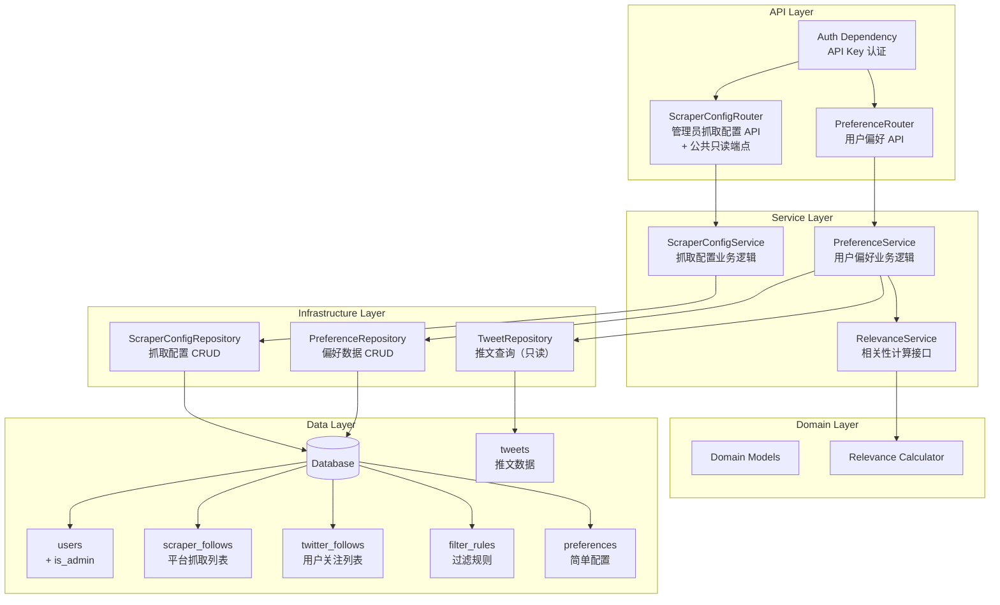
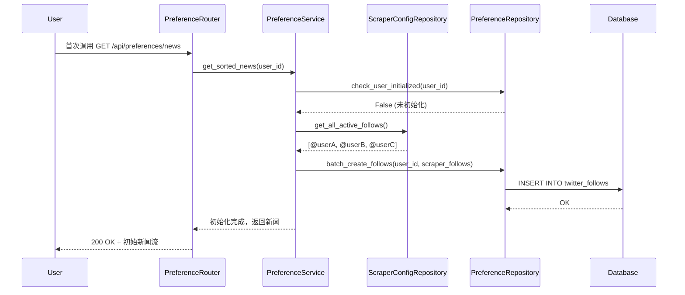
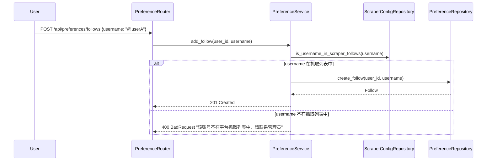
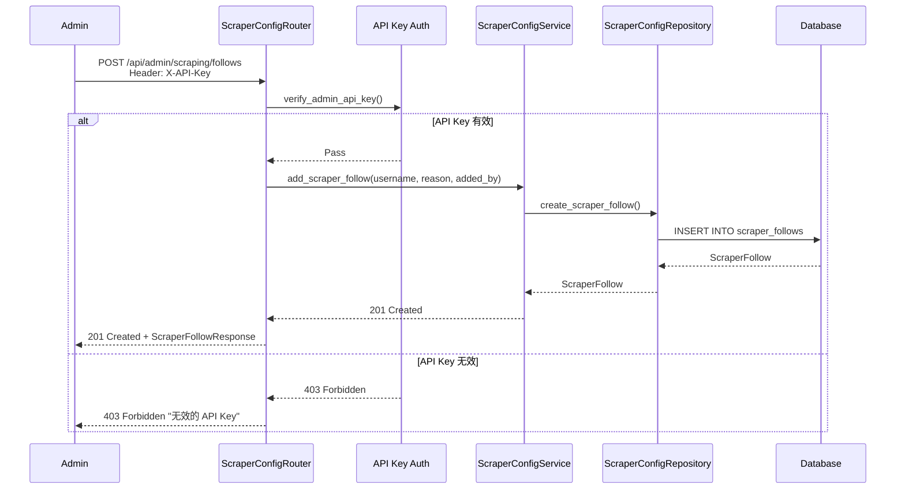
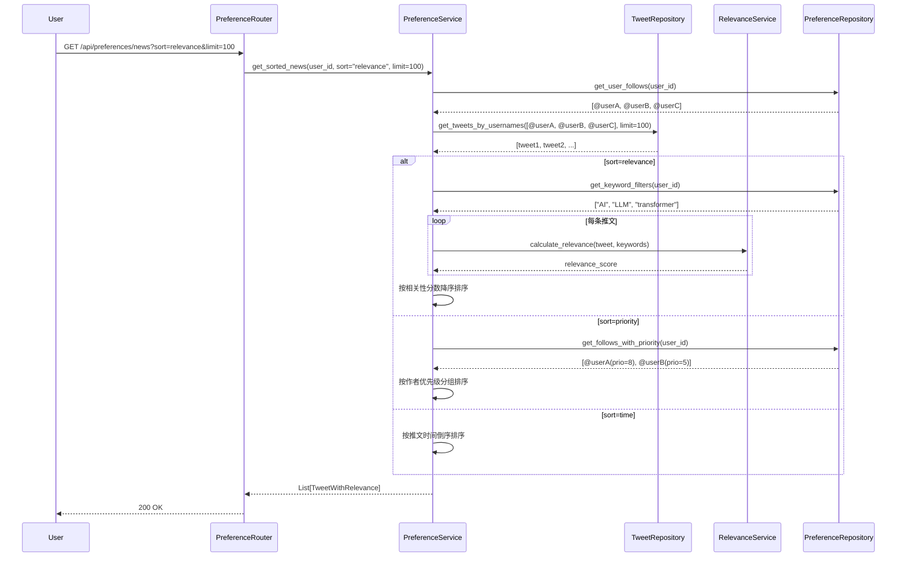
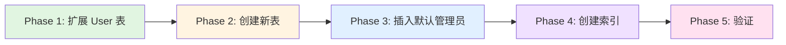

# 设计文档

## 概述

Preference Manager 是 X-watcher 的能力扩展模块，为科技公司高管提供根据公司战略动态调整新闻关注重点的能力。本模块通过 RESTful API 和数据库持久化，支持用户管理个人 Twitter 关注列表、配置排序偏好、设置内容过滤规则，并提供基于偏好排序的新闻流 API。

**模块定位**：可选的能力扩展，不参与核心新闻抓取流程。移除该模块不影响基础新闻功能。

### 目标
- 提供结构化的偏好配置管理（关注列表、排序、过滤）
- 支持动态调整关注重点（从抓取列表中选择/移除/优先级）
- 提供基于偏好排序的新闻流 API
- 设计可扩展的相关性计算接口

### 非目标
- 不实现前端 UI（仅提供 API）
- 不实现推送通知机制
- 不负责新闻抓取（由 scraper 模块负责）

---

## 架构

### 现有架构分析

**现有模式**:
- 分层架构：API → Services → Repository → Database
- 异步数据库操作使用 SQLAlchemy + `async_session_maker`
- 领域模型使用 Pydantic，与 ORM 模型分离
- API 路由使用 FastAPI `APIRouter` 模块化

**约束条件**:
- 必须扩展现有的 `User` 模型（`src/database/models.py`）
- 必须遵循异步数据库操作模式
- 必须保持与现有模块（summarization、deduplication）一致的设计风格

### 架构模式与边界

**选择模式**: 分层架构 + 服务抽象



**架构集成**:
- **选定模式**: 分层架构 + Strategy Pattern（相关性计算）
- **领域边界**:
  - ScraperConfig: 平台级抓取账号列表（管理员管理）
  - Preference: 用户级偏好配置（用户管理）
  - 两层列表关系：用户关注列表初始化时复制自抓取列表，用户可以删除但不能添加新账号
- **保留的现有模式**:
  - 异步 Repository 模式（参考 `SummarizationRepository`）
  - 领域模型与 ORM 分离（`to_domain()` / `from_domain()`）
  - FastAPI 依赖注入模式
- **新组件理由**:
  - `ScraperConfigRouter`: 管理员 API，控制平台抓取数据源
  - `RelevanceService`: 独立的相关性计算接口，便于未来替换算法
  - `scraper_follows`: 新增表存储平台抓取账号列表（支持时间、理由等元数据）
  - `twitter_follows`: 用户关注列表，从抓取列表初始化
- **遵循的指导原则**:
  - 单职责原则：每个组件只负责一个领域
  - 开放封闭原则：相关性算法可扩展而不修改核心逻辑

### 技术栈

| 层级 | 选择 / 版本 | 在特性中的角色 | 备注 |
|------|-------------|----------------|------|
| Backend / Services | Python 3.11+ | 核心业务逻辑 | 遵循项目技术栈 |
| Web Framework | FastAPI | RESTful API | 异步支持，自动文档 |
| Auth | API Key (MVP) | 管理员 API 认证 | Header: X-API-Key |
| Data / Storage | SQLite → PostgreSQL | 偏好配置持久化 | 遵循项目数据库策略 |
| ORM | SQLAlchemy 2.0 (Async) | 数据库操作 | 使用现有 async_session_maker |
| Validation | Pydantic v2 | 请求/响应验证 | 类型安全，自动错误处理 |
| Testing | pytest + pytest-asyncio | 单元和集成测试 | TDD 开发模式 |

---

## 系统流程

### 用户关注列表初始化流程



### 添加/恢复关注流程



### 管理员添加抓取账号流程



### 个性化新闻流排序流程



---

## 需求追溯

| 需求 | 摘要 | 组件 | 接口 | 流程 |
|------|------|------|------|------|
| 1.1 | 添加/恢复关注 | PreferenceRouter, PreferenceService | POST /api/preferences/follows | 添加/恢复关注流程 |
| 1.2 | 移除关注 | PreferenceRouter, PreferenceService | DELETE /api/preferences/follows/{username} | - |
| 1.3 | 查询关注列表 | PreferenceRouter, PreferenceService | GET /api/preferences/follows | - |
| 1.4 | 防止重复关注 | PreferenceRepository | 数据库唯一约束 | - |
| 1.5 | 验证用户名格式 | Pydantic Schemas | 请求验证 | - |
| 2.1 | 时间排序 | PreferenceService, TweetRepository | GET /api/preferences/news?sort=time | 个性化新闻流排序流程 |
| 2.2 | 相关性排序 | PreferenceService, RelevanceService | GET /api/preferences/news?sort=relevance | 个性化新闻流排序流程 |
| 2.3 | 优先级排序 | PreferenceService | GET /api/preferences/news?sort=priority | 个性化新闻流排序流程 |
| 2.4 | 查询排序偏好 | PreferenceRouter, PreferenceService | GET /api/preferences | - |
| 2.5 | 验证排序类型 | Pydantic Schemas | 请求验证 | - |
| 2.6 | 相关性服务降级 | PreferenceService, RelevanceService | - | 个性化新闻流排序流程（降级） |
| 3.1 | 添加关键词过滤 | PreferenceRouter, PreferenceService | POST /api/preferences/filters | - |
| 3.2 | 移除关键词过滤 | PreferenceRouter, PreferenceService | DELETE /api/preferences/filters/{rule_id} | - |
| 3.3 | 查询过滤规则 | PreferenceRouter, PreferenceService | GET /api/preferences/filters | - |
| 4.1 | 偏好持久化 | PreferenceRepository | 数据库操作 | - |
| 4.2 | 偏好查询 | PreferenceRepository | 数据库操作 | - |
| 4.3 | 偏好删除 | PreferenceRepository | 数据库操作 | - |
| 4.4 | 数据库错误处理 | PreferenceRouter | 异常处理中间件 | - |
| 4.5 | 批量更新事务 | PreferenceRepository | 数据库事务 | - |
| 5.1 | 设置优先级 | PreferenceRouter, PreferenceService | PUT /api/preferences/follows/{username}/priority | - |
| 5.2 | 查询优先级 | PreferenceRouter, PreferenceService | GET /api/preferences/follows | - |
| 5.3 | 修改优先级 | PreferenceRouter, PreferenceService | PUT /api/preferences/follows/{username}/priority | - |
| 5.4 | 验证优先级范围 | Pydantic Schemas | 请求验证 | - |
| 5.5 | 默认优先级 | PreferenceRepository | 默认值设置 | - |
| 6.1-6.7 | RESTful API | PreferenceRouter | 各端点 | - |
| 7.1-7.5 | 数据验证 | Pydantic Schemas | 请求/响应验证 | - |
| **NEW** | 用户关注列表初始化 | PreferenceService, ScraperConfigRepository | - | 用户关注列表初始化流程 |
| **NEW** | 验证账号在抓取列表 | PreferenceService, ScraperConfigRepository | - | 添加/恢复关注流程 |
| **NEW** | 管理员添加抓取账号 | ScraperConfigRouter, ScraperConfigService | POST /api/admin/scraping/follows | 管理员添加抓取账号流程 |
| **NEW** | 个性化新闻流 | PreferenceRouter, PreferenceService | GET /api/preferences/news | 个性化新闻流排序流程 |
| 8.1-8.5 | 普通用户查看抓取列表 | ScraperConfigRouter (public_router) | GET /api/scraping/follows | - |

---

## 组件与接口

### 组件概览

| 组件 | 领域/层 | 意图 | 需求覆盖 | 关键依赖 (P0/P1) | 契约 |
|------|---------|------|----------|------------------|------|
| PreferenceRouter | API | 提供用户偏好 RESTful API | 1-7 | PreferenceService (P0) | API Contract |
| ScraperConfigRouter | API | 提供管理员抓取配置 API | NEW | ScraperConfigService (P0) | API Contract |
| AuthDependency | API | API Key 认证 | NEW | - | - |
| PreferenceService | Service | 用户偏好业务逻辑协调 | 1-5, NEW | PreferenceRepository (P0), RelevanceService (P1), ScraperConfigRepository (P1) | Service Interface |
| ScraperConfigService | Service | 抓取配置业务逻辑 | NEW | ScraperConfigRepository (P0) | Service Interface |
| RelevanceService | Service | 计算推文相关性分数 | 2.2, 2.6 | 无 | Service Interface |
| PreferenceRepository | Infrastructure | 用户偏好数据库 CRUD | 1-5 | Database (P0) | - |
| ScraperConfigRepository | Infrastructure | 抓取配置数据库 CRUD | NEW | Database (P0) | - |
| Pydantic Schemas | API | 请求/响应验证 | 1-7, NEW | 无 | - |
| Domain Models | Domain | 领域实体定义 | 1-5, NEW | 无 | - |

---

### API Layer

#### PreferenceRouter (用户偏好 API)

| 字段 | 详情 |
|------|------|
| 意图 | 提供用户偏好的 RESTful API 端点 |
| 需求 | 1-7, NEW |
| 所有者 / 审查者 | - |

**职责与约束**
- 路由定义和请求/响应处理
- 使用 Pydantic 进行数据验证
- 异常处理和 HTTP 状态码映射
- 不包含业务逻辑，仅调用 Service 层

**依赖**
- 入站：前端应用 / Agent 工具 — 偏好配置管理 (Critical)
- 出站：PreferenceService — 业务逻辑执行 (Critical)

**契约**: API [ ]

##### API 契约

| 方法 | 端点 | 请求 | 响应 | 错误 |
|------|------|------|------|------|
| POST | /api/preferences/follows | CreateFollowRequest | FollowResponse | 400, 409, 500 |
| GET | /api/preferences/follows | - | List[FollowResponse] | 500 |
| DELETE | /api/preferences/follows/{username} | - | DeleteResponse | 404, 500 |
| PUT | /api/preferences/follows/{username}/priority | UpdatePriorityRequest | FollowResponse | 400, 404, 500 |
| POST | /api/preferences/filters | CreateFilterRequest | FilterResponse | 400, 409, 500 |
| GET | /api/preferences/filters | - | List[FilterResponse] | 500 |
| DELETE | /api/preferences/filters/{rule_id} | - | DeleteResponse | 404, 500 |
| PUT | /api/preferences/sorting | UpdateSortingRequest | SortingResponse | 400, 500 |
| GET | /api/preferences | - | PreferenceResponse | 500 |
| **GET** | **/api/preferences/news** | **sort, limit** | **List[TweetWithRelevance]** | **400, 500** |

#### ScraperConfigRouter (管理员抓取配置 API)

| 字段 | 详情 |
|------|------|
| 意图 | 提供平台抓取配置的管理员 API 端点 |
| 需求 | NEW |
| 所有者 / 审查者 | - |

**职责与约束**
- 管理端点（`router`，prefix=/api/admin/scraping）需要管理员认证（`get_current_admin_user`）
- 另提供 `public_router`（prefix=/api/scraping）公开只读端点，普通认证用户可访问（`get_current_user`）
- 路由定义和请求/响应处理
- 使用 Pydantic 进行数据验证

**依赖**
- 入站：管理员客户端 — 抓取配置管理 (Critical)
- 出站：ScraperConfigService — 业务逻辑执行 (Critical)
- 横切关注：AuthDependency — API Key 验证 (Critical)

**契约**: API [ ]

##### API 契约

| 方法 | 端点 | 请求 | 响应 | 错误 |
|------|------|------|------|------|
| POST | /api/admin/scraping/follows | CreateScraperFollowRequest | ScraperFollowResponse | 400, 403, 409, 500 |
| GET | /api/admin/scraping/follows | include_inactive | List[ScraperFollowResponse] | 403, 500 |
| PUT | /api/admin/scraping/follows/{username} | UpdateScraperFollowRequest | ScraperFollowResponse | 400, 403, 404, 500 |
| DELETE | /api/admin/scraping/follows/{username} | - | DeleteResponse | 403, 404, 500 |
| **GET** | **/api/scraping/follows** | **-** | **List[ScraperFollowResponse]** | **401, 500** |

> 最后一行为公共只读端点，普通认证用户可访问，仅返回活跃账号（`include_inactive=False` 固定）。

---

### Service Layer

#### PreferenceService

| 字段 | 详情 |
|------|------|
| 意图 | 协调用户偏好管理的业务逻辑 |
| 需求 | 1-5, NEW |
| 所有者 / 审查者 | - |

**职责与约束**
- 关注列表 CRUD 操作（从抓取列表中验证）
- 过滤规则管理
- 排序偏好配置
- 调用 RelevanceService 进行相关性计算
- 调用 TweetRepository 获取推文数据
- 用户关注列表初始化逻辑
- 事务边界管理（使用 Repository 的事务）

**依赖**
- 入向：PreferenceRouter — HTTP 请求处理 (Critical)
- 出向：PreferenceRepository — 用户偏好数据持久化 (Critical)
- 出向：ScraperConfigRepository — 验证账号在抓取列表中 (High)
- 出向：TweetRepository — 查询推文数据 (High)
- 出向：RelevanceService — 相关性计算 (High)

**契约**: Service [ ]

##### Service 接口

```python
class PreferenceService:
    async def initialize_user_follows(
        self, user_id: int
    ) -> Result[None, Error]:
        """为用户初始化关注列表

        复制当前所有启用的 scraper_follows 到用户的 twitter_follows
        如果用户已有关注列表，则跳过
        """

    async def add_follow(
        self, user_id: int, username: str, priority: int = 5
    ) -> Result[Follow, Error]:
        """添加/恢复关注

        验证 username 是否在 scraper_follows 中
        如果是，添加到 twitter_follows
        如果否，返回错误
        """

    async def remove_follow(
        self, user_id: int, username: str
    ) -> Result[None, Error]

    async def get_follows(
        self, user_id: int, sort_by: SortType | None = None
    ) -> Result[list[Follow], Error]

    async def update_priority(
        self, user_id: int, username: str, priority: int
    ) -> Result[Follow, Error]

    async def add_filter(
        self, user_id: int, filter_type: FilterType, value: str
    ) -> Result[FilterRule, Error]

    async def remove_filter(
        self, user_id: int, rule_id: str
    ) -> Result[None, Error]

    async def get_filters(
        self, user_id: int
    ) -> Result[list[FilterRule], Error]

    async def get_sorting_preference(
        self, user_id: int
    ) -> Result[SortingPreference, Error]

    async def update_sorting_preference(
        self, user_id: int, sort_type: SortType
    ) -> Result[SortingPreference, Error]

    async def get_sorted_news(
        self, user_id: int, sort_type: SortType, limit: int = 100
    ) -> Result[list[TweetWithRelevance], Error]:
        """获取排序后的个性化新闻流

        - 查询用户的关注列表
        - 获取相关推文
        - 应用过滤规则
        - 根据排序类型排序
        - 返回排序后的推文列表
        """
```

#### ScraperConfigService

| 字段 | 详情 |
|------|------|
| 意图 | 协调平台抓取配置的业务逻辑 |
| 需求 | NEW |
| 所有者 / 审查者 | - |

**职责与约束**
- 抓取账号列表 CRUD 操作
- 支持添加时间、理由等元数据
- 软删除机制（is_active）

**依赖**
- 入向：ScraperConfigRouter — HTTP 请求处理 (Critical)
- 出向：ScraperConfigRepository — 抓取配置数据持久化 (Critical)

**契约**: Service [ ]

##### Service 接口

```python
class ScraperConfigService:
    async def add_scraper_follow(
        self, username: str, reason: str, added_by: str
    ) -> Result[ScraperFollow, Error]

    async def get_all_follows(
        self, include_inactive: bool = False
    ) -> Result[list[ScraperFollow], Error]

    async def update_follow(
        self, username: str, reason: str | None = None, is_active: bool | None = None
    ) -> Result[ScraperFollow, Error]

    async def deactivate_follow(
        self, username: str
    ) -> Result[None, Error]

    async def is_username_in_follows(
        self, username: str, active_only: bool = True
    ) -> bool:
        """检查用户名是否在抓取列表中"""
```

#### RelevanceService

| 字段 | 详情 |
|------|------|
| 意图 | 计算推文与关键词的相关性分数（可扩展接口） |
| 需求 | 2.2, 2.6 |
| 所有者 / 审查者 | - |

**职责与约束**
- 定义相关性计算接口
- MVP 实现：关键词匹配算法
- 未来扩展：嵌入模型相似度计算
- 降级处理：服务不可用时返回默认分数

**依赖**
- 入向：PreferenceService — 相关性计算请求 (Critical)
- 出向：无（MVP 实现），未来可能有 EmbeddingProvider (High)

**契约**: Service [ ]

##### Service 接口

```python
class RelevanceService(ABC):
    @abstractmethod
    async def calculate_relevance(
        self, tweet: Tweet, keywords: list[str]
    ) -> Result[float, Error]:
        """计算推文与关键词的相关性分数 (0.0-1.0)

        Args:
            tweet: 推文领域模型
            keywords: 关键词列表

        Returns:
            Result[float, Error]: 相关性分数或错误
        """
```

---

### Infrastructure Layer

#### PreferenceRepository

| 字段 | 详情 |
|------|------|
| 意图 | 用户偏好数据库 CRUD 操作 |
| 需求 | 1-5, NEW |
| 所有者 / 审查者 | - |

**职责与约束**
- TwitterFollow ORM 的 CRUD
- FilterRule ORM 的 CRUD
- Preference ORM 的读写
- 数据库事务管理
- 处理唯一约束冲突
- 用户初始化状态检查

#### ScraperConfigRepository

| 字段 | 详情 |
|------|------|
| 意图 | 抓取配置数据库 CRUD 操作 |
| 需求 | NEW |
| 所有者 / 审查者 | - |

**职责与约束**
- ScraperFollow ORM 的 CRUD
- 支持按 is_active 筛选
- 处理 username 唯一约束

---

### Domain Layer

#### 领域模型

**ScraperFollow** (平台抓取列表)
```python
class ScraperFollow(BaseModel):
    id: int
    username: str  # 1-15 字符，唯一
    added_at: datetime
    reason: str  # 添加理由
    added_by: str  # 添加人标识
    is_active: bool  # 是否启用（软删除）
```

**TwitterFollow** (用户关注列表)
```python
class TwitterFollow(BaseModel):
    id: int
    user_id: int
    username: str  # 1-15 字符，字母数字下划线
    priority: int  # 1-10，默认 5
    created_at: datetime
    updated_at: datetime
```

**FilterRule** (过滤规则)
```python
class FilterRule(BaseModel):
    id: str  # UUID
    user_id: int
    filter_type: FilterType  # KEYWORD, HASHTAG, CONTENT_TYPE
    value: str
    created_at: datetime
```

**FilterType** (过滤类型枚举)
```python
class FilterType(str, Enum):
    KEYWORD = "keyword"
    HASHTAG = "hashtag"
    CONTENT_TYPE = "content_type"  # retweet, has_media
```

**SortType** (排序类型枚举)
```python
class SortType(str, Enum):
    TIME = "time"
    RELEVANCE = "relevance"
    PRIORITY = "priority"
```

**TweetWithRelevance** (带相关性分数的推文)
```python
class TweetWithRelevance(BaseModel):
    tweet: Tweet  # 原始推文
    relevance_score: float | None = None  # 相关性分数（仅当 sort=relevance 时有值）
```

---

## 数据模型

### 领域模型

**聚合和事务边界**:
- `User` 聚合根：包含 `is_admin`、`preferences`、`twitter_follows`、`filter_rules`
- `ScraperFollow`：平台级实体，独立于用户
- 事务边界：单次 API 请求对应一个数据库事务

**实体和值对象**:
- 实体：`TwitterFollow`（有唯一标识），`FilterRule`（有唯一标识），`ScraperFollow`（有唯一标识）
- 值对象：`FilterType`，`SortType`，`RelevanceScore`

**业务规则和不变量**:
- `ScraperFollow.username` 全局唯一
- `TwitterFollow` 的 `(user_id, username)` 复合唯一
- 用户关注列表的 username 必须存在于 `ScraperFollow` 中（且 is_active=True）
- 优先级必须在 1-10 范围内
- Twitter 用户名必须符合格式规则（1-15 字符，字母数字下划线）
- 关键词过滤规则最多 100 条

### 逻辑数据模型

**结构定义**:
```
ScraperFollow (平台级，独立)
    ↓ 初始化时复制
TwitterFollow (用户级)
User (1) ----< (N) TwitterFollow
User (1) ----< (N) FilterRule
User (1) ----< (N) Preference (key-value)
```

**属性和类型**:
- `ScraperFollow`: id (PK), username (unique), added_at, reason, added_by, is_active
- `TwitterFollow`: id (PK), user_id (FK), username, priority, created_at, updated_at
- `FilterRule`: id (PK), user_id (FK), filter_type, value, created_at
- `Preference`: id (PK), user_id (FK), key, value

**自然键和标识符**:
- `ScraperFollow`: username 自然键（全局唯一）
- `TwitterFollow`: 复合唯一键 `(user_id, username)`
- `FilterRule`: UUID 主键，业务无自然键

**引用完整性规则**:
- 级联删除：User 删除时删除所有关联的 follows/filters/preferences
- `TwitterFollow.username` 应该引用 `ScraperFollow.username`（应用层验证）

### 物理数据模型

**表定义** (PostgreSQL):

```sql
-- User 表扩展（新增 is_admin 字段）
ALTER TABLE users ADD COLUMN IF NOT EXISTS is_admin BOOLEAN NOT NULL DEFAULT FALSE;

-- 平台抓取账号列表表
CREATE TABLE scraper_follows (
    id SERIAL PRIMARY KEY,
    username VARCHAR(15) NOT NULL UNIQUE,
    added_at TIMESTAMP WITH TIME ZONE NOT NULL DEFAULT NOW(),
    reason TEXT NOT NULL,
    added_by VARCHAR(100) NOT NULL,
    is_active BOOLEAN NOT NULL DEFAULT TRUE
);

-- 用户关注列表表
CREATE TABLE twitter_follows (
    id SERIAL PRIMARY KEY,
    user_id INTEGER NOT NULL REFERENCES users(id) ON DELETE CASCADE,
    username VARCHAR(15) NOT NULL,
    priority INTEGER NOT NULL DEFAULT 5 CHECK (priority BETWEEN 1 AND 10),
    created_at TIMESTAMP WITH TIME ZONE NOT NULL DEFAULT NOW(),
    updated_at TIMESTAMP WITH TIME ZONE NOT NULL DEFAULT NOW(),
    UNIQUE(user_id, username),
    CHECK (username IN (SELECT username FROM scraper_follows WHERE is_active = TRUE))
);

-- 过滤规则表
CREATE TABLE filter_rules (
    id UUID PRIMARY KEY DEFAULT gen_random_uuid(),
    user_id INTEGER NOT NULL REFERENCES users(id) ON DELETE CASCADE,
    filter_type VARCHAR(20) NOT NULL CHECK (filter_type IN ('keyword', 'hashtag', 'content_type')),
    value VARCHAR(500) NOT NULL,
    created_at TIMESTAMP WITH TIME ZONE NOT NULL DEFAULT NOW()
);

-- 现有 Preference 表保留用于简单配置（如排序类型）
-- CREATE TABLE preferences ... (已存在)
```

**索引和性能优化**:
```sql
CREATE INDEX idx_scraper_follows_username ON scraper_follows(username);
CREATE INDEX idx_scraper_follows_active ON scraper_follows(is_active);
CREATE INDEX idx_twitter_follows_user_id ON twitter_follows(user_id);
CREATE INDEX idx_twitter_follows_username ON twitter_follows(username);
CREATE INDEX idx_twitter_follows_priority ON twitter_follows(priority);
CREATE INDEX idx_filter_rules_user_id ON filter_rules(user_id);
CREATE INDEX idx_filter_rules_type ON filter_rules(filter_type);
```

### 数据契约与集成

**API 数据传输**:
- 请求/响应使用 JSON 格式
- 遵循 Pydantic 模型定义的验证规则
- 日期时间使用 ISO 8601 格式

---

## 认证与授权

### 认证策略 (MVP: API Key)

**Phase 1 (MVP)**: API Key 认证

```python
# 认证依赖
ADMIN_API_KEY = os.getenv("ADMIN_API_KEY")

async def verify_admin_api_key(x_api_key: str = Header(...)):
    if x_api_key != ADMIN_API_KEY:
        raise HTTPException(status_code=403, detail="无效的 API Key")
    return True

# 使用方式
@router.post("/api/admin/scraping/follows", dependencies=[Depends(verify_admin_api_key)])
async def add_scraper_follow(...)
```

**环境变量**:
```bash
# .env
ADMIN_API_KEY=your-secret-api-key-here
```

**Phase 2 (后续)**: JWT Bearer + 用户注册
```
用户注册 → JWT Token → 标准的 OAuth2 Password Flow
```

### 默认管理员

```python
# 种子数据
DEFAULT_ADMIN = {
    "email": "xi.sun@metalight.ai",
    "name": "System Administrator",
    "is_admin": True,
}
```

初始化脚本会在数据库首次创建时插入默认管理员记录。

---

## 错误处理

### 错误策略

| 错误类型 | 处理模式 | 恢复机制 |
|----------|----------|----------|
| 认证错误 (403) | API Key 验证失败 | 返回 403 和"无效的 API Key" |
| 验证错误 (400) | Pydantic 自动验证 | 返回字段级错误信息 |
| 账号不在抓取列表 (400) | ScraperConfigRepository 查询验证 | 返回"该账号不在平台抓取列表中，请联系管理员" |
| 唯一约束冲突 (409) | 数据库异常捕获 | 返回友好业务错误 |
| 资源不存在 (404) | Repository 返回 None | 返回 404 和资源描述 |
| 相关性服务错误 (500) | 异常捕获 + 降级 | 回退到时间排序，记录日志 |
| 数据库连接错误 (500) | 异常捕获 | 返回 500，记录日志 |

### 错误类别和响应

**用户错误 (4xx)**:
- 400 Bad Request：用户名格式无效、优先级超出范围、排序类型无效、账号不在抓取列表中
- 403 Forbidden：无效的 API Key
- 404 Not Found：关注记录不存在、过滤规则不存在、抓取账号不存在
- 409 Conflict：重复关注、重复过滤规则、重复抓取账号
- 422 Unprocessable Entity：请求体验证失败

**系统错误 (5xx)**:
- 500 Internal Server Error：数据库连接失败、相关性服务异常

**业务逻辑错误**:
- 账号不在抓取列表："该账号不在平台抓取列表中，请联系管理员添加"
- 违反唯一约束："记录已存在"

### 监控

- 使用 `loguru` 记录错误日志
- 关键操作记录 INFO 级别日志（添加/移除关注、更新偏好、管理员操作）
- 错误记录 ERROR 级别日志，包含堆栈跟踪

---

## 测试策略

### 单元测试
- **Pydantic 验证器**：用户名格式、优先级范围、排序类型枚举
- **RelevanceService**：关键词匹配算法正确性
- **领域模型**：模型序列化/反序列化
- **认证依赖**：API Key 验证逻辑

### 集成测试
- **PreferenceService + Repository**：完整的 CRUD 流程
- **ScraperConfigService + Repository**：抓取配置管理流程
- **用户初始化流程**：首次调用时自动复制抓取列表
- **添加关注验证**：验证账号必须在抓取列表中
- **API 端点**：端到端的 HTTP 请求/响应
- **数据库事务**：回滚和提交正确性

### E2E/UI 测试
- 不适用（无 UI 组件）

### 性能/负载
- 查询关注列表：< 100ms（最多 1000 条记录）
- 更新偏好配置：< 200ms
- 个性化新闻流查询：< 500ms（包含排序和过滤）

---

## 迁移策略

### 数据库迁移阶段



**Phase 1: 扩展 User 表**
- 添加 `is_admin` 字段，默认 FALSE

**Phase 2: 创建新表**
- 创建 `scraper_follows` 表
- 创建 `twitter_follows` 表
- 创建 `filter_rules` 表
- 设置外键和约束

**Phase 3: 插入默认管理员**
- 插入默认管理员记录（xi.sun@metalight.ai）

**Phase 4: 创建索引**
- 创建性能优化索引

**Phase 5: 验证**
- 运行集成测试验证数据库操作
- 检查外键级联删除
- 验证 CHECK 约束

**回滚触发器**:
- 迁移失败 → Alembic rollback
- 验证失败 → 删除新表，重新执行迁移

---

## 支持参考

无需额外支持参考章节。
