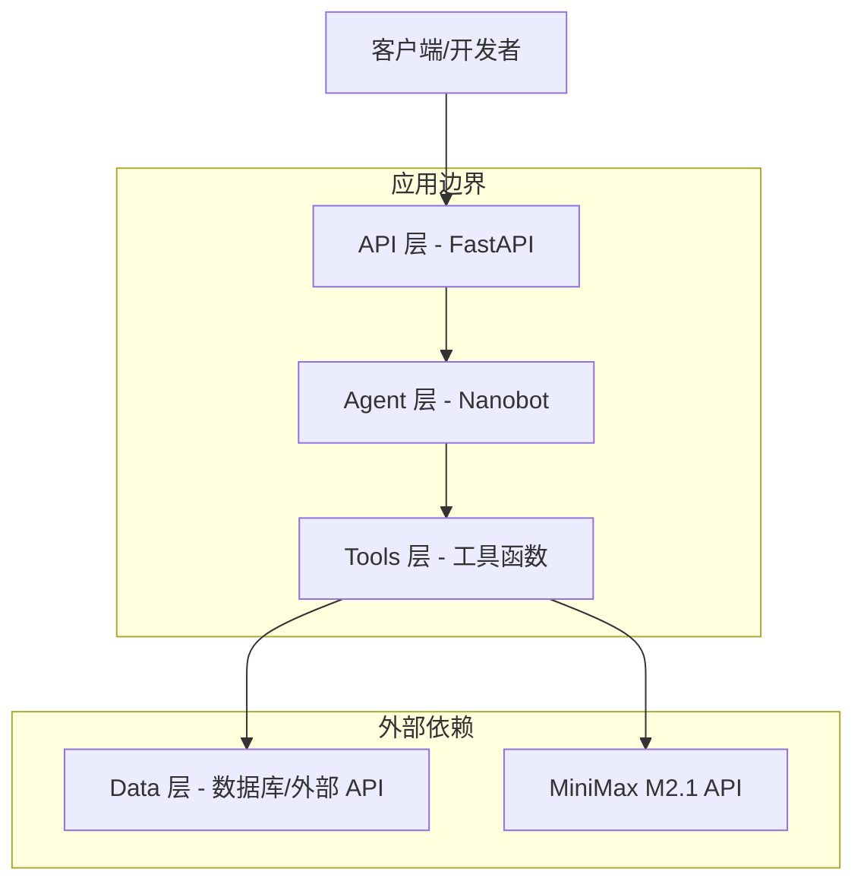
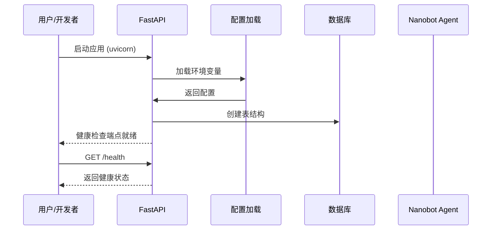

# 技术设计文档

## 概述

本项目初始化功能为 X-watcher 智能新闻助理系统建立完整的基础架构。通过创建标准化的目录结构、依赖配置、开发工具链和核心组件骨架，为后续功能开发提供坚实的工程基础。

**目标用户**：开发团队成员
**影响**：从无到有建立可运行的项目骨架，支持 TDD 开发流程

### 目标
- 建立符合 SDD 规范的项目目录结构
- 配置完整的开发工具链（格式化、Lint、测试）
- 创建可运行的 FastAPI 应用骨架
- 集成 Nanobot Agent 框架和 MiniMax LLM
- 配置数据持久化层（SQLite → PostgreSQL）

### 非目标
- 不包含具体的业务功能实现（如新闻抓取、AI 处理）
- 不包含部署配置（Docker、CI/CD）
- 不包含前端界面（CLI/Web UI 留待后续规格）

## 架构

### 架构模式与边界图



**架构集成**：
- **选择的模式**：分层架构（Layered Architecture）
- **领域/功能边界**：
  - API 层：HTTP 请求处理和路由
  - Agent 层：意图理解和工具调度
  - Tools 层：业务逻辑实现
  - Data 层：数据持久化和外部 API 调用
- **保留的现有模式**：遵循 steering 中定义的架构原则
- **新组件及其理由**：
  - `src/main.py`：FastAPI 应用入口，提供 Web 服务
  - `src/agent/config.py`：Nanobot Agent 配置，集成 LLM 能力
  - `src/database/models.py`：SQLAlchemy 模型，定义数据结构
- **遵循的原则**：
  - YAGNI：不提前实现不需要的功能
  - 单职责：每个组件有明确的单一职责
  - 易演进：工具函数独立，便于未来拆分为 Agent

### 技术栈

| 层级 | 选择 / 版本 | 角色说明 | 备注 |
|------|-------------|----------|------|
| **后端框架** | FastAPI >= 0.104 | Web 服务和 API | 自动文档、类型安全 |
| **Agent 框架** | HKUDS/nanobot | AI 代理调度 | 微内核、MCP 协议 |
| **LLM** | MiniMax M2.1 | 意图理解、摘要、翻译 | 高性价比 |
| **数据库** | SQLite → PostgreSQL | 数据持久化 | 开发/生产渐进 |
| **ORM** | SQLAlchemy >= 2.0 | 数据库操作 | 新式语法、异步支持 |
| **数据验证** | Pydantic >= 2.0 | 请求/响应验证 | 类型安全 |
| **测试** | pytest + pytest-asyncio | 测试框架 | TDD 支持 |
| **代码质量** | Ruff + Black | Lint + 格式化 | 快速、统一风格 |
| **日志** | Loguru | 日志记录 | 简洁、易用 |

## 系统流程



**流程决策**：
- 启动时验证环境变量完整性，缺失则快速失败
- 首次启动自动创建数据库表，无需手动迁移
- 健康检查端点用于验证服务可用性

## 核心技术决策

### 决策 1：使用 Ruff 替代 Flake8 + isort

**背景**：需要快速、可靠的代码 Lint 工具，支持大型项目的开发效率。

**备选方案**：
| 方案 | 优势 | 劣势 | 风险 |
|------|------|------|------|
| 1. Flake8 + isort | 成熟稳定，生态完善 | 速度慢，需维护两个工具 | 性能问题 |
| 2. Ruff | Rust 实现，快 10-100 倍，一体化工具 | 相对较新 | 生态成熟度 |
| 3. Pylint | 规则全面，深度分析 | 速度慢，配置复杂 | 性能和易用性 |

**选择方案**：Ruff

**理由**：
- 性能显著提升，大型项目体验更好
- 功能覆盖 Flake8 + isort + pyupgrade，减少工具链复杂度
- 配置更简单，维护成本低
- 已被 FastAPI、Pydantic 等主流项目采用

**权衡**：
- **接受**：Ruff 相对较新，但社区活跃度高
- **保留**：Black 用于代码格式化（Ruff 格式化功能不如 Black 成熟）

**后续影响**：
- 开发者需要适应新工具（学习成本低）
- CI/CD 流程需要更新配置

---

### 决策 2：Pydantic v2 原生语法

**背景**：FastAPI 0.100+ 已迁移到 Pydantic v2，存在破坏性变更。

**备选方案**：
| 方案 | 优势 | 劣势 | 风险 |
|------|------|------|------|
| 1. Pydantic v1 兼容模式 | 平滑迁移，代码无需修改 | 未来会被移除，技术债务 | 维护负担 |
| 2. Pydantic v2 原生语法 | 面向未来，性能更好 | 需要学习新语法 | 学习成本 |

**选择方案**：Pydantic v2 原生语法

**理由**：
- v1 兼容模式是临时过渡方案，长期不可持续
- v2 性能提升 5-50 倍
- 新项目没有历史包袱，应直接使用最新技术
- v2 的类型系统更强大，减少运行时错误

**权衡**：
- **接受**：开发者需要学习新语法（如 `model_validate()` 替代 `parse_obj()`）
- **降低**：指定明确的最低版本要求（Pydantic >= 2.0），避免兼容性问题

**后续影响**：
- 所有数据模型使用 v2 语法
- 文档和示例代码需遵循 v2 规范

---

### 决策 3：SQLite 开发，PostgreSQL 生产

**背景**：需要选择本地开发和生产环境的数据库方案。

**备选方案**：
| 方案 | 优势 | 劣势 | 风险 |
|------|------|------|------|
| 1. 全部使用 PostgreSQL | 环境一致，减少差异 | 本地需额外服务，部署复杂 | 开发体验 |
| 2. SQLite → PostgreSQL 渐进 | 本地无需额外服务，简单快速 | 方言差异（如 JSON 类型） | 兼容性问题 |
| 3. SQLite 全部使用 | 无需配置，极简 | 并发限制，不适合生产 | 扩展性 |

**选择方案**：SQLite → PostgreSQL 渐进路径

**理由**：
- 本地开发体验优先，无需安装和运行数据库服务
- 生产环境可横向扩展，支持高并发
- SQLAlchemy ORM 可以抽象大部分方言差异
- 遵循"开发简单，生产可靠"的原则

**权衡**：
- **接受**：需要注意 SQLite 和 PostgreSQL 的语法差异（如 JSON 类型处理）
- **降低**：使用 SQLAlchemy 的类型抽象，减少直接 SQL；测试覆盖两种数据库

**后续影响**：
- 测试需要覆盖两种数据库
- 部署时需要配置 PostgreSQL 连接
- Alembic 迁移脚本需要兼容两种方言

---

### 决策 4：环境变量优先于配置文件

**背景**：需要管理敏感信息（API 密钥）和配置。

**备选方案**：
| 方案 | 优势 | 劣势 | 风险 |
|------|------|------|------|
| 1. config.yaml + .env | 分层配置，结构清晰 | 复杂度增加，配置分散 | 维护成本 |
| 2. 仅 .env | 简单，12-factor 原则 | 缺少分层能力 | 扩展性 |
| 3. 环境变量硬编码 | 最简单 | 安全风险，无法版本控制 | 安全 |

**选择方案**：.env + python-dotenv

**理由**：
- 遵循 12-factor app 原则，配置与代码分离
- .env 文件可以添加到 .gitignore，避免泄露敏感信息
- python-dotenv 提供统一的加载机制
- 简单性优先，避免过度设计

**权衡**：
- **接受**：缺少分层配置能力（如 dev/staging/prod 环境）
- **降低**：未来可以通过多个 .env 文件（.env.dev, .env.prod）解决

**后续影响**：
- 需要提供 .env.example 模板
- 启动时需要验证必需的环境变量
- 文档需要说明环境变量配置方法

---

### 决策 5：Python 3.11 作为最低版本

**背景**：需要确定项目的最低 Python 版本要求。

**备选方案**：
| 方案 | 优势 | 劣势 | 风险 |
|------|------|------|------|
| 1. Python 3.9 | 兼容性更广 | 缺少性能和新特性 | 技术债务 |
| 2. Python 3.11 | 性能提升 10-60%，类型系统增强 | 部署环境可能不支持 | 兼容性 |
| 3. Python 3.12 | 最新特性 | 相对较新，生态未完全跟上 | 稳定性 |

**选择方案**：Python 3.11+

**理由**：
- 性能提升显著（特别是字符串处理，对本项目很重要）
- 完全支持 `|` 联合类型语法（PEP 604），代码更简洁
- 3.11 已是成熟稳定版本，被主流云平台支持
- 3.12 的新特性（如 `type` 语句）不是必需的

**权衡**：
- **接受**：部署环境需要 Python 3.11+（主流云平台都已支持）
- **降低**：不追求 3.12，避免生态系统兼容性问题

**后续影响**：
- pyproject.toml 中指定 `requires-python = ">=3.11"`
- CI/CD 流程需要配置 Python 3.11
- 开发者需要升级本地 Python 版本

## 需求追踪

| 需求 | 摘要 | 组件 | 接口 | 流程 |
|------|------|--------|------|------|
| 1 | 项目目录结构 | `src/`, `tests/`, `docs/`, `scripts/` | 文件系统 | 无 |
| 2 | 依赖管理配置 | `pyproject.toml` | pip | 无 |
| 3 | FastAPI 应用骨架 | `src/main.py` | HTTP API | 启动流程 |
| 4 | 环境配置管理 | `src/config.py`, `.env.example` | 环境变量 | 配置加载 |
| 5 | 数据库初始化 | `src/database/models.py` | SQLAlchemy | 建表流程 |
| 6 | Nanobot Agent 配置 | `src/agent/config.py` | LLM API | Agent 初始化 |
| 7 | 测试框架配置 | `tests/conftest.py` | pytest | 无 |
| 8 | 日志和错误处理 | `src/main.py` (中间件) | 日志输出 | 错误处理流程 |
| 9 | Git 配置 | `.gitignore` | Git | 无 |
| 10 | 文档和 README | `README.md`, `docs/` | 无 | 无 |

## 组件与接口

### 组件摘要

| 组件 | 领域/层 | 意图 | 需求覆盖 | 关键依赖 | 契约 |
|------|---------|------|----------|----------|------|
| `src/main.py` | API | FastAPI 应用入口和中间件配置 | 3, 8 | config.py, Loguru | Service, API |
| `src/config.py` | 基础设施 | 环境变量和配置管理 | 4 | python-dotenv, Pydantic | State |
| `src/agent/config.py` | Agent | Nanobot Agent 配置和工具注册 | 6 | nanobot-ai, MiniMax | Service |
| `src/database/models.py` | Data | SQLAlchemy 模型和表定义 | 5 | SQLAlchemy 2.0 | State |
| `tests/conftest.py` | 测试 | pytest Fixtures 和测试配置 | 7 | pytest, pytest-asyncio | Batch |

### API 层

#### `src/main.py` - FastAPI 应用

| 字段 | 详情 |
|------|------|
| 意图 | FastAPI 应用入口，配置中间件和路由 |
| 需求 | 3, 8 |
| 所有者 | 开发团队 |

**职责与约束**
- 创建 FastAPI 应用实例
- 配置 CORS 中间件（允许跨域请求）
- 配置全局异常处理中间件
- 注册健康检查端点
- 集成 Loguru 日志

**依赖**
- 入站：用户请求（HTTP）
- 出站：日志系统、数据库、Agent

**契约**：Service [x], API [x]

##### Service 接口
```python
class ApplicationFactory:
    def create_app() -> FastAPI:
        """创建并配置 FastAPI 应用实例"""

    def setup_middleware(app: FastAPI) -> None:
        """配置中间件"""

    def setup_routes(app: FastAPI) -> None:
        """注册路由"""
```

**前置条件**：环境变量已加载
**后置条件**：应用可接收 HTTP 请求
**不变式**：应用单例模式

##### API 契约
| 方法 | 端点 | 请求 | 响应 | 错误 |
|------|------|------|------|------|
| GET | /health | 无 | `{"status": "healthy"}` | 500 |

**实现注意事项**
- 集成：使用 `loguru` 替代标准 logging
- 验证：启动时验证必需的环境变量
- 风险：中间件顺序可能影响请求处理

### 基础设施层

#### `src/config.py` - 配置管理

| 字段 | 详情 |
|------|------|
| 意图 | 加载和验证环境变量配置 |
| 需求 | 4 |
| 所有者 | 开发团队 |

**职责与约束**
- 使用 `python-dotenv` 加载 `.env` 文件
- 使用 Pydantic 验证配置完整性
- 提供类型安全的配置访问

**依赖**
- 外部：python-dotenv, Pydantic

**契约**：State [x]

##### State 管理
- **状态模型**：不可变配置对象
- **持久化与一致性**：从 `.env` 文件加载，内存缓存
- **并发策略**：只读配置，无需锁

**实现注意事项**
- 集成：应用启动时加载一次
- 验证：Pydantic 自动验证类型和必填项
- 风险：敏感信息泄露（不记录日志）

### Agent 层

#### `src/agent/config.py` - Nanobot Agent 配置

| 字段 | 详情 |
|------|------|
| 意图 | 配置 Nanobot Agent 和 MiniMax LLM |
| 需求 | 6 |
| 所有者 | 开发团队 |

**职责与约束**
- 定义 Agent 系统提示
- 注册工具函数接口
- 配置 MiniMax API 连接

**依赖**
- 外部：nanobot-ai, MiniMax API

**契约**：Service [x]

##### Service 接口
```python
class AgentFactory:
    def create_agent() -> NanobotAgent:
        """创建并配置 Nanobot Agent 实例"""

    def register_tools(agent: NanobotAgent) -> None:
        """注册工具函数到 Agent"""
```

**前置条件**：MiniMax API 密钥已配置
**后置条件**：Agent 可接收用户输入并调用工具

**实现注意事项**
- 集成：使用 MiniMax 兼容 OpenAI SDK 格式
- 验证：测试 Agent 初始化是否成功
- 风险：Nanobot 文档不足，需探索实现

### 数据层

#### `src/database/models.py` - SQLAlchemy 模型

| 字段 | 详情 |
|------|------|
| 意图 | 定义数据库表结构和 ORM 模型 |
| 需求 | 5 |
| 所有者 | 开发团队 |

**职责与约束**
- 使用 SQLAlchemy 2.0 声明式基类
- 定义基础表：用户、偏好、新闻
- 支持异步操作

**依赖**
- 外部：SQLAlchemy >= 2.0

**契约**：State [x]

##### State 管理
- **状态模型**：关系型数据模型
- **持久化与一致性**：ACID 事务
- **并发策略**：数据库级锁

**实现注意事项**
- 集成：使用 Alembic 管理迁移
- 验证：首次启动自动建表
- 风险：SQLite 和 PostgreSQL 方言差异

### 测试层

#### `tests/conftest.py` - pytest 配置

| 字段 | 详情 |
|------|------|
| 意图 | 提供 pytest Fixtures 和测试配置 |
| 需求 | 7 |
| 所有者 | 开发团队 |

**职责与约束**
- 配置测试数据库（SQLite 内存模式）
- 提供应用实例 Fixture
- 提供数据库会话 Fixture

**依赖**
- 外部：pytest, pytest-asyncio

**契约**：Batch [x]

##### Batch / Job 契约
- **触发**：运行 `pytest`
- **输入/验证**：自动发现并执行测试
- **输出/目标**：测试报告和覆盖率
- **幂等性与恢复**：每次测试独立运行

## 数据模型

### 逻辑数据模型

**结构定义**：
- 实体关系和基数
  - 用户 1:N 偏好
  - 用户 1:N 新闻
- 属性和类型
  - 用户：id, name, email, created_at
  - 偏好：id, user_id, key, value
  - 新闻：id, user_id, content, source, created_at
- 自然键：用户 email
- 参照完整性：外键约束

**一致性与完整性**：
- 事务边界：每个请求一个事务
- 级联规则：删除用户时级联删除偏好和新闻
- 时间方面：使用 UTC 时间戳

### 物理数据模型

**关系型数据库**：
```python
# users 表
CREATE TABLE users (
    id INTEGER PRIMARY KEY,
    name VARCHAR NOT NULL,
    email VARCHAR UNIQUE NOT NULL,
    created_at TIMESTAMP DEFAULT CURRENT_TIMESTAMP
);

# preferences 表
CREATE TABLE preferences (
    id INTEGER PRIMARY KEY,
    user_id INTEGER REFERENCES users(id) ON DELETE CASCADE,
    key VARCHAR NOT NULL,
    value VARCHAR NOT NULL
);

# news_items 表
CREATE TABLE news_items (
    id INTEGER PRIMARY KEY,
    user_id INTEGER REFERENCES users(id) ON DELETE CASCADE,
    content TEXT NOT NULL,
    source VARCHAR NOT NULL,
    created_at TIMESTAMP DEFAULT CURRENT_TIMESTAMP
);
```

**索引和性能优化**：
- `users.email` 唯一索引
- `news_items.user_id` 索引（优化查询）

### 数据契约与集成

**API 数据传输**：
- 使用 Pydantic 模型验证请求/响应
- JSON 序列化格式

## 错误处理

### 错误策略

**用户错误 (4xx)**：
- 缺少环境变量 → 启动时明确报错，列出缺失项
- 无效请求输入 → Pydantic 验证错误返回 400
- 资源不存在 → 返回 404 和友好提示

**系统错误 (5xx)**：
- 数据库连接失败 → 记录错误日志，返回 500
- MiniMax API 超时 → 记录日志，返回 503
- 未捕获异常 → 全局异常中间件捕获，返回 500

**业务逻辑错误 (422)**：
- 数据验证失败 → 返回 422 和字段级错误

### 监控
- 使用 Loguru 记录所有错误
- 开发环境输出到控制台
- 生产环境输出到文件（按日期轮转）

## 测试策略

### 单元测试
- `src/config.py` 配置加载逻辑
- `src/database/models.py` 模型验证

### 集成测试
- FastAPI 应用启动流程
- 数据库连接和表创建
- Agent 初始化和工具注册

### 性能测试（暂不需要）
- 项目初始化无性能要求

## 迁移策略

无需数据迁移（新项目）。

## 支持参考

无额外参考内容。
