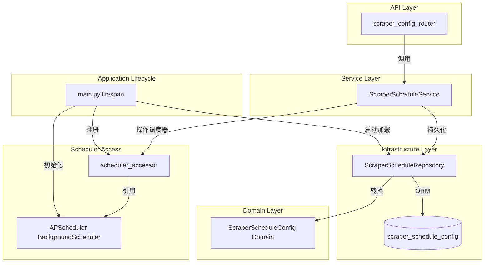
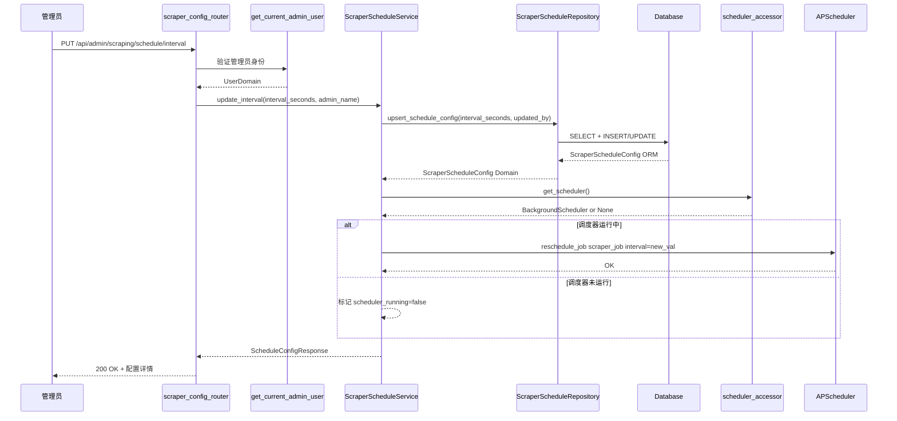
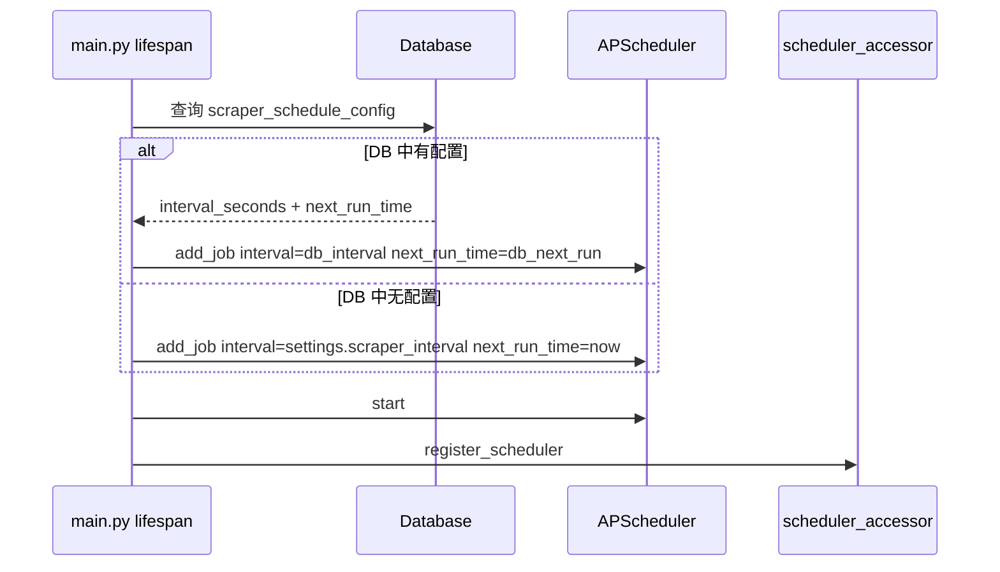

# 技术设计文档

## 概述

**目的**: 本功能为管理员提供运行时调度配置管理能力，支持动态修改抓取间隔和下次触发时间，无需重启服务。

**用户**: 系统管理员通过 RESTful API 端点管理 X-watcher 的定时抓取调度行为。

**影响**: 扩展现有 preference 模块的管理员配置能力，新增调度器访问层以实现运行时调度修改和数据库持久化。

### 目标
- 管理员可运行时查看、修改抓取间隔和下次触发时间
- 配置变更立即生效于运行中的 APScheduler job
- 配置持久化到数据库，重启后自动恢复
- 复用现有管理员认证机制和六边形架构模式

### 非目标
- 不修改现有 `config.py` Settings 机制（动态配置独立存储在 DB 中）
- 不提供前端 UI（仅 API 端点）
- 不支持多调度 job 管理（仅管理 `scraper_job`）
- 不修改抓取逻辑本身（仅调度参数）

## 架构

### 现有架构分析

当前调度系统的约束：
- APScheduler `BackgroundScheduler` 实例为 `main.py` 模块级私有变量 `_scheduler`
- 调度间隔从 `settings.scraper_interval` 只读加载，无运行时修改入口
- preference 模块已建立完整的六边形架构（API → Service → Domain → Repository）
- 管理员认证 `get_current_admin_user()` 已实现并在 scraper_config_router 中使用

### 架构模式与边界



**架构集成**:
- 选定模式: 扩展现有 preference 模块的六边形架构 + 新增 scheduler_accessor 模块
- 域边界: 调度配置作为 preference 模块的子域，共享管理员 API 前缀
- 保留的现有模式: Repository/Service/Domain 分层、AsyncSession 依赖注入、管理员认证
- 新组件理由: `scheduler_accessor` 解决循环依赖；独立 Repository/Service 保持单一职责
- steering 合规: 六边形架构、TDD、YAGNI

### 技术栈

| 层级 | 选择/版本 | 在本特性中的角色 | 备注 |
|------|-----------|-----------------|------|
| 后端服务 | FastAPI + APScheduler 3.10+ | API 端点 + 调度器运行时操作 | 现有依赖，无新增 |
| 数据存储 | SQLAlchemy 2.x + SQLite/PostgreSQL | ORM 模型 + 异步数据访问 | 现有依赖 |
| 数据库迁移 | Alembic | 新建 `scraper_schedule_config` 表 | 现有工具链 |
| 认证 | JWT + API Key（现有） | 管理员端点保护 | 复用 `get_current_admin_user` |

无新增外部依赖。

## 系统流程

### 管理员修改调度配置流程



### 应用启动恢复流程



## 需求追溯

| 需求 | 摘要 | 组件 | 接口 | 流程 |
|------|------|------|------|------|
| 1.1 | GET 返回调度配置 | ScraperScheduleService, ScraperScheduleRepository | GET /schedule API | 查看流程 |
| 1.2 | 调度器未运行时返回状态 | ScraperScheduleService, scheduler_accessor | GET /schedule API | 查看流程 |
| 1.3 | 无 DB 记录时返回默认值 | ScraperScheduleService | GET /schedule API | 查看流程 |
| 1.4 | 认证保护 | scraper_config_router | GET /schedule API | — |
| 2.1 | 设置间隔并更新调度器 | ScraperScheduleService, ScraperScheduleRepository, scheduler_accessor | PUT /schedule/interval API | 修改流程 |
| 2.2 | 间隔范围验证 300-604800 | UpdateScheduleIntervalRequest schema | PUT /schedule/interval API | — |
| 2.3 | 无效范围返回 422 | UpdateScheduleIntervalRequest schema | PUT /schedule/interval API | — |
| 2.4 | 调度器未运行时仍持久化 | ScraperScheduleService | PUT /schedule/interval API | 修改流程 |
| 2.5 | 返回更新后的配置 | ScraperScheduleService | PUT /schedule/interval API | — |
| 2.6 | 认证保护 | scraper_config_router | PUT /schedule/interval API | — |
| 3.1 | 设置下次触发时间并更新调度器 | ScraperScheduleService, ScraperScheduleRepository, scheduler_accessor | PUT /schedule/next-run API | 修改流程 |
| 3.2 | 时间验证：未来 30 秒容差，不超 30 天 | ScraperScheduleService | PUT /schedule/next-run API | — |
| 3.3 | 过去时间返回 422 | UpdateScheduleNextRunRequest schema, ScraperScheduleService | PUT /schedule/next-run API | — |
| 3.4 | 超过 30 天返回 422 | UpdateScheduleNextRunRequest schema, ScraperScheduleService | PUT /schedule/next-run API | — |
| 3.5 | 触发后恢复间隔调度 | APScheduler 内置行为 | — | — |
| 3.6 | 调度器未运行时仍持久化 | ScraperScheduleService | PUT /schedule/next-run API | 修改流程 |
| 3.7 | 认证保护 | scraper_config_router | PUT /schedule/next-run API | — |
| 4.1 | 启动时从 DB 恢复间隔 | main.py lifespan | — | 启动恢复流程 |
| 4.2 | 启动时从 DB 恢复下次触发时间 | main.py lifespan | — | 启动恢复流程 |
| 4.3 | 无 DB 配置时使用环境变量默认值 | main.py lifespan | — | 启动恢复流程 |
| 4.4 | 记录更新时间和更新人 | ScraperScheduleRepository | — | — |
| 5.1 | 所有端点要求管理员认证 | scraper_config_router | 所有 API | — |
| 5.2 | 缺少凭证返回 401 | get_current_admin_user | 所有 API | — |
| 5.3 | 非管理员返回 403 | get_current_admin_user | 所有 API | — |

## 组件与接口

| 组件 | 域/层 | 意图 | 需求覆盖 | 关键依赖 | 契约 |
|------|-------|------|----------|----------|------|
| scheduler_accessor | 调度器访问层 | 提供 APScheduler 实例的安全访问 | 2.1, 3.1 | APScheduler (P0) | Service |
| ScraperScheduleRepository | Infrastructure | 调度配置的 DB 持久化 | 2.1, 3.1, 4.1-4.4 | AsyncSession (P0) | Service |
| ScraperScheduleService | Service | 调度配置业务逻辑与调度器操作 | 1.1-1.3, 2.1-2.5, 3.1-3.6 | Repository (P0), Accessor (P0) | Service |
| scraper_config_router 扩展 | API | 3 个管理员端点 | 1.4, 2.6, 3.7, 5.1-5.3 | Service (P0), Auth (P0) | API |
| ScraperScheduleConfig ORM | Infrastructure | 数据库表映射 | 4.1-4.4 | Base (P0) | — |
| ScraperScheduleConfig Domain | Domain | 领域数据模型 | — | — | — |
| main.py lifespan 扩展 | Application | 启动时加载 DB 配置 + 注册 accessor | 4.1-4.3 | Accessor (P0), Repository (P0) | — |

### 调度器访问层

#### scheduler_accessor

| 字段 | 详情 |
|------|------|
| 意图 | 提供从 Service 层安全访问 APScheduler 实例的接口，避免循环导入 |
| 需求 | 2.1, 3.1 |

**职责与约束**
- 持有 APScheduler `BackgroundScheduler` 实例的全局引用
- 仅在 `main.py` lifespan 中注册/注销
- 返回 `None` 表示调度器未运行

**依赖**
- External: `apscheduler.schedulers.background.BackgroundScheduler` — 类型引用 (P0)

**契约**: Service [x]

##### 服务接口

```python
# src/scheduler_accessor.py

def register_scheduler(scheduler: BackgroundScheduler) -> None:
    """注册调度器引用。在 main.py lifespan 启动时调用。"""

def get_scheduler() -> BackgroundScheduler | None:
    """获取调度器引用。返回 None 表示调度器未运行。"""

def unregister_scheduler() -> None:
    """注销调度器引用。在 main.py lifespan 关闭时调用。"""
```

- 前置条件: `register_scheduler` 在 `get_scheduler` 之前调用
- 后置条件: `unregister_scheduler` 后 `get_scheduler` 返回 `None`
- 不变量: 全局引用为线程安全的简单赋值

### Infrastructure 层

#### ScraperScheduleRepository

| 字段 | 详情 |
|------|------|
| 意图 | 调度配置的数据库 CRUD 操作（singleton 单行模式） |
| 需求 | 2.1, 3.1, 4.1-4.4 |

**职责与约束**
- 管理 `scraper_schedule_config` 表的单行记录（id=1）
- 使用 `flush()` 而非 `commit()`（由调用方控制事务）
- 返回领域模型，不暴露 ORM 模型

**依赖**
- Inbound: ScraperScheduleService — 数据访问 (P0)
- External: SQLAlchemy AsyncSession — 数据库操作 (P0)

**契约**: Service [x]

##### 服务接口

```python
class ScraperScheduleRepository:
    def __init__(self, session: AsyncSession) -> None: ...

    async def get_schedule_config(self) -> ScraperScheduleConfigDomain | None:
        """获取调度配置。返回 None 表示无配置记录。"""

    async def upsert_schedule_config(
        self,
        interval_seconds: int | None = None,
        next_run_time: datetime | None = None,
        updated_by: str = "",
    ) -> ScraperScheduleConfigDomain:
        """创建或更新调度配置。至少需提供一个配置参数。"""
```

- 前置条件: session 处于活跃事务中
- 后置条件: 数据已 flush 但未 commit
- 不变量: 表中最多存在一行（id=1）

**实现备注**
- 参考 `ScraperConfigRepository` 的错误处理模式（`RepositoryError`, `NotFoundError`）
- `upsert` 逻辑: 先 `SELECT WHERE id=1`，存在则更新，不存在则 `INSERT`

#### ScraperScheduleConfig ORM 模型

**位置**: `src/database/models.py`

```python
class ScraperScheduleConfig(Base):
    __tablename__ = "scraper_schedule_config"

    id: Mapped[int] = mapped_column(Integer, primary_key=True)
    interval_seconds: Mapped[int] = mapped_column(
        Integer, nullable=False, default=43200
    )
    next_run_time: Mapped[datetime | None] = mapped_column(
        DateTime, nullable=True
    )
    updated_at: Mapped[datetime] = mapped_column(
        DateTime, nullable=False,
        default=lambda: datetime.now(timezone.utc)
    )
    updated_by: Mapped[str] = mapped_column(
        String(100), nullable=False
    )
```

### Domain 层

#### ScraperScheduleConfig 领域模型

**位置**: `src/preference/domain/models.py`

```python
class ScraperScheduleConfig(BaseModel):
    """调度配置领域模型。"""
    id: int
    interval_seconds: int
    next_run_time: datetime | None
    updated_at: datetime
    updated_by: str

    @classmethod
    def from_orm(cls, orm_obj) -> "ScraperScheduleConfig": ...
```

### Service 层

#### ScraperScheduleService

| 字段 | 详情 |
|------|------|
| 意图 | 协调调度配置的业务逻辑：验证、持久化、调度器操作 |
| 需求 | 1.1-1.3, 2.1-2.5, 3.1-3.6 |

**职责与约束**
- 验证业务规则（间隔范围、时间有效性）
- 持久化配置到数据库
- 通过 scheduler_accessor 操作运行中的调度器
- 调度器未运行时仍正常持久化，并在响应中标注状态

**依赖**
- Inbound: scraper_config_router — API 调用 (P0)
- Outbound: ScraperScheduleRepository — 数据持久化 (P0)
- Outbound: scheduler_accessor — 调度器操作 (P0)
- Outbound: config.get_settings() — 获取默认间隔值 (P1)

**契约**: Service [x]

##### 服务接口

```python
class ScraperScheduleService:
    def __init__(self, repository: ScraperScheduleRepository) -> None: ...

    async def get_schedule_config(self) -> ScheduleConfigResponse:
        """获取当前调度配置。
        合并 DB 配置 + 调度器运行状态 + 环境变量默认值。
        """

    async def update_interval(
        self, interval_seconds: int, updated_by: str
    ) -> ScheduleConfigResponse:
        """更新抓取间隔。
        验证: 300 <= interval_seconds <= 604800
        操作: 持久化 → reschedule_job（如调度器运行中）
        """

    async def update_next_run_time(
        self, next_run_time: datetime, updated_by: str
    ) -> ScheduleConfigResponse:
        """设置下次触发时间。
        验证: 未来时间（-30s 容差），不超过 30 天
        操作: 持久化 → modify_job next_run_time（如调度器运行中）
        """
```

- 前置条件: 参数已通过 Pydantic schema 基础验证
- 后置条件: DB 已更新；调度器已同步（如运行中）
- 不变量: `ScheduleConfigResponse.scheduler_running` 准确反映调度器状态

**实现备注**
- `get_schedule_config`: 当 DB 无记录时，使用 `get_settings().scraper_interval` 作为默认值；通过 `scheduler_accessor.get_scheduler()` 获取运行状态和 `next_run_time`
- `update_interval`: 调用 `scheduler.reschedule_job("scraper_job", trigger="interval", seconds=new_val)`
- `update_next_run_time`: 调用 `scheduler.modify_job("scraper_job", next_run_time=new_time)`
- 调度器未运行时: 配置仍持久化，`ScheduleConfigResponse.scheduler_running = False`，添加 `message` 字段提示

### API 层

#### scraper_config_router 扩展

| 字段 | 详情 |
|------|------|
| 意图 | 3 个管理员调度配置 API 端点 |
| 需求 | 1.4, 2.6, 3.7, 5.1-5.3 |

**依赖**
- Inbound: HTTP 客户端 — API 请求 (P0)
- Outbound: ScraperScheduleService — 业务逻辑 (P0)
- External: get_current_admin_user — 认证 (P0)

**契约**: API [x]

##### API 契约

| 方法 | 端点 | 请求 | 响应 | 错误 |
|------|------|------|------|------|
| GET | /api/admin/scraping/schedule | — | ScheduleConfigResponse | 401, 403, 500 |
| PUT | /api/admin/scraping/schedule/interval | UpdateScheduleIntervalRequest | ScheduleConfigResponse | 401, 403, 422, 500 |
| PUT | /api/admin/scraping/schedule/next-run | UpdateScheduleNextRunRequest | ScheduleConfigResponse | 401, 403, 422, 500 |

## 数据模型

### 领域模型

- **聚合根**: `ScraperScheduleConfig` — 全局唯一的调度配置
- **实体**: 单一实体，无子实体
- **值对象**: `interval_seconds` (int), `next_run_time` (datetime | None)
- **业务规则**:
  - `interval_seconds` 范围: [300, 604800]
  - `next_run_time` 须为未来时间（-30s 容差），不超过当前时间 30 天
  - `next_run_time` 为一次性覆盖，触发后由 APScheduler 自动恢复间隔调度

### 物理数据模型

**表: `scraper_schedule_config`**

| 列名 | 类型 | 约束 | 默认值 | 说明 |
|------|------|------|--------|------|
| id | INTEGER | PRIMARY KEY | — | 固定为 1（singleton） |
| interval_seconds | INTEGER | NOT NULL | 43200 | 抓取间隔（秒） |
| next_run_time | DATETIME | NULLABLE | NULL | 管理员设置的下次触发时间 |
| updated_at | DATETIME | NOT NULL | — | 最后更新时间 (UTC) |
| updated_by | VARCHAR(100) | NOT NULL | — | 最后更新人标识 |

无外键关系。无需索引（单行表）。

### 数据契约

**请求 Schema**

```python
class UpdateScheduleIntervalRequest(BaseModel):
    interval_seconds: int = Field(
        ..., ge=300, le=604800,
        description="抓取间隔（秒），300-604800"
    )

class UpdateScheduleNextRunRequest(BaseModel):
    next_run_time: datetime = Field(
        ..., description="下次触发时间（ISO 8601，必须为未来时间）"
    )
```

**响应 Schema**

```python
class ScheduleConfigResponse(BaseModel):
    interval_seconds: int = Field(..., description="当前抓取间隔（秒）")
    next_run_time: datetime | None = Field(None, description="下次触发时间")
    scheduler_running: bool = Field(..., description="调度器是否运行中")
    updated_at: datetime | None = Field(None, description="最后配置更新时间")
    updated_by: str | None = Field(None, description="最后更新人")
    message: str | None = Field(None, description="附加信息（如调度器未运行提示）")
```

## 错误处理

### 错误策略

遵循项目现有模式：Pydantic 验证错误 → 422；业务规则违反 → 422 (HTTPException)；认证失败 → 401/403；服务器异常 → 500。

### 错误分类

| 类别 | 触发条件 | HTTP 状态 | 响应 |
|------|----------|-----------|------|
| 验证错误 | interval 超出 [300, 604800] | 422 | Pydantic 标准错误 |
| 验证错误 | next_run_time 为过去时间 | 422 | `{"detail": "下次触发时间必须为未来时间"}` |
| 验证错误 | next_run_time 超过 30 天 | 422 | `{"detail": "下次触发时间不能超过 30 天后"}` |
| 认证失败 | 缺少凭证 | 401 | `{"detail": "未认证"}` |
| 权限不足 | 非管理员用户 | 403 | `{"detail": "需要管理员权限"}` |
| 调度器异常 | APScheduler job 操作失败 | 500 | `{"detail": "调度器操作失败"}` |

### 监控

- 调度配置变更记录 INFO 级别日志（操作人、变更内容）
- 调度器操作失败记录 ERROR 级别日志

## 测试策略

### 单元测试
- `scheduler_accessor`: register/get/unregister 生命周期、未注册时返回 None
- `ScraperScheduleRepository`: get（空表/有数据）、upsert（创建/更新）
- `ScraperScheduleService`: get_config（有/无 DB 配置、调度器运行/未运行）、update_interval（正常/超范围）、update_next_run_time（正常/过去/超 30 天）

### 集成测试
- API GET /schedule: 默认配置返回、认证保护
- API PUT /schedule/interval: 正常更新、无效值 422、未认证 401、非管理员 403
- API PUT /schedule/next-run: 正常更新、过去时间 422、超 30 天 422
- 配合 mock scheduler 验证 Service 层调度器操作调用

### 测试 fixture 模式
- 参考 `tests/preference/test_admin_api.py`:
  - 创建独立 `FastAPI()` 实例 + `include_router`
  - `app.dependency_overrides[get_async_session]` 注入测试 session
  - `app.dependency_overrides[get_current_admin_user]` mock 管理员
  - `AsyncClient(ASGITransport(app=app))` 测试 HTTP 请求

## 迁移策略

- 新建 Alembic migration: `alembic revision --autogenerate -m "add scraper_schedule_config table"`
- `upgrade()`: 创建 `scraper_schedule_config` 表，`server_default='43200'` 为 `interval_seconds`
- `downgrade()`: 删除 `scraper_schedule_config` 表
- 迁移为纯增量操作，不影响现有表
