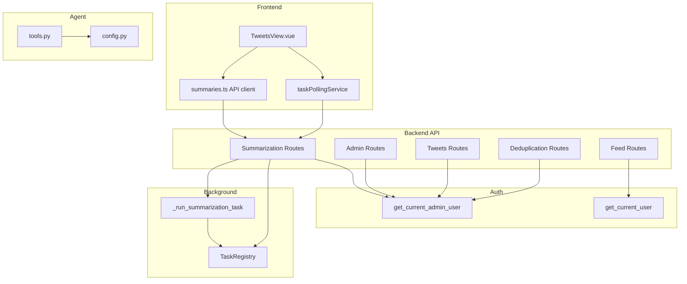
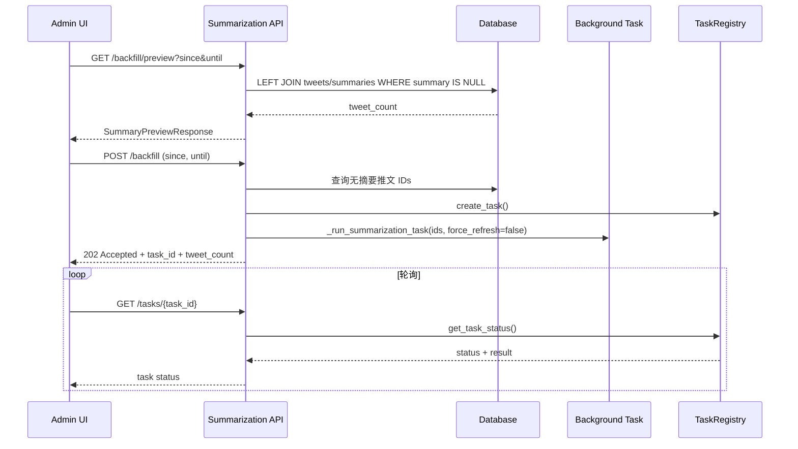

# 技术设计文档

## Overview

**Purpose**: 本功能为 X-watcher Web 管理界面新增推文摘要修复能力（补缺 + 重置），并统一全系统 API 权限管理。
**Users**: 管理员通过 Web UI 或 API 执行批量摘要修复操作；AI Agent 通过工具调用自动化摘要质量维护。
**Impact**: 扩展现有摘要 API 增加 4 个端点，为 17 个现有端点添加认证保护，前端推文列表页增加摘要工具下拉菜单。

### Goals
- 为缺少摘要的推文提供批量补缺能力（`force_refresh=false`）
- 为指定时间窗口的推文提供批量重置能力（`force_refresh=true`）
- 统一所有 API 端点的认证保护（Feed 普通权限，其他管理员权限）
- 在推文列表页提供可视化的摘要修复操作界面
- 注册 Agent 工具元数据，支持自动化调用

### Non-Goals
- 不修改现有 `_run_summarization_task()` 后台任务逻辑
- 不修改现有 LLM 调用、摘要生成或翻译逻辑
- 不引入新的数据库表或迁移
- 不实现摘要质量评估或自动检测
- 不修改前端认证流程（`client.ts` 已自动注入 API Key）

## Architecture

### Existing Architecture Analysis

当前系统采用 API + Service 层架构，摘要模块结构：

```
API 层 (routes.py + schemas.py)
    ↓ BackgroundTasks
后台任务 (_run_summarization_task)
    ↓ asyncio.new_event_loop
Service 层 (SummarizationService.summarize_tweets)
    ↓
Infrastructure 层 (SummarizationRepository + LLM clients)
```

现有约束：
- 后台任务使用独立事件循环（非 FastAPI 主循环），通过 `TaskRegistry` 单例管理状态
- 认证通过 FastAPI `Depends()` 注入，`get_current_admin_user` 支持 JWT/API Key/ADMIN_API_KEY 三种方式
- 前端 `client.ts` 全局拦截器自动注入 `X-API-Key` header

### Architecture Pattern & Boundary Map



**Architecture Integration**:
- **Selected pattern**: 扩展现有组件（Extension），在现有文件中追加功能
- **Domain boundaries**: 补缺/重置端点属于 Summarization 域，与现有批量摘要端点同域
- **Existing patterns preserved**: BackgroundTasks + TaskRegistry + Depends() 认证注入
- **New components rationale**: 无新组件，仅扩展现有文件
- **Steering compliance**: 遵循 YAGNI、单职责、模块化分层原则

### Technology Stack

| Layer | Choice / Version | Role in Feature | Notes |
|-------|------------------|-----------------|-------|
| Frontend | Vue 3 + Element Plus | 下拉菜单 + 对话框 + 日期选择器 | `el-dropdown` / `el-dialog` / `el-date-picker` |
| Backend | FastAPI + Pydantic v2 | 4 个新端点 + 17 个端点认证 | 复用 `Depends()` 模式 |
| Data | SQLAlchemy async + SQLite | LEFT JOIN 查询无摘要推文 | 复用 `TweetOrm` / `SummaryOrm` |
| Background | BackgroundTasks + asyncio | 异步执行批量 LLM 调用 | 完全复用 `_run_summarization_task()` |

## System Flows

### 补缺流程



重置流程与补缺流程相同，差异仅在：
- 查询条件：`WHERE created_at BETWEEN since AND until`（不过滤 summary 存在与否）
- 执行参数：`force_refresh=true`

## Requirements Traceability

| Requirement | Summary | Components | Interfaces | Flows |
|-------------|---------|------------|------------|-------|
| 1.1 | 补缺预览查询无摘要推文数量 | SummarizationRoutes | `GET /backfill/preview` | 补缺流程 |
| 1.2 | 补缺预览支持可选时间范围 | SummarizationRoutes | `GET /backfill/preview` query params | 补缺流程 |
| 1.3 | 补缺执行创建后台任务 | SummarizationRoutes, BackgroundTask | `POST /backfill` | 补缺流程 |
| 1.4 | 无需补缺时返回 404 | SummarizationRoutes | `POST /backfill` 404 | — |
| 1.5 | 通过 TaskRegistry 管理任务生命周期 | TaskRegistry | `GET /tasks/{task_id}` | 补缺流程轮询 |
| 2.1 | 重置预览查询时间范围内推文数量 | SummarizationRoutes | `GET /reset/preview` | 重置流程 |
| 2.2 | 重置执行创建后台任务 force_refresh=true | SummarizationRoutes, BackgroundTask | `POST /reset` | 重置流程 |
| 2.3 | since >= until 返回 422 | SummarizationRoutes | `POST /reset` 422 | — |
| 2.4 | 无推文时返回 404 | SummarizationRoutes | `POST /reset` 404 | — |
| 2.5 | 与补缺共享任务查询机制 | TaskRegistry | `GET /tasks/{task_id}` | — |
| 3.1 | Feed API 普通用户认证 | FeedRoutes | `get_current_user` | — |
| 3.2 | Summarization API 管理员认证 | SummarizationRoutes | `get_current_admin_user` | — |
| 3.3 | Admin API 管理员认证 | AdminRoutes | `get_current_admin_user` | — |
| 3.4 | Tweets API 管理员认证 | TweetsRoutes | `get_current_admin_user` | — |
| 3.5 | Deduplication API 管理员认证 | DeduplicationRoutes | `get_current_admin_user` | — |
| 3.6 | 无凭证返回 401 | Auth middleware | — | — |
| 3.7 | 非管理员返回 403 | Auth middleware | — | — |
| 4.1 | 摘要工具下拉菜单 | TweetsView | `el-dropdown` | — |
| 4.2 | 补缺对话框 + 时间范围选择器 | TweetsView | `el-dialog` + `el-date-picker` | 补缺流程 |
| 4.3 | 补缺查询按钮调用 preview API | TweetsView | `summariesApi.previewBackfill()` | 补缺流程 |
| 4.4 | 补缺确认执行 + 轮询进度 | TweetsView | `summariesApi.startBackfill()` + polling | 补缺流程 |
| 4.5 | 重置对话框 + danger 样式 | TweetsView | `el-dialog` type=danger | 重置流程 |
| 4.6 | 重置查询按钮调用 preview API | TweetsView | `summariesApi.previewReset()` | 重置流程 |
| 4.7 | 重置确认执行 + 轮询进度 | TweetsView | `summariesApi.startReset()` + polling | 重置流程 |
| 4.8 | 任务执行中禁用操作按钮 | TweetsView | disabled state | — |
| 5.1 | 注册 summary_backfill 工具 | AgentTools | tool metadata | — |
| 5.2 | 注册 summary_reset 工具 | AgentTools | tool metadata | — |
| 5.3 | 系统提示包含修复工具说明 | AgentConfig | SYSTEM_PROMPT | — |

## Components and Interfaces

| Component | Domain/Layer | Intent | Req Coverage | Key Dependencies | Contracts |
|-----------|--------------|--------|--------------|-----------------|-----------|
| SummarizationSchemas | Backend/API | 补缺/重置请求响应模型 | 1.1-1.4, 2.1-2.4 | Pydantic (P0) | API |
| SummarizationRoutes | Backend/API | 4 个新端点 + 6 个现有端点认证 | 1.1-1.5, 2.1-2.5, 3.2 | Auth (P0), TaskRegistry (P0), SQLAlchemy (P0) | API, Batch |
| AdminRoutes | Backend/API | 4 个现有端点添加认证 | 3.3 | Auth (P0) | API |
| TweetsRoutes | Backend/API | 2 个现有端点添加认证 | 3.4 | Auth (P0) | API |
| DeduplicationRoutes | Backend/API | 5 个现有端点添加认证 | 3.5 | Auth (P0) | API |
| SummariesApiClient | Frontend/API | 4 个新 API 方法 | 4.3, 4.4, 4.6, 4.7 | client.ts (P0) | API |
| TweetsView | Frontend/UI | 下拉菜单 + 2 个对话框 | 4.1-4.8 | SummariesApiClient (P0), taskPollingService (P0) | State |
| AgentTools | Agent/Config | 2 个工具元数据 + 系统提示 | 5.1-5.3 | — | — |

### Backend / API Layer

#### SummarizationSchemas (扩展 `src/summarization/api/schemas.py`)

| Field | Detail |
|-------|--------|
| Intent | 定义补缺/重置 API 的请求和响应 Pydantic 模型 |
| Requirements | 1.1, 1.2, 1.3, 2.1, 2.2, 2.3 |

**Responsibilities & Constraints**
- 请求参数验证（时间范围、`since < until` 校验）
- 响应序列化（task_id、status、tweet_count）

**Contracts**: API [x]

##### API Contract — Data Models

```python
class SummaryPreviewResponse(BaseModel):
    """预览响应 — 补缺和重置共用。"""
    tweet_count: int = Field(..., ge=0, description="受影响推文数量")

class SummaryBackfillRequest(BaseModel):
    """补缺请求 — 可选时间范围。"""
    since: datetime | None = Field(None, description="起始时间（含）")
    until: datetime | None = Field(None, description="截止时间（不含）")

class SummaryBackfillResponse(BaseModel):
    """补缺响应。"""
    task_id: str = Field(..., description="任务 ID")
    status: Literal["pending", "running", "completed", "failed"]
    tweet_count: int = Field(..., ge=0, description="补缺推文数量")

class SummaryResetRequest(BaseModel):
    """重置请求 — 必填时间范围，since 必须早于 until。"""
    since: datetime = Field(..., description="起始时间（含）")
    until: datetime = Field(..., description="截止时间（不含）")

    @field_validator("until")
    @classmethod
    def validate_time_range(cls, v, info):
        if info.data.get("since") and v <= info.data["since"]:
            raise ValueError("until 必须晚于 since")
        return v

class SummaryResetResponse(BaseModel):
    """重置响应。"""
    task_id: str = Field(..., description="任务 ID")
    status: Literal["pending", "running", "completed", "failed"]
    tweet_count: int = Field(..., ge=0, description="重置推文数量")
```

**Implementation Notes**
- `SummaryPreviewResponse` 同时用于补缺和重置的 preview 端点
- `SummaryResetRequest` 使用 `field_validator` 校验 `since < until`，无效时 Pydantic 自动返回 422

---

#### SummarizationRoutes (扩展 `src/summarization/api/routes.py`)

| Field | Detail |
|-------|--------|
| Intent | 提供摘要补缺和重置的 preview + execute 端点，并为所有现有端点添加管理员认证 |
| Requirements | 1.1-1.5, 2.1-2.5, 3.2 |

**Responsibilities & Constraints**
- 查询无摘要推文（LEFT JOIN + WHERE NULL）
- 查询时间范围内推文（WHERE between）
- 编排后台任务（创建任务 → 收集 IDs → 提交后台执行）
- 所有端点要求 `get_current_admin_user` 认证

**Dependencies**
- Inbound: Frontend SummariesApiClient — HTTP 调用 (P0)
- Outbound: `_run_summarization_task()` — 后台任务执行 (P0)
- Outbound: TaskRegistry — 任务状态管理 (P0)
- Outbound: SQLAlchemy session — 数据库查询 (P0)
- External: `get_current_admin_user` — 认证 (P0)

**Contracts**: API [x] / Batch [x]

##### API Contract

| Method | Endpoint | Request | Response | Errors |
|--------|----------|---------|----------|--------|
| GET | `/api/summaries/backfill/preview` | Query: `since?`, `until?` | `SummaryPreviewResponse` | 401, 403 |
| POST | `/api/summaries/backfill` | `SummaryBackfillRequest` | `SummaryBackfillResponse` (202) | 401, 403, 404 |
| GET | `/api/summaries/reset/preview` | Query: `since`, `until` | `SummaryPreviewResponse` | 401, 403, 422 |
| POST | `/api/summaries/reset` | `SummaryResetRequest` | `SummaryResetResponse` (202) | 401, 403, 404, 422 |

##### Batch / Job Contract
- **Trigger**: POST 端点接收请求后立即返回 202
- **Input**: 从数据库查询得到的 `tweet_ids: list[str]`
- **Output**: 通过 `TaskRegistry` 管理状态，前端轮询 `GET /tasks/{task_id}`
- **Idempotency**: 补缺幂等（已有摘要的推文不会被重复处理，`force_refresh=false`）；重置非幂等（`force_refresh=true` 总会重新生成）

##### 辅助查询函数

```python
async def _query_tweets_without_summary(
    session: AsyncSession,
    since: datetime | None = None,
    until: datetime | None = None,
) -> list[str]:
    """LEFT JOIN 查询无摘要的推文 ID 列表。"""
    ...

async def _query_tweets_in_range(
    session: AsyncSession,
    since: datetime,
    until: datetime,
) -> list[str]:
    """按时间范围查询推文 ID 列表。"""
    ...
```

**Implementation Notes**
- 辅助函数使用 SQLAlchemy `select(TweetOrm.tweet_id).outerjoin(SummaryOrm).where(SummaryOrm.tweet_id.is_(None))`
- preview 端点返回 `COUNT(*)` 而非完整 ID 列表，减少内存开销
- execute 端点在查询 ID 后立即创建后台任务，202 返回不等待任务完成
- 空结果返回 404 而非空数组，避免用户在无需操作时产生困惑

---

#### AdminRoutes / TweetsRoutes / DeduplicationRoutes (认证添加)

| Field | Detail |
|-------|--------|
| Intent | 为 17 个现有端点添加管理员认证 |
| Requirements | 3.3, 3.4, 3.5 |

**Contracts**: API [x]

每个端点函数签名添加：
```python
from fastapi import Depends
from src.user.api.auth import get_current_admin_user
from src.user.domain.models import UserDomain

async def existing_endpoint(
    ...,
    admin: UserDomain = Depends(get_current_admin_user),  # 新增
) -> ...:
```

**Implementation Notes**
- `admin` 参数名使用 `_` 前缀（如 `_admin`）表示未使用，或保留用于审计日志
- 每个文件顶部添加 2-3 行导入即可
- `src/api/routes/admin.py`: 4 个端点
- `src/api/routes/tweets.py`: 2 个端点
- `src/deduplication/api/routes.py`: 5 个端点

---

### Frontend / UI Layer

#### SummariesApiClient (扩展 `src/web/src/api/summaries.ts`)

| Field | Detail |
|-------|--------|
| Intent | 提供补缺/重置 API 的 TypeScript 客户端方法 |
| Requirements | 4.3, 4.4, 4.6, 4.7 |

**Contracts**: API [x]

```typescript
interface SummaryPreviewResponse {
  tweet_count: number
}

interface SummaryBackfillResponse {
  task_id: string
  status: 'pending' | 'running' | 'completed' | 'failed'
  tweet_count: number
}

interface SummaryResetResponse {
  task_id: string
  status: 'pending' | 'running' | 'completed' | 'failed'
  tweet_count: number
}

// 新增方法
previewBackfill(params?: { since?: string; until?: string }): Promise<SummaryPreviewResponse>
startBackfill(params?: { since?: string; until?: string }): Promise<SummaryBackfillResponse>
previewReset(params: { since: string; until: string }): Promise<SummaryPreviewResponse>
startReset(params: { since: string; until: string }): Promise<SummaryResetResponse>
```

**Implementation Notes**
- 遵循现有 `summariesApi` 对象的方法模式
- 时间参数使用 ISO 8601 字符串格式
- preview 使用 GET + query params，execute 使用 POST + JSON body

---

#### TweetsView (扩展 `src/web/src/views/TweetsView.vue`)

| Field | Detail |
|-------|--------|
| Intent | 在推文列表页提供摘要补缺和重置的可视化操作界面 |
| Requirements | 4.1-4.8 |

**Contracts**: State [x]

##### State Management

```typescript
// 补缺对话框状态
const backfillDialogVisible: Ref<boolean>
const backfillDateRange: Ref<[Date, Date] | null>
const backfillPreviewCount: Ref<number | null>
const backfillLoading: Ref<boolean>
const backfillTaskRunning: Ref<boolean>

// 重置对话框状态
const resetDialogVisible: Ref<boolean>
const resetDateRange: Ref<[Date, Date]>
const resetPreviewCount: Ref<number | null>
const resetLoading: Ref<boolean>
const resetTaskRunning: Ref<boolean>
```

**Implementation Notes**
- `el-dropdown` 放在批量操作区域的末尾，与"批量摘要"、"批量去重"按钮并列
- 补缺对话框：时间范围可选，"查询"按钮调用 preview API，显示推文数量后启用"执行"按钮
- 重置对话框：时间范围必填，"执行"按钮使用 `type="danger"` 样式，提示"此操作将覆盖现有摘要"
- 任务执行中：`backfillTaskRunning` / `resetTaskRunning` 为 true 时禁用对应的操作按钮
- 轮询模式复用 `taskPollingService.startPolling()`，完成后调用 `fetchTweets()` 刷新列表

---

### Agent / Config Layer

#### AgentTools (扩展 `src/agent/tools.py` + `src/agent/config.py`)

| Field | Detail |
|-------|--------|
| Intent | 注册摘要修复工具元数据，让 Agent 可调用补缺/重置 API |
| Requirements | 5.1, 5.2, 5.3 |

**Implementation Notes**
- 在 `FEED_TOOLS` 列表后追加 `SUMMARY_REPAIR_TOOLS` 列表
- 工具元数据格式与现有 `fetch_feed` 一致（name, description, endpoint, parameters, authentication）
- `config.py` 的 `SYSTEM_PROMPT` 追加摘要修复工具说明段落
- `authentication` 字段标注为 `"X-API-Key header (admin)"`

工具定义：
```python
SUMMARY_REPAIR_TOOLS = [
    {
        "name": "summary_backfill",
        "description": "批量为缺少摘要的推文生成摘要和翻译",
        "endpoint": "POST /api/summaries/backfill",
        "parameters": {
            "since": {"type": "string", "format": "ISO 8601 datetime", "required": False},
            "until": {"type": "string", "format": "ISO 8601 datetime", "required": False},
        },
        "authentication": "X-API-Key header (admin)",
    },
    {
        "name": "summary_reset",
        "description": "指定时间范围重新生成所有推文的摘要和翻译",
        "endpoint": "POST /api/summaries/reset",
        "parameters": {
            "since": {"type": "string", "format": "ISO 8601 datetime", "required": True},
            "until": {"type": "string", "format": "ISO 8601 datetime", "required": True},
        },
        "authentication": "X-API-Key header (admin)",
    },
]
```

## Data Models

### Domain Model

本功能不引入新的领域模型或数据库表。所有操作基于现有模型：
- `TweetOrm.tweet_id` + `TweetOrm.created_at` — 推文标识和时间过滤
- `SummaryOrm.tweet_id` — LEFT JOIN 判断摘要存在性

### Data Contracts & Integration

**API Data Transfer**:
- 请求：JSON body（POST）或 query params（GET）
- 响应：JSON，UTC 时间戳
- 时间参数：ISO 8601 格式，`datetime` 类型

## Error Handling

### Error Categories and Responses

| 场景 | HTTP Code | 条件 | 响应 |
|------|-----------|------|------|
| 无凭证 | 401 | 缺少 X-API-Key 和 Bearer token | `{"detail": "缺少认证凭证"}` |
| 非管理员 | 403 | 认证用户 `is_admin=false` | `{"detail": "需要管理员权限"}` |
| 无需补缺 | 404 | 查询无摘要推文数量为 0 | `{"detail": "没有找到需要补缺的推文"}` |
| 无推文 | 404 | 时间范围内推文数量为 0 | `{"detail": "指定时间范围内没有推文"}` |
| 时间范围无效 | 422 | `since >= until` | Pydantic 校验错误 |
| 服务器错误 | 500 | 数据库查询异常 | `{"detail": "..."}` |

## Testing Strategy

### Unit Tests
- `SummaryResetRequest` 的 `since < until` 校验（正常 + 边界 + 异常）
- `SummaryBackfillRequest` 的可选参数处理
- `SummaryPreviewResponse` 序列化

### Integration Tests (`tests/summarization/test_summary_repair_api.py`)
- `GET /backfill/preview` — 有/无时间范围、有/无缺失摘要
- `POST /backfill` — 正常 202、空结果 404
- `GET /reset/preview` — 正常、空结果、无效时间范围
- `POST /reset` — 正常 202、空结果 404、`since >= until` 422
- 所有 4 个新端点 — 无凭证 401、非管理员 403
- 现有端点认证回归 — 确认添加认证后功能正常

### E2E/UI Tests
- 摘要工具下拉菜单可见且可交互
- 补缺对话框：打开 → 查询 → 显示数量 → 执行 → 轮询 → 完成
- 重置对话框：打开 → 选择时间 → 查询 → 确认 → 执行 → 轮询 → 完成
- 任务执行中按钮禁用状态

## Security Considerations

- 所有管理端点要求 `get_current_admin_user` 认证（JWT/API Key + admin 权限检查）
- Feed API 使用 `get_current_user`（普通权限即可）
- 认证失败返回标准 401/403，不泄露内部信息
- Agent 工具标注认证要求为 `"X-API-Key header (admin)"`
