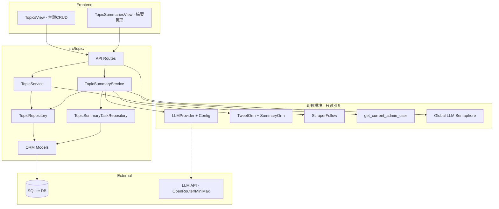
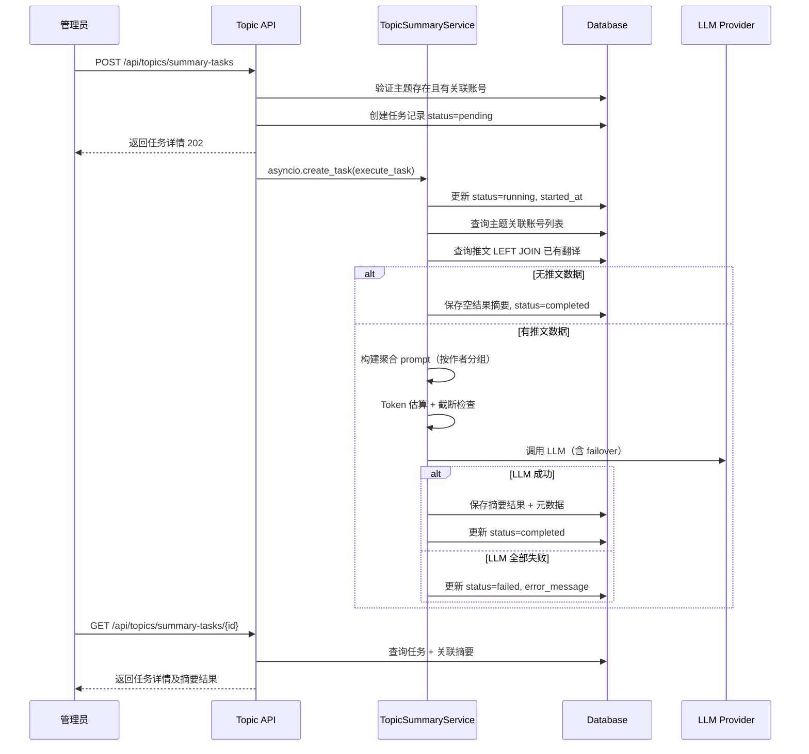

# 技术设计文档

## Overview

本功能为 X-watcher 系统新增"主题管理"模块，使管理员能够将多个 Twitter 账号组织为"主题"（如 AI 产品列表、独立开发者列表），并基于主题创建异步摘要任务。系统聚合指定时间范围内的推文数据，通过 LLM 生成按话题组织的综合摘要报告。

**Purpose**: 提供多账号聚合分析能力，使管理员能从宏观视角获取一组相关账号的信息动态。
**Users**: 系统管理员通过管理后台使用此功能进行主题组织和摘要生成。
**Impact**: 新增独立的 `src/topic/` 模块，4 张数据库表，2 个前端页面。不修改现有模块的行为。

### Goals
- 管理员可创建、编辑、删除主题列表，灵活组织 Twitter 账号
- 支持异步创建摘要任务，不阻塞 API 响应
- 复用现有 LLM 提供商体系，支持 provider failover
- 摘要结果持久化存储，支持前端查看

### Non-Goals
- 不提供定时/周期性自动摘要功能（仅支持手动创建任务）
- 不支持跨主题聚合分析
- 不提供摘要内容的再编辑功能
- 不引入新的 LLM 提供商或模型

## Architecture

### Existing Architecture Analysis

当前系统采用六边形架构 + 模块化设计，每个业务模块（scraper, summarization, preference, browse, feed）独立包含 domain/infrastructure/services/api 四层。主要集成点：

- **LLM 基础设施** (`src/summarization/llm/`): `LLMProvider` 抽象基类、`LLMProviderConfig.from_env()` 配置加载、`_get_global_llm_semaphore()` 并发控制
- **推文数据** (`src/scraper/infrastructure/`): `TweetOrm` + `SummaryOrm` 提供推文和已有翻译的查询能力
- **账号验证** (`src/database/models.py`): `ScraperFollow` 模型提供抓取账号列表查询
- **认证** (`src/user/api/auth.py`): `get_current_admin_user` JWT/API Key 认证依赖

### Architecture Pattern & Boundary Map



**Architecture Integration**:
- **Selected pattern**: 独立 `src/topic/` 模块，遵循现有六边形架构
- **Domain boundaries**: 主题管理独立于推文摘要，通过导入复用 LLM 基础设施，不修改现有模块
- **Existing patterns preserved**: 四层分离（domain/infrastructure/services/api）、`Result` 类型错误处理、`UTCDatetimeModel` 序列化
- **New components rationale**: 主题是全新的业务概念，与现有推文级摘要在数据流和 prompt 结构上完全不同
- **Steering compliance**: YAGNI 原则、模块独立可测、领域驱动设计

### Technology Stack

| Layer | Choice / Version | Role in Feature | Notes |
|-------|------------------|-----------------|-------|
| Frontend | Vue 3 + Element Plus + TypeScript | 主题管理 CRUD 界面 + 摘要任务管理界面 | 复用现有 AdminLayout 模式 |
| Backend | FastAPI + SQLAlchemy (async) | API 路由 + 业务编排 + 数据持久化 | 新增 10+ API 端点 |
| Data | SQLite (WAL mode) + Alembic | 4 张新表持久化主题和摘要数据 | 级联删除策略 |
| LLM | OpenRouter (Claude Sonnet 4.5) / MiniMax (M2.1) | 生成主题综合摘要 | 复用现有 provider，不引入新依赖 |

## System Flows

### 摘要任务异步执行流程



**Key decisions**:
- 使用 `asyncio.create_task()` 启动后台协程，状态通过 DB 持久化（非内存态 TaskRegistry），确保服务重启后任务状态可查
- LLM 调用前获取全局信号量 `_get_global_llm_semaphore()`，与推文摘要共享 3 并发上限
- 推文查询优先使用已有中文翻译（LEFT JOIN SummaryOrm），减少约 50% token 消耗

## Requirements Traceability

| Requirement | Summary | Components | Interfaces | Flows |
|-------------|---------|------------|------------|-------|
| 1.1-1.8 | 主题 CRUD + 认证 | TopicService, TopicRepository, TopicORM, TopicAPI | Service, API | - |
| 2.1-2.6 | 账号管理 + 验证 | TopicService, TopicRepository, TopicAccountORM | Service, API | - |
| 3.1-3.6 | 任务创建 + 异步启动 | TopicSummaryService, TaskRepository, TopicAPI | Service, API | 异步执行流程 |
| 4.1-4.9 | 异步执行 + LLM 调用 | TopicSummaryService, TaskRepository | Service, Batch | 异步执行流程 |
| 5.1-5.4 | 提示词管理 | TopicSummaryService | Service | - |
| 6.1-6.5 | 状态查询 + 删除 | TaskRepository, TopicAPI | API | - |
| 7.1-7.8 | 前端界面 | TopicsView, TopicSummariesView | State | - |

## Components and Interfaces

| Component | Domain/Layer | Intent | Req Coverage | Key Dependencies | Contracts |
|-----------|-------------|--------|--------------|-----------------|-----------|
| TopicService | services | 主题 CRUD + 账号管理编排 | 1.1-1.8, 2.1-2.6 | TopicRepository (P0), ScraperFollow (P1) | Service, API |
| TopicSummaryService | services | 摘要任务执行编排 | 3.1-3.6, 4.1-4.9, 5.1-5.4 | TaskRepository (P0), LLMProvider (P0), TweetOrm (P1) | Service, Batch |
| TopicRepository | infrastructure | 主题和账号数据持久化 | 1.1-1.8, 2.1-2.6 | TopicOrm (P0), TopicAccountOrm (P0) | Service |
| TopicSummaryTaskRepository | infrastructure | 摘要任务和结果数据持久化 | 3.1, 4.5, 6.1-6.5 | TopicSummaryTaskOrm (P0), TopicSummaryOrm (P0) | Service |
| TopicAPI | api | FastAPI 路由 + 请求验证 | 1.1-1.8, 2.1-2.6, 3.1-3.4, 6.1-6.5 | TopicService (P0), TopicSummaryService (P0), Auth (P0) | API |
| TopicsView | frontend | 主题 CRUD + 账号管理 UI | 7.1-7.3, 7.8 | TopicAPI (P0) | State |
| TopicSummariesView | frontend | 摘要任务管理 + 结果展示 UI | 7.4-7.8 | TopicAPI (P0), TaskPollingService (P1) | State |

### Services Layer

#### TopicService

| Field | Detail |
|-------|--------|
| Intent | 主题 CRUD 和账号管理业务编排 |
| Requirements | 1.1-1.8, 2.1-2.6 |

**Responsibilities & Constraints**
- 编排主题的创建、查询、更新、删除操作
- 管理主题与账号的关联关系
- 验证账号存在于 `scraper_follows` 表中
- 确保主题名称唯一性

**Dependencies**
- Inbound: TopicAPI — 接收 HTTP 请求 (P0)
- Outbound: TopicRepository — 数据持久化 (P0)
- External: ScraperFollow model — 账号存在性验证 (P1)

**Contracts**: Service [x] / API [ ] / Event [ ] / Batch [ ] / State [ ]

##### Service Interface

```python
class TopicService:
    async def create_topic(
        self, session: AsyncSession, name: str, description: str | None
    ) -> TopicDomain:
        """创建主题。名称重复时抛出 ValueError。"""

    async def list_topics(
        self, session: AsyncSession
    ) -> list[TopicWithCountDomain]:
        """列出所有主题（按创建时间倒序），包含关联账号数量。"""

    async def get_topic(
        self, session: AsyncSession, topic_id: int
    ) -> TopicDetailDomain | None:
        """获取主题详情（含账号列表）。不存在返回 None。"""

    async def update_topic(
        self, session: AsyncSession, topic_id: int,
        name: str | None, description: str | None
    ) -> TopicDomain | None:
        """更新主题。不存在返回 None，名称重复抛出 ValueError。"""

    async def delete_topic(
        self, session: AsyncSession, topic_id: int
    ) -> bool:
        """删除主题（级联删除账号关联、任务、摘要）。不存在返回 False。"""

    async def add_account(
        self, session: AsyncSession, topic_id: int, username: str
    ) -> TopicAccountDomain:
        """添加账号到主题。验证 scraper_follows 存在性。"""

    async def remove_account(
        self, session: AsyncSession, topic_id: int, username: str
    ) -> bool:
        """从主题移除账号。不存在返回 False。"""

    async def set_accounts(
        self, session: AsyncSession, topic_id: int, usernames: list[str]
    ) -> list[TopicAccountDomain]:
        """批量设置主题账号（替换模式）。验证所有用户名存在于 scraper_follows。"""
```

- Preconditions: session 有效；topic_id/username 参数非空
- Postconditions: 数据库状态一致；返回值反映最新状态
- Invariants: 主题名称全局唯一；账号必须存在于 scraper_follows

#### TopicSummaryService

| Field | Detail |
|-------|--------|
| Intent | 摘要任务执行编排：推文聚合 → prompt 构建 → LLM 调用 → 结果存储 |
| Requirements | 3.1-3.6, 4.1-4.9, 5.1-5.4 |

**Responsibilities & Constraints**
- 创建摘要任务记录并异步启动执行
- 查询指定时间范围内的推文数据（优先使用已有翻译）
- 构建聚合 prompt 并管理上下文窗口限制（80K token 安全上限）
- 调用 LLM 生成摘要，支持 provider failover
- 保存摘要结果和 LLM 元数据

**Dependencies**
- Inbound: TopicAPI — 接收任务创建请求 (P0)
- Outbound: TopicSummaryTaskRepository — 任务和结果持久化 (P0)
- Outbound: TopicRepository — 查询主题和账号列表 (P0)
- External: LLMProvider — 调用 LLM 生成摘要 (P0)
- External: TweetOrm + SummaryOrm — 查询推文和已有翻译 (P1)
- External: Global LLM Semaphore — 并发控制 (P1)

**Contracts**: Service [x] / API [ ] / Event [ ] / Batch [x] / State [ ]

##### Service Interface

```python
class TopicSummaryService:
    def __init__(self, providers: list[LLMProvider]):
        """初始化时注入 LLM providers 列表（按 failover 优先级排序）。"""

    async def create_and_execute_task(
        self, session: AsyncSession, topic_id: int,
        time_span_hours: int, deadline: datetime,
        custom_prompt: str | None
    ) -> TopicSummaryTaskDomain:
        """创建任务记录并异步启动执行。返回 pending 状态的任务。"""

    async def execute_task(
        self, task_id: int, session_factory: async_sessionmaker
    ) -> None:
        """后台执行摘要任务（由 asyncio.create_task 调用）。"""

    async def get_task(
        self, session: AsyncSession, task_id: int
    ) -> TopicSummaryTaskDomain | None:
        """查询任务详情（含摘要结果）。"""

    async def list_tasks(
        self, session: AsyncSession, topic_id: int | None
    ) -> list[TopicSummaryTaskDomain]:
        """列出任务（按创建时间倒序），可按 topic_id 筛选。"""

    async def delete_task(
        self, session: AsyncSession, task_id: int
    ) -> bool:
        """删除任务（级联删除摘要结果）。"""
```

- Preconditions: providers 非空；task 关联的主题有账号
- Postconditions: 任务最终状态为 completed 或 failed
- Invariants: 全局 LLM 并发不超过信号量上限（3）

##### Batch / Job Contract
- **Trigger**: API 创建任务后通过 `asyncio.create_task()` 启动
- **Input**: task_id + session_factory（后台协程使用独立 session）
- **Output**: 摘要结果持久化到 `topic_summaries` 表
- **Idempotency**: 每个任务仅执行一次；状态通过 DB 跟踪，不支持自动重试（管理员可手动重新创建）

**Implementation Notes**
- 使用独立 `async_sessionmaker` 创建后台 session，避免与请求 session 冲突
- Token 估算采用简单的字符计数法：1 中文字 ≈ 1 token，英文按空格分词后 ≈ 1.3 token/word
- 超出 80K token 限制时，按时间正序截断最旧推文
- LLM 调用使用 failover 模式：按 providers 列表顺序尝试，第一个成功即返回

### Infrastructure Layer

#### TopicRepository

| Field | Detail |
|-------|--------|
| Intent | 主题和账号数据的 CRUD 持久化 |
| Requirements | 1.1-1.8, 2.1-2.6 |

**Responsibilities & Constraints**
- 主题记录的增删改查
- 主题-账号关联记录的管理
- 查询时包含关联账号数量（COUNT 子查询）

**Contracts**: Service [x]

##### Service Interface

```python
class TopicRepository:
    async def create(self, session: AsyncSession, topic: TopicOrm) -> TopicOrm: ...
    async def get_by_id(self, session: AsyncSession, topic_id: int) -> TopicOrm | None: ...
    async def get_by_name(self, session: AsyncSession, name: str) -> TopicOrm | None: ...
    async def list_all(self, session: AsyncSession) -> list[TopicOrm]: ...
    async def update(self, session: AsyncSession, topic: TopicOrm) -> TopicOrm: ...
    async def delete(self, session: AsyncSession, topic_id: int) -> bool: ...

    async def add_account(self, session: AsyncSession, account: TopicAccountOrm) -> TopicAccountOrm: ...
    async def get_account(self, session: AsyncSession, topic_id: int, username: str) -> TopicAccountOrm | None: ...
    async def get_accounts(self, session: AsyncSession, topic_id: int) -> list[TopicAccountOrm]: ...
    async def delete_account(self, session: AsyncSession, topic_id: int, username: str) -> bool: ...
    async def replace_accounts(self, session: AsyncSession, topic_id: int, accounts: list[TopicAccountOrm]) -> list[TopicAccountOrm]: ...
```

#### TopicSummaryTaskRepository

| Field | Detail |
|-------|--------|
| Intent | 摘要任务和结果的持久化 |
| Requirements | 3.1, 4.5, 6.1-6.5 |

**Contracts**: Service [x]

##### Service Interface

```python
class TopicSummaryTaskRepository:
    async def create_task(self, session: AsyncSession, task: TopicSummaryTaskOrm) -> TopicSummaryTaskOrm: ...
    async def get_task(self, session: AsyncSession, task_id: int) -> TopicSummaryTaskOrm | None: ...
    async def list_tasks(self, session: AsyncSession, topic_id: int | None) -> list[TopicSummaryTaskOrm]: ...
    async def update_task(self, session: AsyncSession, task: TopicSummaryTaskOrm) -> TopicSummaryTaskOrm: ...
    async def delete_task(self, session: AsyncSession, task_id: int) -> bool: ...

    async def create_summary(self, session: AsyncSession, summary: TopicSummaryOrm) -> TopicSummaryOrm: ...
    async def get_summary_by_task(self, session: AsyncSession, task_id: int) -> TopicSummaryOrm | None: ...
```

### API Layer

#### TopicAPI

| Field | Detail |
|-------|--------|
| Intent | 主题管理和摘要任务的 HTTP API 端点 |
| Requirements | 1.1-1.8, 2.1-2.6, 3.1-3.4, 6.1-6.5 |

**Dependencies**
- Inbound: Frontend / HTTP 客户端 (P0)
- Outbound: TopicService, TopicSummaryService (P0)
- External: get_current_admin_user — 认证 (P0)

**Contracts**: API [x]

##### API Contract

**主题 CRUD:**

| Method | Endpoint | Request | Response | Errors |
|--------|----------|---------|----------|--------|
| POST | /api/topics | CreateTopicRequest | TopicResponse | 400, 409 |
| GET | /api/topics | - | list[TopicListItem] | - |
| GET | /api/topics/{id} | - | TopicDetailResponse | 404 |
| PUT | /api/topics/{id} | UpdateTopicRequest | TopicResponse | 404, 409 |
| DELETE | /api/topics/{id} | - | 204 No Content | 404 |

**账号管理:**

| Method | Endpoint | Request | Response | Errors |
|--------|----------|---------|----------|--------|
| PUT | /api/topics/{id}/accounts | SetAccountsRequest | list[AccountResponse] | 400, 404 |
| POST | /api/topics/{id}/accounts/{username} | - | AccountResponse | 400, 404, 409 |
| DELETE | /api/topics/{id}/accounts/{username} | - | 204 No Content | 404 |

**摘要任务:**

| Method | Endpoint | Request | Response | Errors |
|--------|----------|---------|----------|--------|
| POST | /api/topics/summary-tasks | CreateSummaryTaskRequest | SummaryTaskResponse | 400, 404 |
| GET | /api/topics/summary-tasks | ?topic_id=int (optional) | list[SummaryTaskListItem] | - |
| GET | /api/topics/summary-tasks/{task_id} | - | SummaryTaskDetailResponse | 404 |
| DELETE | /api/topics/summary-tasks/{task_id} | - | 204 No Content | 404 |

### Frontend Layer

#### TopicsView

| Field | Detail |
|-------|--------|
| Intent | 主题列表展示 + CRUD 操作 + 账号管理 |
| Requirements | 7.1-7.3, 7.8 |

**Implementation Notes**
- 参考 `FollowsView.vue` 的 dialog + form + table 模式
- 主题列表使用 `el-table`，操作列包含编辑/删除按钮
- 账号管理通过 drawer 或 dialog 展示，支持从 scraper_follows 列表中选择添加
- 删除操作弹出 `el-message-box` 确认对话框

#### TopicSummariesView

| Field | Detail |
|-------|--------|
| Intent | 摘要任务列表 + 创建表单 + 状态轮询 + 结果展示 |
| Requirements | 7.4-7.8 |

**Implementation Notes**
- 任务列表使用 `el-table`，支持按主题筛选（`el-select`）
- 创建任务表单：主题选择、时间跨度（小时数输入）、截止时间（`el-date-picker` datetime 类型）、自定义提示词（`el-input` textarea，可选）
- pending/running 状态的任务使用 `TaskPollingService`（2 秒间隔）自动刷新状态
- 已完成任务的摘要内容使用 Markdown 渲染展示
- 元数据（LLM 提供商、token 用量、成本、推文数量）使用 `el-descriptions` 展示

## Data Models

### Domain Model

```mermaid
erDiagram
    Topic ||--o{ TopicAccount : contains
    Topic ||--o{ TopicSummaryTask : has
    TopicSummaryTask ||--o| TopicSummary : produces

    Topic {
        int id PK
        string name UK
        string description
        datetime created_at
        datetime updated_at
    }

    TopicAccount {
        int id PK
        int topic_id FK
        string username
        datetime added_at
    }

    TopicSummaryTask {
        int id PK
        int topic_id FK
        int time_span_hours
        datetime deadline
        string custom_prompt
        string status
        string error_message
        datetime created_at
        datetime started_at
        datetime completed_at
    }

    TopicSummary {
        int id PK
        int task_id FK_UK
        string content
        string llm_provider
        string llm_model
        int prompt_tokens
        int completion_tokens
        int total_tokens
        float cost_usd
        int tweet_count
        int account_count
        datetime created_at
    }
```

**Aggregates**: `Topic` 是聚合根，包含 `TopicAccount` 集合。`TopicSummaryTask` 是独立聚合，关联 `Topic` 但有自己的生命周期。

**Domain Models (Pydantic)**:

```python
class TopicSummaryTaskStatus(str, Enum):
    pending = "pending"
    running = "running"
    completed = "completed"
    failed = "failed"

class TopicDomain(BaseModel):
    id: int
    name: str
    description: str | None
    created_at: datetime
    updated_at: datetime

class TopicWithCountDomain(TopicDomain):
    account_count: int

class TopicAccountDomain(BaseModel):
    id: int
    topic_id: int
    username: str
    added_at: datetime

class TopicDetailDomain(TopicDomain):
    accounts: list[TopicAccountDomain]

class TopicSummaryTaskDomain(BaseModel):
    id: int
    topic_id: int
    topic_name: str | None
    time_span_hours: int
    deadline: datetime
    custom_prompt: str | None
    status: TopicSummaryTaskStatus
    error_message: str | None
    created_at: datetime
    started_at: datetime | None
    completed_at: datetime | None
    summary: TopicSummaryDomain | None

class TopicSummaryDomain(BaseModel):
    id: int
    task_id: int
    content: str
    llm_provider: str
    llm_model: str
    prompt_tokens: int
    completion_tokens: int
    total_tokens: int
    cost_usd: float
    tweet_count: int
    account_count: int
    created_at: datetime
```

### Physical Data Model

**Table: `topics`**

| Column | Type | Constraints | Notes |
|--------|------|-------------|-------|
| id | INTEGER | PK, AUTOINCREMENT | |
| name | VARCHAR(200) | NOT NULL, UNIQUE | 主题名称 |
| description | TEXT | NULLABLE | 主题描述 |
| created_at | DATETIME | NOT NULL, DEFAULT NOW | |
| updated_at | DATETIME | NOT NULL, DEFAULT NOW | |

**Table: `topic_accounts`**

| Column | Type | Constraints | Notes |
|--------|------|-------------|-------|
| id | INTEGER | PK, AUTOINCREMENT | |
| topic_id | INTEGER | FK → topics.id, ON DELETE CASCADE, NOT NULL | |
| username | VARCHAR(100) | NOT NULL | Twitter 用户名 |
| added_at | DATETIME | NOT NULL, DEFAULT NOW | |
| | | UNIQUE(topic_id, username) | 复合唯一约束 |

**Index**: `ix_topic_accounts_topic_id` on `topic_id`

**Table: `topic_summary_tasks`**

| Column | Type | Constraints | Notes |
|--------|------|-------------|-------|
| id | INTEGER | PK, AUTOINCREMENT | |
| topic_id | INTEGER | FK → topics.id, ON DELETE CASCADE, NOT NULL | |
| time_span_hours | INTEGER | NOT NULL | 时间跨度（小时） |
| deadline | DATETIME | NOT NULL | 截止时间 |
| custom_prompt | TEXT | NULLABLE | 自定义提示词 |
| status | VARCHAR(20) | NOT NULL, DEFAULT 'pending' | pending/running/completed/failed |
| error_message | TEXT | NULLABLE | 失败时的错误信息 |
| created_at | DATETIME | NOT NULL, DEFAULT NOW | |
| started_at | DATETIME | NULLABLE | 开始执行时间 |
| completed_at | DATETIME | NULLABLE | 完成时间 |

**Index**: `ix_topic_summary_tasks_topic_id` on `topic_id`, `ix_topic_summary_tasks_status` on `status`

**Table: `topic_summaries`**

| Column | Type | Constraints | Notes |
|--------|------|-------------|-------|
| id | INTEGER | PK, AUTOINCREMENT | |
| task_id | INTEGER | FK → topic_summary_tasks.id, ON DELETE CASCADE, NOT NULL, UNIQUE | 一个任务最多一个摘要 |
| content | TEXT | NOT NULL | 摘要内容 |
| llm_provider | VARCHAR(50) | NOT NULL | 使用的 LLM 提供商 |
| llm_model | VARCHAR(100) | NOT NULL | 使用的模型名称 |
| prompt_tokens | INTEGER | NOT NULL, DEFAULT 0 | 输入 token 数 |
| completion_tokens | INTEGER | NOT NULL, DEFAULT 0 | 输出 token 数 |
| total_tokens | INTEGER | NOT NULL, DEFAULT 0 | 总 token 数 |
| cost_usd | FLOAT | NOT NULL, DEFAULT 0.0 | 成本（美元） |
| tweet_count | INTEGER | NOT NULL, DEFAULT 0 | 聚合推文数 |
| account_count | INTEGER | NOT NULL, DEFAULT 0 | 涉及账号数 |
| created_at | DATETIME | NOT NULL, DEFAULT NOW | |

### Data Contracts & Integration

**API Request/Response Schemas (Pydantic)**:

```python
# 请求模型
class CreateTopicRequest(BaseModel):
    name: str = Field(..., min_length=1, max_length=200)
    description: str | None = Field(default=None, max_length=1000)

class UpdateTopicRequest(BaseModel):
    name: str | None = Field(default=None, min_length=1, max_length=200)
    description: str | None = None

class SetAccountsRequest(BaseModel):
    usernames: list[str] = Field(..., min_length=1)

class CreateSummaryTaskRequest(BaseModel):
    topic_id: int
    time_span_hours: int = Field(..., ge=1, le=720)  # 1 小时到 30 天
    deadline: datetime
    custom_prompt: str | None = Field(default=None, max_length=5000)

# 响应模型（继承 UTCDatetimeModel）
class TopicResponse(UTCDatetimeModel):
    id: int
    name: str
    description: str | None
    created_at: datetime
    updated_at: datetime

class TopicListItem(UTCDatetimeModel):
    id: int
    name: str
    description: str | None
    account_count: int
    created_at: datetime

class TopicDetailResponse(TopicResponse):
    accounts: list[AccountResponse]

class AccountResponse(UTCDatetimeModel):
    id: int
    username: str
    added_at: datetime

class SummaryTaskResponse(UTCDatetimeModel):
    id: int
    topic_id: int
    topic_name: str | None
    time_span_hours: int
    deadline: datetime
    custom_prompt: str | None
    status: str
    error_message: str | None
    created_at: datetime
    started_at: datetime | None
    completed_at: datetime | None

class SummaryTaskDetailResponse(SummaryTaskResponse):
    summary: SummaryResponse | None

class SummaryResponse(UTCDatetimeModel):
    id: int
    content: str
    llm_provider: str
    llm_model: str
    prompt_tokens: int
    completion_tokens: int
    total_tokens: int
    cost_usd: float
    tweet_count: int
    account_count: int
    created_at: datetime
```

## Error Handling

### Error Strategy

遵循项目现有的 FastAPI `HTTPException` 模式，分层处理：

### Error Categories and Responses

**User Errors (4xx)**:
- `400 Bad Request`: 主题无关联账号时创建摘要任务；账号不在 scraper_follows 中
- `404 Not Found`: 主题/任务/账号不存在
- `409 Conflict`: 主题名称重复；账号已关联到主题

**System Errors (5xx)**:
- LLM 全部提供商不可用 → 任务标记为 failed，记录错误信息，不抛出 HTTP 错误（异步执行）
- 数据库写入失败 → 异步任务中捕获异常，标记任务 failed

**Business Logic**:
- 时间范围内无推文 → 任务 completed，摘要内容为提示信息
- Token 超出上下文限制 → 截断最旧推文，在摘要中不额外标注

### Monitoring

- 使用项目现有的 `logging_config.py` 记录日志
- 关键日志点：任务创建、任务开始、LLM 调用结果、任务完成/失败
- 使用 `trace_id` 关联同一任务的所有日志

## Testing Strategy

### Unit Tests
- **TopicService**: 主题 CRUD 操作、账号添加/删除/替换、名称唯一性验证、scraper_follows 存在性验证
- **TopicSummaryService**: prompt 构建逻辑、token 估算和截断、LLM failover 调用（mock providers）、空推文处理
- **Repository**: 基本 CRUD 操作、级联删除、复合唯一约束

### Integration Tests (API Routes)
- 主题 CRUD 端点完整流程
- 账号管理端点（添加/删除/批量设置）
- 摘要任务创建和状态查询
- 认证验证（无 token → 401）
- 错误场景（404, 409, 400）

### E2E Tests
- 创建主题 → 添加账号 → 创建摘要任务 → 查询结果的完整流程（mock LLM）

## Performance & Scalability

- **LLM 上下文窗口**: 80K token 安全上限，超出时截断最旧推文（详见 `research.md`）
- **LLM 并发**: 共享全局信号量（最大 3 并发），避免主题摘要与推文摘要同时压垮 API
- **Token 优化**: 优先使用已有中文翻译（约 100 字/条），比原文（约 200 字/条）减少约 50% token 消耗
- **数据库**: 为 `topic_accounts.topic_id`、`topic_summary_tasks.topic_id`、`topic_summary_tasks.status` 创建索引
