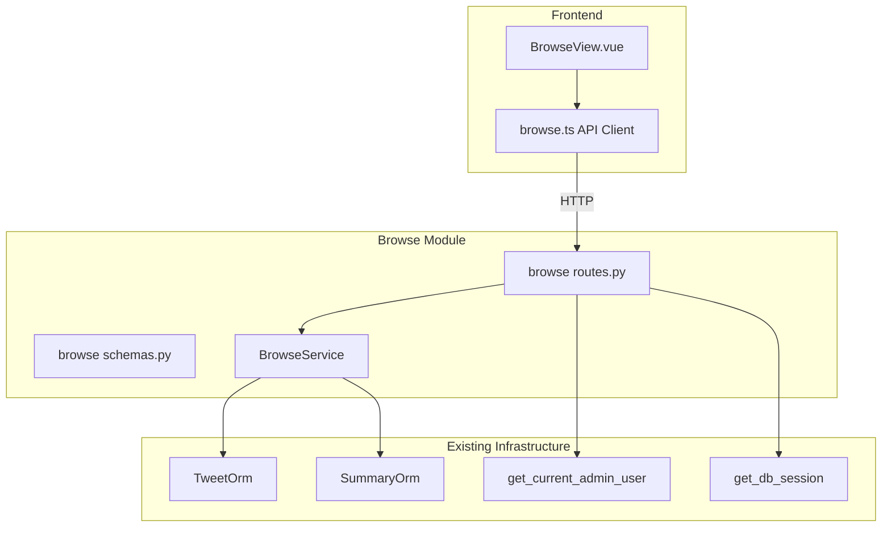
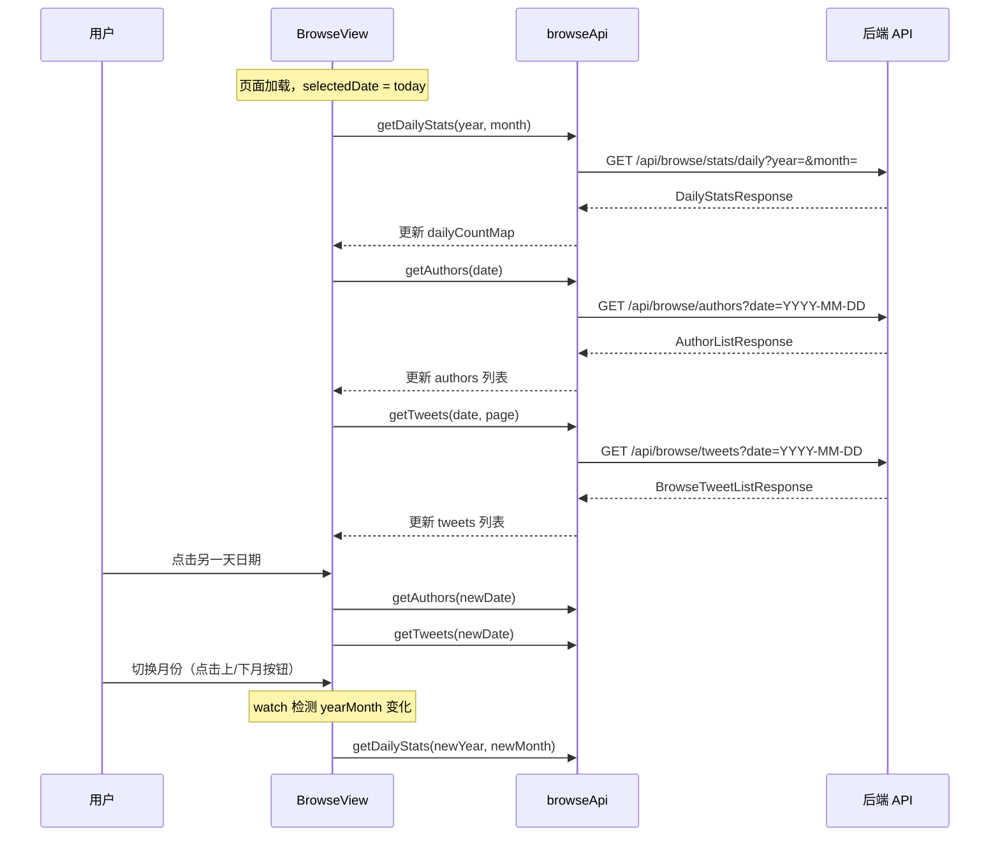

# 技术设计文档

## 概述

**目的**: 推文浏览功能为管理员提供一个友好的推文阅读界面，按日期和作者两个维度筛选推文，以结构化方式完整展示推文内容（发布时刻、摘要、中文翻译、原文）。

**用户**: 管理员通过管理后台侧边栏访问推文浏览页面，用于日常的信息消费和内容审阅。

**影响**: 新增独立 `browse` 后端模块和前端页面，不影响现有推文管理、Feed API 等功能。

### 目标
- 提供按日期浏览推文的日历交互，日历上显示每日推文数量
- 提供按作者筛选推文的列表，作者按最后活跃时间排序
- 完整展示推文信息：发布时刻 → 摘要 → 中文翻译 → 原文
- 根据筛选模式智能展示/隐藏作者信息

### 非目标
- 不实现推文的编辑、删除、批量操作等管理功能
- 不实现全文搜索
- 不处理时区转换（V1 统一使用 UTC 日期）
- 不实现多种排序方式（V1 仅支持按最后活跃时间排序）

## 架构

### 现有架构分析

项目采用六边形架构 + 模块化设计，每个业务功能独立模块（feed、deduplication、summarization 等），模块内分 API / Service 层。新增 browse 模块遵循相同模式。

关键集成点：
- `TweetOrm`（`src/scraper/infrastructure/models.py`）：推文数据表，包含所有需要的字段
- `SummaryOrm`（`src/summarization/infrastructure/models.py`）：摘要和翻译数据
- `UTCDatetimeModel`（`src/shared/schemas.py`）：Pydantic 基类，处理 SQLite naive datetime
- `get_current_admin_user`（`src/user/api/auth.py`）：admin 认证依赖

### 架构模式与边界



- **选定模式**: 六边形架构，新建独立 `src/browse/` 模块
- **领域边界**: browse 模块只做读查询，不修改数据，不引入新的 ORM 模型
- **现有模式保持**: 复用 FeedService 的 `tweets LEFT JOIN summaries` 查询模式
- **新组件理由**: 推文浏览的查询逻辑（按日期聚合、作者列表、含摘要的分页列表）与现有 API 不同，需专用端点
- **Steering 合规**: 遵循 YAGNI 原则、单职责原则、六边形架构分层

### 技术栈

| 层级 | 选择/版本 | 在本功能中的角色 | 备注 |
|------|----------|-----------------|------|
| 前端 | Vue 3 + Element Plus 2.13.x | BrowseView 页面，el-calendar 日历控件 | 已有依赖 |
| 后端 | FastAPI + SQLAlchemy (async) | 3 个 API 端点 + BrowseService | 已有依赖 |
| 数据 | SQLite (WAL 模式) | 查询 tweets + summaries 表 | 已有，无新表 |

## 需求追踪

| 需求 | 摘要 | 组件 | 接口 | 流程 |
|------|------|------|------|------|
| 1.1 | 日历控件选择日期 | BrowseView | — | — |
| 1.2 | 日历显示每日推文数 | BrowseView, BrowseService | GET /api/browse/stats/daily | 月份切换流程 |
| 1.3 | 默认选中今天 | BrowseView | — | — |
| 1.4 | 点击日期加载数据 | BrowseView | GET /api/browse/authors, GET /api/browse/tweets | — |
| 1.5 | 月份切换更新统计 | BrowseView | GET /api/browse/stats/daily | 月份切换流程 |
| 1.6 | 后端每日统计 API | BrowseRouter, BrowseService | GET /api/browse/stats/daily | — |
| 2.1 | 作者列表面板 | BrowseView | GET /api/browse/authors | — |
| 2.2 | 作者推文数量 | BrowseView, BrowseService | GET /api/browse/authors | — |
| 2.3 | 按最后更新排序 | BrowseService | GET /api/browse/authors | — |
| 2.4 | 全部作者选项 | BrowseView | — | — |
| 2.5 | 点击作者筛选 | BrowseView | GET /api/browse/tweets | — |
| 2.6 | 点击全部取消筛选 | BrowseView | GET /api/browse/tweets | — |
| 2.7 | 后端作者列表 API | BrowseRouter, BrowseService | GET /api/browse/authors | — |
| 3.1 | 展示顺序 | BrowseView | — | — |
| 3.2 | 无摘要跳过 | BrowseView | — | — |
| 3.3 | 无翻译跳过 | BrowseView | — | — |
| 3.4 | 引用推文展示 | BrowseView | — | — |
| 3.5 | 媒体附件展示 | BrowseView | — | — |
| 3.6 | 按时间正序 | BrowseService | GET /api/browse/tweets | — |
| 3.7 | 分页浏览 | BrowseView, BrowseService | GET /api/browse/tweets | — |
| 3.8 | 后端浏览列表 API | BrowseRouter, BrowseService | GET /api/browse/tweets | — |
| 4.1 | 日期模式显示作者 | BrowseView | — | — |
| 4.2 | 作者模式顶部显示 | BrowseView | — | — |
| 4.3 | 作者模式推文不重复 | BrowseView | — | — |
| 5.1 | 侧边栏菜单项 | AdminLayout | — | — |
| 5.2 | 菜单图标 | AdminLayout | — | — |
| 5.3 | 一致的布局风格 | BrowseView | — | — |
| 5.4 | 前端路由注册 | router/index.ts | — | — |
| 5.5 | admin 认证 | BrowseRouter | — | — |

## 系统流程

### 月份切换与日期选择流程



## 组件与接口

| 组件 | 域/层 | 职责 | 需求覆盖 | 关键依赖 | 契约 |
|------|-------|------|---------|---------|------|
| BrowseRouter | 后端 API | 3 个 HTTP 端点 | 1.6, 2.7, 3.8, 5.5 | BrowseService (P0), AdminAuth (P0) | API |
| BrowseSchemas | 后端 API | Pydantic 响应模型 | 1.6, 2.7, 3.8 | UTCDatetimeModel (P0) | — |
| BrowseService | 后端 Service | 数据库查询逻辑 | 1.2, 2.2, 2.3, 3.6, 3.7 | TweetOrm (P0), SummaryOrm (P0) | Service |
| BrowseView | 前端 UI | 页面布局与交互 | 1.1-1.5, 2.1-2.6, 3.1-3.7, 4.1-4.3, 5.3 | browseApi (P0) | State |
| browseApi | 前端 API | HTTP 客户端 | — | client.ts (P0) | — |
| browse types | 前端 Types | TypeScript 类型定义 | — | — | — |

### 后端 API 层

#### BrowseRouter

| 字段 | 详情 |
|------|------|
| 职责 | 定义 3 个 API 端点，参数校验，调用 BrowseService |
| 需求 | 1.6, 2.7, 3.8, 5.5 |

**依赖**
- Inbound: 前端 browseApi — HTTP 调用 (P0)
- Outbound: BrowseService — 查询执行 (P0)
- External: get_current_admin_user — admin 认证 (P0)

**契约**: API [x]

##### API 契约

| 方法 | 端点 | 请求参数 | 响应 | 错误 |
|------|------|---------|------|------|
| GET | /api/browse/stats/daily | year: int, month: int (1-12) | DailyStatsResponse | 422 |
| GET | /api/browse/authors | date: str (YYYY-MM-DD), sort_by: str = "last_active" | AuthorListResponse | 422 |
| GET | /api/browse/tweets | date: str (YYYY-MM-DD), author: str?, page: int = 1, page_size: int = 20 | BrowseTweetListResponse | 422 |

**实现备注**
- 路由前缀 `/api/browse`，标签 `["browse"]`
- `date` 参数使用 `str` 类型，通过正则校验 `YYYY-MM-DD` 格式
- 所有端点使用 `Depends(get_current_admin_user)` 认证

#### BrowseSchemas

| 字段 | 详情 |
|------|------|
| 职责 | 定义 API 的 Pydantic 请求/响应模型 |
| 需求 | 1.6, 2.7, 3.8 |

**契约**: 以下类型定义

```python
class DailyCount(BaseModel):
    date: str          # "YYYY-MM-DD"
    count: int

class DailyStatsResponse(BaseModel):
    year: int
    month: int
    days: list[DailyCount]

class AuthorInfo(UTCDatetimeModel):
    author_username: str
    author_display_name: str | None
    tweet_count: int
    last_tweet_at: datetime

class AuthorListResponse(BaseModel):
    authors: list[AuthorInfo]
    total: int

class BrowseTweetItem(UTCDatetimeModel):
    tweet_id: str
    created_at: datetime
    author_username: str
    author_display_name: str | None
    summary_text: str | None
    translation_text: str | None
    text: str
    reference_type: str | None
    referenced_tweet_id: str | None
    referenced_tweet_text: str | None
    referenced_tweet_author_username: str | None
    media: list[dict] | None
    referenced_tweet_media: list[dict] | None

class BrowseTweetListResponse(BaseModel):
    items: list[BrowseTweetItem]
    total: int
    page: int
    page_size: int
    total_pages: int
```

### 后端 Service 层

#### BrowseService

| 字段 | 详情 |
|------|------|
| 职责 | 封装推文浏览相关的数据库查询逻辑 |
| 需求 | 1.2, 2.2, 2.3, 3.6, 3.7 |

**依赖**
- Inbound: BrowseRouter — 调用查询方法 (P0)
- Outbound: TweetOrm — 推文数据查询 (P0)
- Outbound: SummaryOrm — 摘要/翻译联合查询 (P0)

**契约**: Service [x]

##### 服务接口

```python
class BrowseService:
    def __init__(self, session: AsyncSession) -> None: ...

    async def get_daily_stats(self, year: int, month: int) -> list[DailyCount]:
        """按月查询每日推文数量。
        使用 func.date(TweetOrm.created_at) GROUP BY 聚合。
        """

    async def get_authors(
        self, date: str, sort_by: str = "last_active"
    ) -> list[AuthorInfo]:
        """查询指定日期有推文的作者列表。
        包含推文数量和最后活跃时间，使用关联子查询获取 display_name。
        """

    async def get_tweets(
        self, date: str, author: str | None, page: int, page_size: int
    ) -> tuple[list[dict], int]:
        """查询指定日期（可选作者）的推文列表，含摘要和翻译。
        复用 FeedService 的 LEFT JOIN summaries 模式。
        按 created_at ASC 排序。
        """
```

**实现备注**
- `get_daily_stats`: SQL 为 `SELECT DATE(created_at) as date, COUNT(*) as count FROM tweets WHERE created_at >= start AND created_at < end GROUP BY DATE(created_at)`
- `get_authors`: 使用 `GROUP BY author_username` 聚合，关联子查询获取每个作者最新推文的 display_name
- `get_tweets`: 复用 `FeedService.get_feed` 的 `SELECT ... FROM tweets LEFT JOIN summaries` 模式，增加 `referenced_tweet_text`、`referenced_tweet_media`、`referenced_tweet_author_username` 字段

### 前端 UI 层

#### BrowseView

| 字段 | 详情 |
|------|------|
| 职责 | 推文浏览页面，三栏布局（日历 + 作者列表 + 推文列表） |
| 需求 | 1.1-1.5, 2.1-2.6, 3.1-3.7, 4.1-4.3, 5.3 |

**依赖**
- Outbound: browseApi — API 调用 (P0)
- External: Element Plus — el-calendar, el-badge, el-pagination, el-card 等 (P0)
- External: format.ts — formatFullDateTime 等工具函数 (P1)

**契约**: State [x]

##### 状态管理

```typescript
// 核心响应式状态
const selectedDate: Ref<Date>                    // 当前选中日期，默认 today
const selectedAuthor: Ref<string | null>         // 当前选中作者，null 表示全部
const dailyCountMap: Ref<Record<string, number>> // 日期 -> 推文数量映射
const authors: Ref<AuthorInfo[]>                 // 作者列表
const tweets: Ref<BrowseTweetItem[]>             // 推文列表
const total: Ref<number>                         // 推文总数
const page: Ref<number>                          // 当前页码
const loading: Ref<boolean>                      // 加载状态

// 计算属性
const currentYearMonth: ComputedRef<string>      // 从 selectedDate 提取 "YYYY-MM"
const selectedDateStr: ComputedRef<string>        // 从 selectedDate 提取 "YYYY-MM-DD"
const selectedAuthorInfo: ComputedRef<AuthorInfo | null> // 选中的作者详细信息
```

**实现备注**
- 布局：三栏 flex 布局 — 日历面板(320px) + 作者面板(240px) + 推文面板(flex:1)
- 月份检测：`watch(currentYearMonth, ...)` 触发 `loadDailyStats`
- 日期切换：`watch(selectedDateStr, ...)` 触发 `loadAuthors` + `loadTweets`，同时重置 `selectedAuthor`
- 作者切换：调用 `loadTweets(selectedDateStr, selectedAuthor)`
- 作者信息条件展示（需求 4）：
  - 未选作者时，推文卡片中渲染 `tweet.author_display_name` 和 `@tweet.author_username`
  - 选中作者时，推文列表顶部渲染 `selectedAuthorInfo` 的信息，推文卡片中不渲染作者信息
- el-calendar 的 `#date-cell` 插槽中使用 el-badge 显示推文数量
- el-calendar 需通过 CSS 覆盖缩小以适配 320px 宽度

#### browseApi

前端 API 客户端，遵循现有 `tweetsApi` 的模式。

```typescript
const browseApi = {
  getDailyStats(year: number, month: number): Promise<DailyStatsResponse>
  getAuthors(params: { date: string; sort_by?: string }): Promise<AuthorListResponse>
  getTweets(params: BrowseTweetListParams): Promise<BrowseTweetListResponse>
}
```

#### 前端类型定义

```typescript
interface DailyCount { date: string; count: number }
interface DailyStatsResponse { year: number; month: number; days: DailyCount[] }
interface AuthorInfo {
  author_username: string
  author_display_name: string | null
  tweet_count: number
  last_tweet_at: string
}
interface AuthorListResponse { authors: AuthorInfo[]; total: number }
interface BrowseTweetItem {
  tweet_id: string
  created_at: string
  author_username: string
  author_display_name: string | null
  summary_text: string | null
  translation_text: string | null
  text: string
  reference_type: string | null
  referenced_tweet_id: string | null
  referenced_tweet_text: string | null
  referenced_tweet_author_username: string | null
  media: Record<string, unknown>[] | null
  referenced_tweet_media: Record<string, unknown>[] | null
}
interface BrowseTweetListResponse {
  items: BrowseTweetItem[]
  total: number
  page: number
  page_size: number
  total_pages: number
}
interface BrowseTweetListParams {
  date: string
  author?: string
  page?: number
  page_size?: number
}
```

## 数据模型

### 领域模型

本功能**不引入新的数据库表或 ORM 模型**。所有查询基于现有表：

- `tweets` 表（TweetOrm）：推文数据，包含 `created_at`、`author_username`、`author_display_name`、`text`、`media`、`referenced_tweet_text`、`referenced_tweet_media`、`referenced_tweet_author_username` 等字段
- `summaries` 表（SummaryOrm）：通过 `tweet_id` 关联，提供 `summary_text` 和 `translation_text`

查询关系：`tweets LEFT JOIN summaries ON tweets.tweet_id = summaries.tweet_id`

### 数据契约

**API 数据传输**

所有响应使用 JSON 格式，datetime 字段通过 `UTCDatetimeModel` 基类序列化为 ISO 8601 带 UTC 时区标记。

`date` 请求参数使用 `YYYY-MM-DD` 字符串格式，在路由层进行正则校验：
- 校验规则：`r"^\d{4}-\d{2}-\d{2}$"`
- 无效格式返回 422 错误

## 错误处理

### 错误类别与响应

**用户错误 (4xx)**：
- 422：无效的日期格式（非 YYYY-MM-DD）、无效的月份范围（不在 1-12 之间）、无效的分页参数
- 401：未认证或无 admin 权限

**系统错误 (5xx)**：
- 500：数据库查询失败 — 记录日志，返回通用错误信息

### 监控

复用现有的 Prometheus HTTP 中间件自动采集 `/api/browse/*` 端点的请求计数和延迟。

## 测试策略

### 单元测试
- `BrowseService.get_daily_stats`: 验证按月聚合、空数据、跨月边界
- `BrowseService.get_authors`: 验证按日期筛选、排序、display_name 获取
- `BrowseService.get_tweets`: 验证分页、作者筛选、LEFT JOIN 摘要、正序排列

### 集成测试
- 3 个 API 端点的完整调用链（HTTP → 认证 → 查询 → 响应格式）
- 无效参数返回 422
- 无认证返回 401
- 空数据返回正确的空响应

### 前端测试
- 组件挂载和初始数据加载
- 日期切换触发数据刷新
- 作者选择联动推文列表
- 作者信息条件展示逻辑
