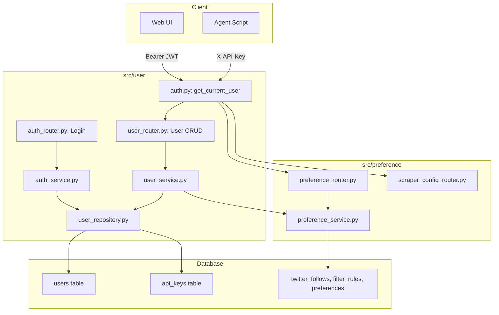
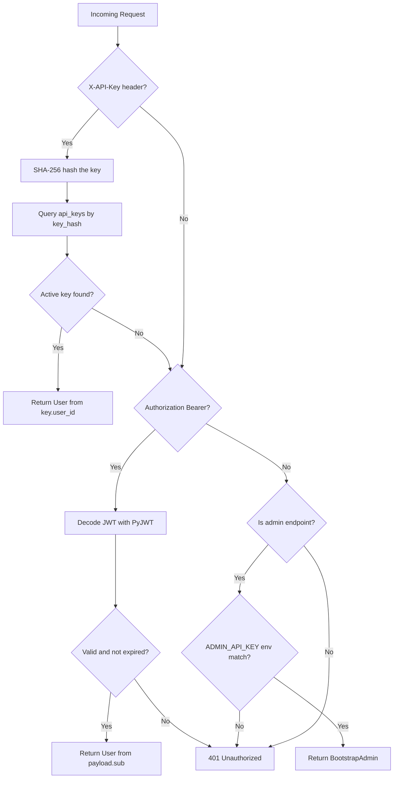
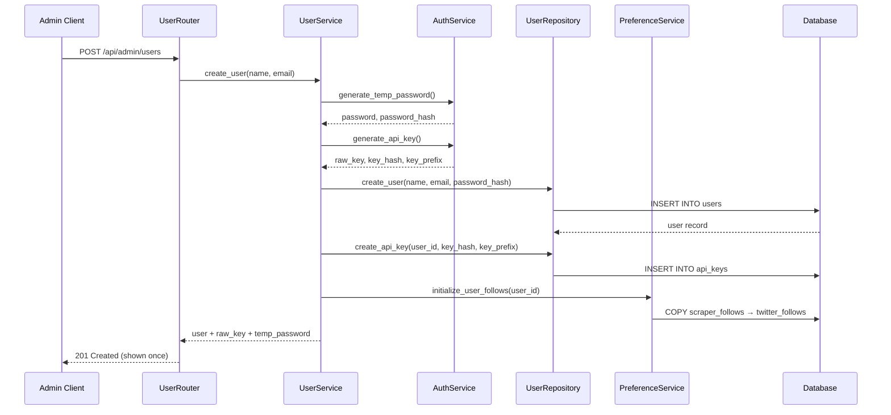
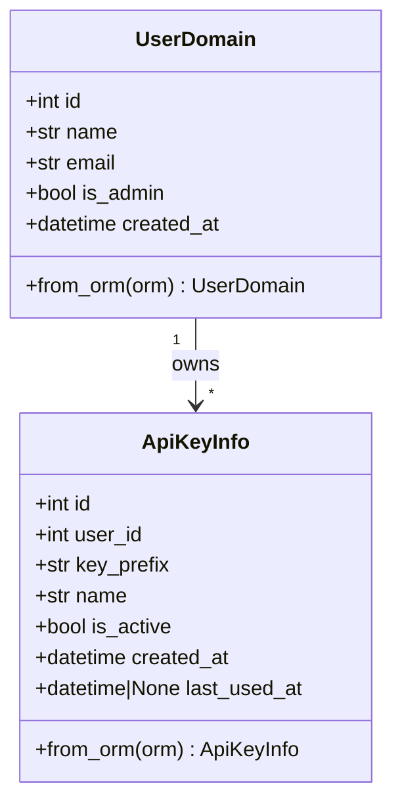

# 设计文档 — user-manager

## Overview

**Purpose**: 本功能为 X-watcher 提供多用户访问控制，使不同用户（人类和 AI Agent）能各自管理关注列表并获取个性化推文流。

**Users**: 系统管理员通过邀请制创建用户；普通用户通过 API Key（Agent/脚本）或 JWT（Web UI）认证后访问系统。

**Impact**: 将现有无认证的 preference 模块（15 个端点）迁移为基于身份认证的安全访问；新增独立的 `src/user/` 模块提供用户管理和认证能力。

### Goals
- 实现管理员邀请制用户注册，支持自动初始化关注列表
- 实现 API Key + JWT 双模式认证，对人类和 Agent 统一友好
- 提供统一认证中间件 `get_current_user` / `get_current_admin_user`，替代现有 `user_id` 查询参数
- 迁移 preference 模块 15 个端点至新认证体系

### Non-Goals
- 不实现 OAuth2 / 第三方登录
- 不实现 JWT Refresh Token（当前阶段 Access Token 过期后重新登录）
- 不实现用户自助注册（仅管理员邀请制）
- 不实现细粒度权限控制（RBAC）——仅区分 admin / 普通用户

## Architecture

### Existing Architecture Analysis

当前系统采用六边形架构 + 模块化设计，已有 4 个业务模块（scraper, deduplication, summarization, preference）。

**需维护的现有模式**:
- 每个模块遵循 `domain/ → services/ → infrastructure/ → api/` 分层
- Pydantic BaseModel 作为领域模型，SQLAlchemy ORM 作为持久化模型
- Repository 模式封装数据访问，自定义异常（NotFoundError, DuplicateError）
- FastAPI Depends 注入 AsyncSession 和 Service 实例

**需改造的集成点**:
- `src/preference/api/auth.py` — 现有 `verify_admin_api_key()` 仅校验环境变量
- `src/preference/api/preference_router.py` — 11 个端点使用 `user_id: Query(...)`
- `src/preference/api/scraper_config_router.py` — 4 个端点使用 `verify_admin_api_key`

### Architecture Pattern & Boundary Map



**Architecture Integration**:
- **Selected pattern**: 独立模块（方案 B），与现有 scraper/preference 等模块平行
- **Domain boundaries**: user 模块拥有用户身份和认证；preference 模块拥有关注列表和偏好
- **Existing patterns preserved**: 六边形分层、Repository 模式、Pydantic 领域模型、FastAPI Depends 注入
- **New components rationale**: 认证是跨模块公共能力，独立模块使 import 路径自然（`from src.user.api.auth import get_current_user`）
- **Steering compliance**: YAGNI（不引入 OAuth/RBAC）、单职责、易演进

### Technology Stack

| Layer | Choice / Version | Role in Feature | Notes |
|-------|------------------|-----------------|-------|
| Backend | FastAPI >=0.104, Python 3.11+ | API 路由、认证依赖注入 | 现有 |
| Auth - JWT | PyJWT 2.11.0 | JWT Token 生成与验证 | **新增依赖** |
| Auth - Password | bcrypt 5.0.0 | 密码哈希与验证 | **新增依赖** |
| Auth - API Key | hashlib + secrets (stdlib) | API Key 生成与 SHA-256 哈希 | 内置库 |
| ORM | SQLAlchemy 2.0 async | User/ApiKey 持久化 | 现有 |
| Migration | Alembic | Schema 变更 | 现有 |
| Validation | Pydantic v2 | 请求/响应验证 | 现有 |

bcrypt 5.0.0 要求对 >72 字节密码预哈希（SHA-256 + base64），详见 `research.md`。

## System Flows

### 认证决策流程



### 用户创建流程



## Requirements Traceability

| Requirement | Summary | Components | Interfaces | Flows |
|-------------|---------|------------|------------|-------|
| 1.1 | 管理员创建用户返回 info + API Key | UserService, UserRepository, AuthService | POST /api/admin/users | 用户创建流程 |
| 1.2 | 邮箱重复返回 409 | UserRepository | POST /api/admin/users | - |
| 1.3 | 仅管理员可创建 | get_current_admin_user | POST /api/admin/users | - |
| 1.4 | 生成临时密码 | AuthService | POST /api/admin/users | 用户创建流程 |
| 1.5 | 生成默认 API Key | AuthService | POST /api/admin/users | 用户创建流程 |
| 1.6 | 自动初始化关注列表 | PreferenceService.initialize_user_follows | POST /api/admin/users | 用户创建流程 |
| 2.1 | X-API-Key 认证 | get_current_user, UserRepository | X-API-Key header | 认证决策流程 |
| 2.2 | 无效 Key 返回 401 | get_current_user | X-API-Key header | 认证决策流程 |
| 2.3 | 无凭证返回 401 | get_current_user | - | 认证决策流程 |
| 2.4 | SHA-256 哈希存储 | AuthService | - | - |
| 2.5 | sna_ 前缀 | AuthService | - | - |
| 2.6 | 更新 last_used_at | UserRepository | - | 认证决策流程 |
| 3.1 | 邮箱+密码登录返回 JWT | AuthService | POST /api/auth/login | - |
| 3.2 | 错误凭证返回 401 | AuthService | POST /api/auth/login | - |
| 3.3 | Bearer Token 认证 | get_current_user | Authorization header | 认证决策流程 |
| 3.4 | 过期 Token 返回 401 | get_current_user | Authorization header | 认证决策流程 |
| 3.5 | JWT 包含 user_id, email, is_admin | AuthService | POST /api/auth/login | - |
| 3.6 | JWT 密钥和过期时间可配置 | Settings | - | - |
| 4.1 | 统一 get_current_user 依赖 | get_current_user | FastAPI Depends | 认证决策流程 |
| 4.2 | API Key 优先于 JWT | get_current_user | - | 认证决策流程 |
| 4.3 | get_current_admin_user 依赖 | get_current_admin_user | FastAPI Depends | - |
| 4.4 | 保留 ADMIN_API_KEY 引导 | get_current_admin_user | - | 认证决策流程 |
| 4.5 | ADMIN_API_KEY 返回 BootstrapAdmin 虚拟用户 | get_current_admin_user | - | 认证决策流程 |
| 5.1 | 创建新 Key | UserService | POST /api/users/me/api-keys | - |
| 5.2 | 查看 Key 元数据 | UserRepository | GET /api/users/me/api-keys | - |
| 5.3 | 撤销 Key | UserRepository | DELETE /api/users/me/api-keys/{id} | - |
| 5.4 | 非活跃 Key 拒绝认证 | get_current_user | - | 认证决策流程 |
| 5.5 | 不可撤销他人 Key | UserService | DELETE /api/users/me/api-keys/{id} | - |
| 6.1 | 修改密码（验证旧密码） | UserService, AuthService | PUT /api/users/me/password | - |
| 6.2 | 旧密码错误返回 400 | UserService | PUT /api/users/me/password | - |
| 6.3 | bcrypt 哈希存储 | AuthService | - | - |
| 6.4 | 密码最少 8 字符 | ChangePasswordRequest schema | PUT /api/users/me/password | - |
| 7.1 | 获取自身信息 | UserRepository | GET /api/users/me | - |
| 7.2 | 管理员获取用户列表 | UserRepository | GET /api/admin/users | - |
| 7.3 | 非管理员不可查看他人 | get_current_admin_user | GET /api/admin/users | - |
| 8.1 | Preference 端点迁移 | get_current_user | preference_router.py 11 endpoints | - |
| 8.2 | Admin 端点迁移 | get_current_admin_user | scraper_config_router.py 4 endpoints | - |
| 8.3 | 自动使用认证用户 ID | get_current_user | All preference endpoints | - |
| 8.4 | 测试适配 | - | tests/preference/*.py | - |
| 9.1 | 管理员列出用户 | UserRepository | GET /api/admin/users | - |
| 9.2 | 管理员重置密码 | UserService, AuthService | POST /api/admin/users/{id}/reset-password | - |
| 9.3 | 仅管理员可操作 | get_current_admin_user | /api/admin/users/* | - |

## Components and Interfaces

| Component | Domain/Layer | Intent | Req Coverage | Key Dependencies | Contracts |
|-----------|-------------|--------|-------------|-----------------|-----------|
| AuthService | user/services | 密码哈希、API Key 生成、JWT 编解码 | 2.4-2.5, 3.1-3.5, 6.3 | bcrypt (P0), PyJWT (P0) | Service |
| UserService | user/services | 用户创建、密码管理、Key 管理 | 1.1-1.6, 5.1-5.5, 6.1-6.2, 9.2 | AuthService (P0), UserRepo (P0), PrefService (P1) | Service |
| UserRepository | user/infrastructure | User + ApiKey CRUD | 2.1, 2.6, 5.2-5.3, 7.1-7.2, 9.1 | AsyncSession (P0) | Service |
| get_current_user | user/api | 统一认证依赖 | 4.1-4.2, 2.1-2.3, 3.3-3.4 | AuthService (P0), UserRepo (P0) | Service |
| get_current_admin_user | user/api | 管理员认证依赖 | 4.3-4.5, 1.3, 9.3 | get_current_user (P0) | Service |
| AuthRouter | user/api | 登录端点 | 3.1-3.2 | AuthService (P0), UserRepo (P0) | API |
| UserRouter | user/api | 用户管理 + Key 管理端点 | 5.1-5.3, 6.1, 7.1-7.2, 9.1-9.2 | UserService (P0) | API |
| AdminUserRouter | user/api | 管理员用户操作端点 | 1.1-1.6, 9.1-9.2 | UserService (P0) | API |

### Services Layer

#### AuthService

| Field | Detail |
|-------|--------|
| Intent | 提供密码哈希、API Key 生成、JWT Token 编解码等底层认证原语 |
| Requirements | 2.4, 2.5, 3.1, 3.2, 3.5, 6.3 |

**Responsibilities & Constraints**
- 密码哈希/验证使用 bcrypt（CPU 密集型操作通过 `asyncio.to_thread` 执行）
- API Key 生成格式: `sna_` + `secrets.token_hex(16)` = 36 字符总长
- API Key 存储: SHA-256 哈希，前 8 字符作为 key_prefix
- JWT 使用 HS256 算法，payload 包含 `sub`(user_id), `email`, `is_admin`, `exp`, `iat`
- 不持有数据库访问权限（纯计算服务）

**Dependencies**
- External: bcrypt 5.0.0 — 密码哈希 (P0)
- External: PyJWT 2.11.0 — JWT 编解码 (P0)
- Inbound: UserService — 调用认证原语 (P0)
- Inbound: get_current_user — JWT 验证 (P0)

**Contracts**: Service [x]

##### Service Interface
```python
class AuthService:
    def hash_password(self, password: str) -> str:
        """bcrypt 哈希密码。返回哈希字符串。"""

    def verify_password(self, password: str, hashed: str) -> bool:
        """验证密码。常量时间比较。"""

    def generate_api_key(self) -> tuple[str, str, str]:
        """生成 API Key。返回 (raw_key, key_hash, key_prefix)。"""

    def hash_api_key(self, raw_key: str) -> str:
        """SHA-256 哈希 API Key。"""

    def verify_api_key_hash(self, raw_key: str, stored_hash: str) -> bool:
        """常量时间比较 API Key 哈希。使用 hmac.compare_digest。"""

    def create_jwt_token(self, user_id: int, email: str, is_admin: bool) -> str:
        """生成 JWT Access Token。"""

    def decode_jwt_token(self, token: str) -> dict[str, Any]:
        """解码并验证 JWT Token。
        Raises: jwt.ExpiredSignatureError, jwt.InvalidTokenError
        """

    def generate_temp_password(self) -> str:
        """生成随机临时密码（12 字符，字母+数字）。"""
```

- Preconditions: 密码非空且 >= 8 字符（由 Schema 层验证）
- Postconditions: 哈希值可被同一方法验证
- Invariants: 不存储任何状态，纯函数式设计

#### UserService

| Field | Detail |
|-------|--------|
| Intent | 编排用户生命周期：创建、密码管理、API Key 管理 |
| Requirements | 1.1-1.6, 5.1-5.5, 6.1-6.2, 9.2 |

**Responsibilities & Constraints**
- 用户创建事务：创建用户 → 生成密码 → 生成 API Key → 初始化关注列表（原子操作）
- API Key 权限隔离：撤销 Key 时验证 key.user_id == current_user.id
- 密码修改：验证旧密码 → 更新新密码（事务内）

**Dependencies**
- Outbound: AuthService — 密码和 Key 原语 (P0)
- Outbound: UserRepository — 数据持久化 (P0)
- Outbound: PreferenceService.initialize_user_follows — 初始化关注列表 (P1)

**Contracts**: Service [x]

##### Service Interface
```python
class UserService:
    async def create_user(
        self, name: str, email: str
    ) -> tuple[UserDomain, str, str]:
        """创建用户。返回 (user, temp_password, raw_api_key)。
        Raises: DuplicateError if email exists.
        """

    async def create_api_key(
        self, user_id: int, name: str = "default"
    ) -> tuple[ApiKeyInfo, str]:
        """创建 API Key。返回 (key_info, raw_key)。"""

    async def revoke_api_key(
        self, user_id: int, key_id: int
    ) -> None:
        """撤销 API Key。验证 key 属于 user_id。
        Raises: NotFoundError, PermissionError.
        """

    async def list_api_keys(self, user_id: int) -> list[ApiKeyInfo]:
        """列出用户的 API Key 元数据。"""

    async def change_password(
        self, user_id: int, old_password: str, new_password: str
    ) -> None:
        """修改密码。
        Raises: ValueError if old_password incorrect.
        """

    async def reset_password(self, user_id: int) -> str:
        """管理员重置密码。返回新临时密码。"""

    async def get_user(self, user_id: int) -> UserDomain | None:
        """获取用户信息。"""

    async def list_users(self) -> list[UserDomain]:
        """列出所有用户（管理员用）。"""
```

#### UserRepository

| Field | Detail |
|-------|--------|
| Intent | User 和 ApiKey 表的 CRUD 操作 |
| Requirements | 2.1, 2.6, 5.2-5.3, 7.1-7.2, 9.1 |

**Responsibilities & Constraints**
- 所有数据库操作通过注入的 AsyncSession 执行
- 错误映射: IntegrityError → DuplicateError, 未找到 → NotFoundError
- 遵循 preference 模块的 Repository 模式

**Dependencies**
- External: AsyncSession — SQLAlchemy 异步会话 (P0)

**Contracts**: Service [x]

##### Service Interface
```python
class UserRepository:
    async def create_user(
        self, name: str, email: str, password_hash: str
    ) -> UserDomain: ...

    async def get_user_by_id(self, user_id: int) -> UserDomain | None: ...
    async def get_user_by_email(self, email: str) -> UserDomain | None: ...
    async def get_all_users(self) -> list[UserDomain]: ...
    async def update_password_hash(self, user_id: int, password_hash: str) -> None: ...

    async def create_api_key(
        self, user_id: int, key_hash: str, key_prefix: str, name: str
    ) -> ApiKeyInfo: ...

    async def get_active_key_by_hash(self, key_hash: str) -> tuple[ApiKeyInfo, int] | None:
        """返回 (key_info, user_id) 或 None。仅查询 is_active=True 的 Key。"""

    async def get_keys_by_user(self, user_id: int) -> list[ApiKeyInfo]: ...
    async def deactivate_key(self, key_id: int) -> None: ...
    async def update_key_last_used(self, key_id: int) -> None: ...
```

### API Layer

#### get_current_user (统一认证依赖)

| Field | Detail |
|-------|--------|
| Intent | FastAPI 依赖：从 X-API-Key 或 Bearer JWT 解析当前用户 |
| Requirements | 4.1, 4.2, 2.1-2.3, 3.3-3.4 |

**Contracts**: Service [x]

```python
# FastAPI security schemes
api_key_header = APIKeyHeader(name="X-API-Key", auto_error=False)
bearer_scheme = HTTPBearer(auto_error=False)

async def get_current_user(
    api_key: Annotated[str | None, Depends(api_key_header)] = None,
    bearer: Annotated[HTTPAuthorizationCredentials | None, Depends(bearer_scheme)] = None,
    session: AsyncSession = Depends(get_async_session),
) -> UserDomain:
    """优先 API Key，其次 JWT。两者均无效则 401。"""
```

- Preconditions: 请求必须携带 X-API-Key 或 Authorization Bearer 之一
- Postconditions: 返回已认证的 UserDomain 对象
- Invariants: API Key 路径更新 last_used_at；JWT 路径不访问数据库

#### get_current_admin_user

```python
# BootstrapAdmin 虚拟用户（ADMIN_API_KEY 引导时使用）
BOOTSTRAP_ADMIN = UserDomain(
    id=0, name="bootstrap", email="bootstrap@system",
    is_admin=True, created_at=datetime.min
)

async def get_current_admin_user(
    api_key: Annotated[str | None, Depends(api_key_header)] = None,
    bearer: Annotated[HTTPAuthorizationCredentials | None, Depends(bearer_scheme)] = None,
    session: AsyncSession = Depends(get_async_session),
) -> UserDomain:
    """管理员认证。先尝试用户认证，回退到 ADMIN_API_KEY 环境变量。
    ADMIN_API_KEY 认证时返回 BOOTSTRAP_ADMIN 虚拟用户（id=0），
    统一返回类型为 UserDomain，简化下游端点逻辑并保留审计能力。
    Raises: HTTPException 401 or 403.
    """
```

#### AuthRouter

| Field | Detail |
|-------|--------|
| Intent | JWT 登录端点 |
| Requirements | 3.1, 3.2 |

**Contracts**: API [x]

##### API Contract

| Method | Endpoint | Request | Response | Errors |
|--------|----------|---------|----------|--------|
| POST | /api/auth/login | LoginRequest{email, password} | LoginResponse{access_token, token_type} | 401 |

#### UserRouter

| Field | Detail |
|-------|--------|
| Intent | 用户自身操作：查看信息、管理 API Key、修改密码 |
| Requirements | 5.1-5.3, 6.1, 7.1 |

**Contracts**: API [x]

##### API Contract

| Method | Endpoint | Auth | Request | Response | Errors |
|--------|----------|------|---------|----------|--------|
| GET | /api/users/me | User | - | UserResponse | 401 |
| POST | /api/users/me/api-keys | User | CreateApiKeyRequest{name?} | CreateApiKeyResponse{key, key_prefix, name} | 401 |
| GET | /api/users/me/api-keys | User | - | list[ApiKeyResponse] | 401 |
| DELETE | /api/users/me/api-keys/{key_id} | User | - | 204 No Content | 401, 404 |
| PUT | /api/users/me/password | User | ChangePasswordRequest{old_password, new_password} | 200 OK | 400, 401 |

#### AdminUserRouter

| Field | Detail |
|-------|--------|
| Intent | 管理员用户操作：创建用户、列出用户、重置密码 |
| Requirements | 1.1-1.6, 7.2, 9.1-9.2 |

**Contracts**: API [x]

##### API Contract

| Method | Endpoint | Auth | Request | Response | Errors |
|--------|----------|------|---------|----------|--------|
| POST | /api/admin/users | Admin | CreateUserRequest{name, email} | CreateUserResponse{user, temp_password, api_key} | 401, 403, 409 |
| GET | /api/admin/users | Admin | - | list[UserResponse] | 401, 403 |
| POST | /api/admin/users/{user_id}/reset-password | Admin | - | ResetPasswordResponse{temp_password} | 401, 403, 404 |

## Data Models

### Domain Model



**领域模型**（`src/user/domain/models.py`）:
- `UserDomain` — 用户信息（不含密码哈希）
- `ApiKeyInfo` — API Key 元数据（不含 key_hash）
- `BOOTSTRAP_ADMIN` — 虚拟管理员常量（`id=0, name="bootstrap"`），用于 ADMIN_API_KEY 引导场景
- 均为 Pydantic BaseModel，带 `from_orm()` 类方法

### Physical Data Model

**User 表变更**（修改现有 `src/database/models.py`）:

```
users 表新增字段:
  password_hash: String(128), nullable=True
```

`password_hash` 允许 NULL 以兼容现有无密码用户。Alembic 迁移添加此列。

**ApiKey 表**（新增，定义在 `src/database/models.py`）:

```
api_keys 表:
  id: Integer, PK, autoincrement
  user_id: Integer, FK(users.id, CASCADE), NOT NULL
  key_hash: String(64), NOT NULL, UNIQUE
  key_prefix: String(8), NOT NULL
  name: String(100), NOT NULL, default="default"
  is_active: Boolean, NOT NULL, default=True
  created_at: DateTime, NOT NULL, default=utcnow
  last_used_at: DateTime, nullable=True

索引:
  idx_api_keys_key_hash ON key_hash (用于认证查询 <100ms)
  idx_api_keys_user_id ON user_id (用于列出用户 Key)

关系:
  User.api_keys → relationship("ApiKey", back_populates="user", cascade="all, delete-orphan")
  ApiKey.user → relationship("User", back_populates="api_keys")
```

### Data Contracts

**API Key 格式规格**:
- 格式: `sna_` + 32 字符 hex = 总长 36 字符
- 生成: `f"sna_{secrets.token_hex(16)}"`
- 存储: `hashlib.sha256(raw_key.encode()).hexdigest()` → 64 字符 hex
- key_prefix: 原始 Key 前 8 字符（如 `sna_a1b2`）

**JWT Payload 结构**:
```json
{
  "sub": 123,
  "email": "user@example.com",
  "is_admin": false,
  "exp": 1707523200,
  "iat": 1707436800
}
```

## Error Handling

### Error Categories and Responses

| 场景 | HTTP 状态码 | 错误消息 |
|------|------------|---------|
| 无认证凭证 | 401 | "缺少认证凭证" |
| API Key 无效/非活跃 | 401 | "无效的 API Key" |
| JWT 过期 | 401 | "Token 已过期" |
| JWT 无效 | 401 | "无效的 Token" |
| 非管理员访问管理端点 | 403 | "需要管理员权限" |
| 邮箱已存在 | 409 | "该邮箱已被注册" |
| 旧密码错误 | 400 | "旧密码不正确" |
| 密码过短 | 422 | Pydantic 验证错误 |
| 撤销他人 Key | 404 | "API Key 不存在"（不透露归属） |
| 用户不存在 | 404 | "用户不存在" |

### Monitoring

- 认证失败次数（按方法和原因分类）记录为 WARNING 日志
- 不在日志中记录密码明文、API Key 明文或 JWT Token
- 认证成功记录为 DEBUG 日志（包含 user_id 和认证方式）

## Testing Strategy

### Unit Tests
- `test_auth_service.py`: 密码哈希/验证、API Key 生成/哈希/比较、JWT 编解码/过期处理、临时密码生成
- `test_domain_models.py`: UserDomain.from_orm、ApiKeyInfo.from_orm 转换
- `test_schemas.py`: Pydantic 请求/响应验证（密码长度、邮箱格式）

### Integration Tests
- `test_user_repository.py`: User CRUD、ApiKey CRUD、邮箱唯一约束、Key 去活/last_used_at 更新
- `test_user_service.py`: create_user 完整流程（用户+密码+Key+关注列表）、change_password、revoke_api_key 权限隔离

### API Tests
- `test_auth_api.py`: 登录成功/失败、JWT Token 验证
- `test_user_api.py`: /me 信息查询、API Key 生命周期、密码修改
- `test_admin_api.py`: 创建用户、列出用户、重置密码、权限验证
- `test_auth_dependency.py`: get_current_user 双模式、优先级、ADMIN_API_KEY 回退

### Preference Migration Tests
- 适配 `tests/preference/test_preference_api.py`: 从 `?user_id=X` 改为 mock get_current_user 依赖
- 适配 `tests/preference/test_admin_api.py`: 从 X-API-Key 头改为 mock get_current_admin_user 依赖

## Security Considerations

- **密码存储**: bcrypt with rounds=12，>72 字节密码预先 SHA-256+base64 处理（bcrypt 5.0.0 要求）
- **API Key 存储**: SHA-256 哈希，明文仅在创建时返回一次
- **API Key 验证**: `hmac.compare_digest` 常量时间比较（NFR 1.2）
- **JWT 安全**: HS256 算法，`algorithms=["HS256"]` 防止算法混淆攻击
- **信息泄露防护**: 登录失败不区分"邮箱不存在"和"密码错误"（统一 401）
- **ADMIN_API_KEY 限制**: 仅在 `get_current_admin_user` 中可用，不可用于 `get_current_user`（防止滥用访问普通用户数据）
- **BootstrapAdmin 虚拟用户**: ADMIN_API_KEY 认证时返回 `id=0` 的虚拟用户，统一返回类型并保留审计追踪能力

## Migration Strategy

### Phase 1: 数据库迁移
1. Alembic migration: User 表添加 `password_hash` 列（nullable=True）
2. Alembic migration: 创建 `api_keys` 表
3. 更新 `alembic/env.py` 导入新模型

### Phase 2: User 模块构建
1. 构建 domain models → infrastructure → services → api 各层
2. 在 `src/main.py` 注册新路由

### Phase 3: Preference 模块迁移
1. `preference_router.py`: 11 个端点替换 `user_id: Query(...)` 为 `Depends(get_current_user)`
2. `scraper_config_router.py`: 4 个端点替换 `verify_admin_api_key` 为 `Depends(get_current_admin_user)`
3. 废弃 `src/preference/api/auth.py`（保留重导出以兼容）

### Phase 4: 测试适配
1. 新增 `tests/user/` 测试套件
2. 适配 `tests/preference/` 现有测试使用新认证依赖

### Phase 5: 种子数据与配置
1. 更新 `scripts/seed_admin.py` — 设置初始管理员密码
2. 更新 `.env.example` — 添加 `JWT_SECRET_KEY`, `JWT_EXPIRE_HOURS`
3. 更新 `src/config.py` — 新增配置字段

### 配置变更

`src/config.py` Settings 类新增:
```
jwt_secret_key: str = Field(description="JWT 签名密钥")
jwt_expire_hours: int = Field(default=24, description="JWT 过期时间（小时）")
```

`.env.example` 新增:
```
JWT_SECRET_KEY=your-secret-key-change-in-production
JWT_EXPIRE_HOURS=24
```

`pyproject.toml` dependencies 新增:
```
bcrypt>=5.0.0
PyJWT>=2.11.0
```
