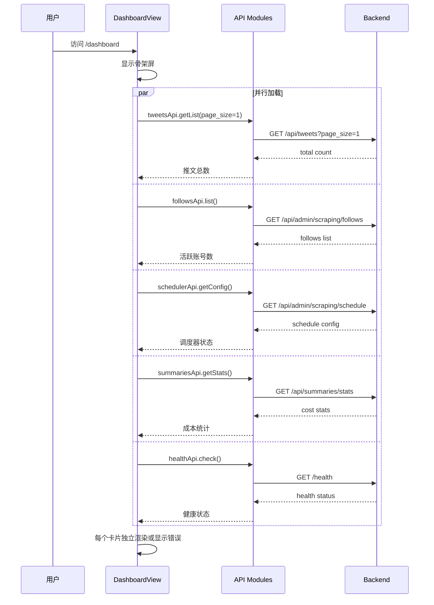
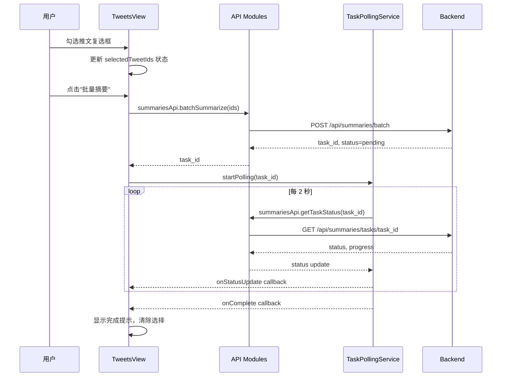

# Design Document: web-admin-ui-v2

## Overview

**Purpose**: 本特性将 X-watcher 管理后台前端从简单顶部导航升级为侧边栏管理后台，新增仪表盘、调度管理、用户管理三个页面，并增强现有推文/任务页面。

**Users**: 人类管理员使用此界面审核推文数据质量、配置抓取参数、管理系统用户。

**Impact**: 替换现有顶部导航布局；新增 3 个路由页面；修复 style.css 冲突和 Pinia 未初始化问题；对接后端已有但前端未使用的 ~15 个 API 端点。

### Goals
- 侧边栏布局支持 6+ 个菜单项的清晰导航
- 仪表盘提供系统概览（推文统计、健康状态、成本统计）
- 调度管理页面实现间隔/启禁/下次执行的完整配置
- 用户管理页面实现创建用户、重置密码
- 推文详情支持摘要再生成，推文列表支持批量操作
- 修复 style.css/Pinia/空 usernames 等基础问题

### Non-Goals
- JWT 登录页面和路由守卫（Step 2 范围）
- WebSocket 实时通信（保持轮询方案）
- 后端 API 变更（纯前端变更）
- 多语言/国际化支持

## Architecture

### Existing Architecture Analysis

当前前端为 Vue 3 SPA，结构：
- **API 层**: `api/` 目录下 4 个模块（client, tweets, tasks, follows），每个模块导出 xxxApi 对象
- **类型层**: `types/` 目录下 2 个文件（tweet.ts, task.ts），barrel export
- **视图层**: `views/` 目录下 4 个 Vue SFC，各自管理本地状态
- **服务层**: `services/` 目录下 2 个模块（polling, message）
- **布局**: App.vue 直接包含顶部 header + nav + RouterView
- **状态**: 无 Pinia store，所有状态组件本地管理

需保持的模式：
- API 模块 `export const xxxApi = { ... }` + `client.get<T>()` 模式
- 类型定义每个 interface/property 带 JSDoc + snake_case 属性名
- 服务模块单例导出模式
- Element Plus 组件库统一使用

需修复的技术债：
- style.css Vite 暗色主题默认（与 Element Plus 冲突）
- Pinia 已安装未注册
- formatTime 在 3 个组件中重复
- TasksView 空 usernames bug

### Architecture Pattern & Boundary Map

```mermaid
graph TB
    subgraph Frontend SPA
        App[App.vue]
        Layout[AdminLayout.vue]

        subgraph Views
            Dashboard[DashboardView]
            Tweets[TweetsView]
            TweetDetail[TweetDetailView]
            Follows[FollowsView]
            Tasks[TasksView]
            Scheduler[SchedulerView]
            Users[UsersView]
        end

        subgraph Stores
            AuthStore[Auth Store]
        end

        subgraph API Modules
            ClientTS[client.ts]
            TweetsAPI[tweets.ts]
            TasksAPI[tasks.ts]
            FollowsAPI[follows.ts]
            SchedulerAPI[scheduler.ts]
            UsersAPI[users.ts]
            HealthAPI[health.ts]
            SummariesAPI[summaries.ts]
            DedupAPI[dedup.ts]
        end

        subgraph Utils
            FormatUtils[format.ts]
        end
    end

    subgraph Backend FastAPI
        AdminAPI[Admin API]
        TweetsEndpoint[Tweets API]
        SchedulerEndpoint[Scheduler API]
        UsersEndpoint[Users API]
        HealthEndpoint[Health API]
        SummariesEndpoint[Summaries API]
        DedupEndpoint[Dedup API]
    end

    App --> Layout
    Layout --> Views
    Views --> API Modules
    Views --> Stores
    Views --> Utils
    API Modules --> ClientTS
    ClientTS --> AuthStore
    ClientTS --> Backend FastAPI
```

**Architecture Integration**:
- **Selected pattern**: 扩展现有 Vue 3 模块化架构，新增 stores/layouts/utils 层
- **Domain boundaries**: API 模块按后端服务模块 1:1 映射；View 组件按页面划分
- **Existing patterns preserved**: API 模块导出模式、TypeScript 类型模式、服务单例模式
- **New components rationale**: AdminLayout（布局重构）、3 个新 View（新页面）、5 个新 API 模块（新后端端点）、Auth Store（状态统一管理）、format utils（去重复）
- **Steering compliance**: YAGNI（仅实现当前需要的功能）、单职责（每个模块一个职责）

### Technology Stack

| Layer | Choice / Version | Role in Feature | Notes |
|-------|------------------|-----------------|-------|
| Frontend Framework | Vue 3.5 + TypeScript 5.9 | SPA 应用框架 | 已有 |
| UI Library | Element Plus 2.13 | 所有 UI 组件（Container/Aside/Menu/Switch/DatePicker/Statistic） | 已有 |
| State Management | Pinia 2.3 | Auth Store 管理认证状态 | 已安装未注册，需初始化 |
| HTTP Client | Axios 1.13 | API 请求 | 已有 |
| Router | Vue Router 4.6 | SPA 路由 | 已有，需扩展路由 |
| Build Tool | Vite 7.2 | 开发/构建 | 已有 |

> 无新外部依赖引入。所有新功能仅使用已有依赖。

## System Flows

### 仪表盘数据加载流程



关键决策：使用 `Promise.allSettled` 确保单个 API 失败不阻塞其他卡片。

### 批量操作流程



## Requirements Traceability

| Requirement | Summary | Components | Interfaces | Flows |
|-------------|---------|------------|------------|-------|
| 1.1-1.8 | 侧边栏布局 | AdminLayout, App.vue | State: isCollapsed | — |
| 2.1-2.5 | 样式修复 | style.css | — | — |
| 3.1-3.6 | Pinia + Auth Store | main.ts, stores/auth.ts, client.ts | State: apiKey, isAuthenticated | — |
| 4.1-4.5 | 工具函数 | utils/format.ts | formatRelativeTime, formatFullTime, formatDateTime | — |
| 5.1-5.10 | 仪表盘 | DashboardView, api/health.ts, api/summaries.ts | API: health, summaries stats | 仪表盘数据加载 |
| 6.1-6.12 | 调度管理 | SchedulerView, api/scheduler.ts | API: scheduler CRUD | — |
| 7.1-7.11 | 用户管理 | UsersView, api/users.ts | API: users CRUD | — |
| 8.1-8.6 | 摘要再生成 | TweetDetailView, api/summaries.ts | API: regenerate | — |
| 9.1-9.7 | 批量操作 | TweetsView, api/summaries.ts, api/dedup.ts | API: batch summary, batch dedup | 批量操作流程 |
| 10.1-10.6 | 任务增强 | TasksView | API: delete task, list follows | — |
| 11.1-11.4 | 路由更新 | router/index.ts | — | — |
| 12.1-12.7 | API 集成 | api/scheduler.ts, api/users.ts, api/health.ts, api/summaries.ts, api/dedup.ts | 全部新 API 模块 | — |

## Components and Interfaces

### 组件总览

| Component | Domain/Layer | Intent | Req Coverage | Key Dependencies | Contracts |
|-----------|-------------|--------|--------------|------------------|-----------|
| style.css | 基础 | 全局样式重置 | 2 | Element Plus (P0) | — |
| main.ts | 基础 | 应用入口 + Pinia 注册 | 3 | Pinia (P0) | — |
| Auth Store | Store | 认证状态管理 | 3 | localStorage (P0) | State |
| format.ts | Utils | 时间格式化工具 | 4 | — | Service |
| AdminLayout | Layout | 侧边栏布局组件 | 1 | Vue Router (P0), Auth Store (P1) | State |
| DashboardView | View | 系统概览仪表盘 | 5 | health/summaries/tweets/follows/tasks API (P0) | — |
| SchedulerView | View | 调度配置管理 | 6 | scheduler API (P0) | — |
| UsersView | View | 用户管理 | 7 | users API (P0) | — |
| TweetDetailView | View | 推文详情增强 | 8 | summaries API (P1) | — |
| TweetsView | View | 推文列表增强 | 9 | summaries/dedup API (P1), TaskPollingService (P1) | — |
| TasksView | View | 任务监控增强 | 10 | follows API (P1) | — |
| router/index.ts | 基础 | 路由配置 | 11 | 所有 View (P0) | — |
| scheduler API | API | 调度管理端点封装 | 12 | client.ts (P0) | API |
| users API | API | 用户管理端点封装 | 12 | client.ts (P0) | API |
| health API | API | 健康检查端点封装 | 12 | client.ts (P0) | API |
| summaries API | API | 摘要相关端点封装 | 12 | client.ts (P0) | API |
| dedup API | API | 去重相关端点封装 | 12 | client.ts (P0) | API |

---

### 基础层

#### style.css

| Field | Detail |
|-------|--------|
| Intent | 全局最小化浏览器重置样式，与 Element Plus 兼容 |
| Requirements | 2.1, 2.2, 2.3, 2.4, 2.5 |

**Responsibilities & Constraints**
- 仅包含 body margin reset、font-family、background-color
- 不覆盖 Element Plus 默认样式

**Implementation Notes**
- 替换当前 80 行 Vite 默认样式为约 15 行最小化样式
- `body { margin: 0; font-family: system-ui, ...; background-color: #f5f5f5; }`
- 移除 `#app` 的 max-width 和 text-align 约束

#### main.ts 修改

| Field | Detail |
|-------|--------|
| Intent | 注册 Pinia 状态管理插件 |
| Requirements | 3.1 |

**Implementation Notes**
- 在 `app.use(router)` 之前添加 `app.use(createPinia())`
- import `{ createPinia }` from 'pinia'

---

### Store 层

#### Auth Store (`stores/auth.ts`)

| Field | Detail |
|-------|--------|
| Intent | 统一管理 API Key 认证状态，为后续 JWT 扩展做准备 |
| Requirements | 3.2, 3.3, 3.4, 3.5, 3.6 |

**Responsibilities & Constraints**
- 管理 apiKey 状态，同步到 localStorage
- 提供 isAuthenticated 计算属性
- 被 AdminLayout（状态显示）和 client.ts（请求注入）使用

**Dependencies**
- External: localStorage — 持久化存储 (P0)

**Contracts**: State [x]

##### State Management

```typescript
interface AuthState {
  /** 管理员 API Key */
  apiKey: string | null
}

interface AuthGetters {
  /** 是否已认证（API Key 已配置） */
  isAuthenticated: boolean
}

interface AuthActions {
  /** 设置 API Key 并保存到 localStorage */
  setApiKey(key: string): void
  /** 清除 API Key */
  clearApiKey(): void
  /** 从 localStorage 恢复状态（应用启动时调用） */
  loadFromStorage(): void
}
```

- localStorage 键名: `admin_api_key`（与现有一致）
- `loadFromStorage()` 在 store 初始化时自动调用

**Implementation Notes**
- client.ts 请求拦截器需改为从 auth store 读取 apiKey（在拦截器函数体内动态 import store）
- App.vue 中的 apiKey 相关逻辑迁移到此 store，App.vue 变为仅导入 store 使用

---

### Utils 层

#### format.ts (`utils/format.ts`)

| Field | Detail |
|-------|--------|
| Intent | 统一时间格式化工具函数 |
| Requirements | 4.1, 4.2, 4.3, 4.4 |

**Contracts**: Service [x]

##### Service Interface

```typescript
/** 相对时间（如"3分钟前"、"2天前"） */
function formatRelativeTime(dateStr: string): string

/** 完整日期时间（如"2026-02-14 12:30"） */
function formatFullTime(dateStr: string | null): string

/** 本地化日期时间（zh-CN locale） */
function formatDateTime(dateStr: string | null): string

/** 格式化秒数为可读时间描述（如"2 小时 30 分钟"） */
function formatDuration(seconds: number): string
```

**Implementation Notes**
- `formatRelativeTime` 合并自 TweetsView.formatTime 逻辑
- `formatFullTime` 合并自 TweetDetailView.formatFullTime 和 TasksView.formatFullTime
- `formatDateTime` 合并自 FollowsView.formatTime 和 TasksView.formatTime
- `formatDuration` 新增，供 SchedulerView 格式化间隔秒数
- 替换后删除各组件内的重复函数

---

### Layout 层

#### AdminLayout (`layouts/AdminLayout.vue`)

| Field | Detail |
|-------|--------|
| Intent | 侧边栏管理后台布局，包含导航菜单、折叠控制、API Key 状态 |
| Requirements | 1.1, 1.2, 1.3, 1.4, 1.5, 1.6, 1.7, 1.8 |

**Responsibilities & Constraints**
- 提供 el-container + el-aside + el-header + el-main 布局结构
- 管理侧边栏折叠状态（组件本地 ref，无需 store）
- 侧边栏菜单项绑定路由路径
- 底部区域显示 API Key 配置状态和设置入口
- 包含 API Key 设置对话框（从 App.vue 迁移）

**Dependencies**
- Inbound: App.vue — 作为根布局组件 (P0)
- Outbound: Vue Router — 路由导航 (P0)
- Outbound: Auth Store — 读取/设置 API Key (P1)

**Contracts**: State [x]

##### State Management

```typescript
/** AdminLayout 本地状态 */
interface AdminLayoutState {
  /** 侧边栏是否折叠 */
  isCollapsed: boolean
  /** API Key 设置对话框是否可见 */
  apiKeyDialogVisible: boolean
  /** API Key 输入值 */
  apiKeyInput: string
}
```

**Implementation Notes**
- `el-menu` 属性：`router=true`, `default-active` 绑定到当前路由 path, `collapse` 绑定到 isCollapsed
- 菜单项 `index` 值直接使用路由路径（如 "/dashboard", "/tweets"）
- 折叠按钮使用 `Fold`/`Expand` 图标
- 侧边栏宽度：展开 220px，折叠 64px
- 顶部 header 使用 `route.meta.title` 显示当前页面名称

---

### View 层 — 新增页面

#### DashboardView (`views/DashboardView.vue`)

| Field | Detail |
|-------|--------|
| Intent | 系统概览仪表盘，聚合多数据源展示统计和状态 |
| Requirements | 5.1, 5.2, 5.3, 5.4, 5.5, 5.6, 5.7, 5.8, 5.9, 5.10 |

**Responsibilities & Constraints**
- 并行加载 5 个数据源（tweets total, follows count, scheduler config, summary stats, health）
- 每个数据源独立 loading/error 状态
- 最近任务列表展示最近 5 条

**Dependencies**
- Outbound: tweetsApi — 获取推文总数 (P0)
- Outbound: followsApi — 获取关注账号数 (P0)
- Outbound: schedulerApi — 获取调度器状态 (P0)
- Outbound: summariesApi — 获取成本统计 (P0)
- Outbound: healthApi — 获取健康状态 (P0)
- Outbound: tasksApi — 获取最近任务 (P1)
- Outbound: formatUtils — 时间格式化 (P2)

**Implementation Notes**
- 使用 `el-row` + `el-col` 排列 4 个统计卡片（`el-statistic` 组件）
- 健康状态使用 `el-tag` 标签显示各组件状态（healthy=success, unhealthy=danger）
- 最近任务列表使用 `el-table` 组件，复用 TasksView 的状态标签模式
- Promise.allSettled 并行加载，失败的数据源在对应卡片内显示 `el-alert` 错误

#### SchedulerView (`views/SchedulerView.vue`)

| Field | Detail |
|-------|--------|
| Intent | 调度器配置管理页面 |
| Requirements | 6.1, 6.2, 6.3, 6.4, 6.5, 6.6, 6.7, 6.8, 6.9, 6.10, 6.11, 6.12 |

**Responsibilities & Constraints**
- 展示调度器当前配置（启用/禁用、间隔、下次执行时间）
- 提供启用/禁用开关操作
- 提供间隔修改（预设按钮 + 自定义输入）
- 提供下次执行时间设置（日期时间选择器，仅未来时间）

**Dependencies**
- Outbound: schedulerApi — 调度配置 CRUD (P0)
- Outbound: formatUtils — formatDuration, formatFullTime (P2)

**Implementation Notes**
- 启用/禁用使用 `el-switch` 组件
- 间隔预设使用 `el-radio-group`：30min(1800s), 1h(3600s), 2h(7200s), 4h(14400s), 8h(28800s), 24h(86400s)
- 自定义间隔使用 `el-input-number`（单位：秒，min=300, max=604800）
- 下次执行时间使用 `el-date-picker` type="datetime"，配置 `disabled-date` 排除过去日期
- 操作成功后自动调用 getConfig() 刷新显示

#### UsersView (`views/UsersView.vue`)

| Field | Detail |
|-------|--------|
| Intent | 系统用户管理页面 |
| Requirements | 7.1, 7.2, 7.3, 7.4, 7.5, 7.6, 7.7, 7.8, 7.9, 7.10, 7.11 |

**Responsibilities & Constraints**
- 展示用户列表（表格）
- 创建用户 → 显示临时密码和 API Key（一次性）
- 重置密码 → 显示新临时密码

**Dependencies**
- Outbound: usersApi — 用户管理 CRUD (P0)
- Outbound: formatUtils — formatDateTime (P2)

**Implementation Notes**
- 用户列表使用 `el-table`：ID, 名称, 邮箱, 管理员(el-tag), 创建时间, 操作
- 创建用户对话框：`el-form` 包含 name(required) + email(required, email 格式验证)
- 创建成功后，对话框内容切换为"创建成功"面板：
  - 显示临时密码（`el-input` readonly + 复制按钮）
  - 显示 API Key（`el-input` readonly + 复制按钮）
  - 显示警告提示"此信息仅显示一次，请妥善保存"
  - 点击"确定"关闭对话框并刷新列表
- 重置密码：`ElMessageBox.confirm` 确认 → 调用 API → `ElMessageBox.alert` 显示新密码

---

### View 层 — 现有页面增强

#### TweetDetailView 增强

| Field | Detail |
|-------|--------|
| Intent | 支持摘要再生成/首次生成 |
| Requirements | 8.1, 8.2, 8.3, 8.4, 8.5, 8.6 |

**Implementation Notes**
- 摘要卡片 header slot 中增加"重新生成"按钮（`el-button` link type, `Refresh` 图标）
- 无摘要时 `el-empty` 区域增加"生成摘要"按钮
- 调用 `summariesApi.regenerate(tweetId)`
- 成功后重新调用 `tweetsApi.getDetail(tweetId)` 刷新整个详情
- 使用 `regenerating` ref 管理按钮加载状态

#### TweetsView 增强

| Field | Detail |
|-------|--------|
| Intent | 支持批量摘要和批量去重操作 |
| Requirements | 9.1, 9.2, 9.3, 9.4, 9.5, 9.6, 9.7 |

**Implementation Notes**
- 每个推文卡片左侧增加 `el-checkbox`，绑定到 `selectedTweetIds: Set<string>`
- 筛选区域右侧增加操作栏：显示"已选 N 条" + "批量摘要"/"批量去重"按钮
- 批量按钮仅在 selectedTweetIds.size > 0 时可用
- 调用 `summariesApi.batchSummarize(ids)` 或 `dedupApi.batchDeduplicate(ids)`
- 返回 task_id 后启动 `taskPollingService.startPolling()` 轮询
- 完成后显示成功提示，清空选择，刷新列表

#### TasksView 增强

| Field | Detail |
|-------|--------|
| Intent | 修复空 usernames bug + 支持任务删除 |
| Requirements | 10.1, 10.2, 10.3, 10.4, 10.5, 10.6 |

**Implementation Notes**
- 修复 `handleTriggerScraping`：调用 `followsApi.list()` 获取活跃账号，过滤 `is_active === true`，拼接 usernames 字符串
- 如果无活跃账号，使用 `ElMessage.warning` 提示
- 任务历史表格增加"删除"列按钮（仅非 running 状态显示）
- 删除操作：`ElMessageBox.confirm` → `tasksApi.deleteTask(taskId)` → 刷新列表

---

### API 层 — 新增模块

所有新 API 模块遵循现有模式：`export const xxxApi = { ... }`，使用 `client.get<T>()`/`client.post<T>()` 发请求，返回 `response.data`。

#### scheduler API (`api/scheduler.ts`)

| Field | Detail |
|-------|--------|
| Intent | 封装调度管理后端端点 |
| Requirements | 12.1 |

**Contracts**: API [x]

##### API Contract

| Method | Endpoint | Request | Response | Errors |
|--------|----------|---------|----------|--------|
| GET | /admin/scraping/schedule | — | ScheduleConfig | 403 |
| PUT | /admin/scraping/schedule/interval | `{ interval_seconds: number }` | ScheduleConfig | 400, 403 |
| PUT | /admin/scraping/schedule/next-run | `{ next_run_time: string }` | ScheduleConfig | 400, 403 |
| POST | /admin/scraping/schedule/enable | — | ScheduleConfig | 403, 422 |
| POST | /admin/scraping/schedule/disable | — | ScheduleConfig | 403 |

#### users API (`api/users.ts`)

| Field | Detail |
|-------|--------|
| Intent | 封装用户管理后端端点 |
| Requirements | 12.2 |

**Contracts**: API [x]

##### API Contract

| Method | Endpoint | Request | Response | Errors |
|--------|----------|---------|----------|--------|
| GET | /admin/users | — | `UserInfo[]` | 403 |
| POST | /admin/users | `{ name, email }` | `{ user, temp_password, api_key }` | 403, 409 |
| POST | /admin/users/{id}/reset-password | — | `{ temp_password }` | 403, 404 |

#### health API (`api/health.ts`)

| Field | Detail |
|-------|--------|
| Intent | 封装健康检查端点 |
| Requirements | 12.3 |

**Contracts**: API [x]

##### API Contract

| Method | Endpoint | Request | Response | Errors |
|--------|----------|---------|----------|--------|
| GET | /health (注意：非 /api 前缀) | — | `HealthResponse` | — |

**Implementation Notes**
- 注意 `/health` 端点不在 `/api` 前缀下，需使用绝对路径或创建独立 axios 实例

#### summaries API (`api/summaries.ts`)

| Field | Detail |
|-------|--------|
| Intent | 封装摘要相关端点（统计、批量、再生成） |
| Requirements | 12.4 |

**Contracts**: API [x]

##### API Contract

| Method | Endpoint | Request | Response | Errors |
|--------|----------|---------|----------|--------|
| GET | /summaries/stats | query: `start_date?, end_date?` | CostStats | 400 |
| POST | /summaries/batch | `{ tweet_ids, force_refresh? }` | `{ task_id, status }` | — |
| POST | /summaries/tweets/{id}/regenerate | — | SummaryResponse | 404, 500 |
| GET | /summaries/tasks/{id} | — | TaskStatusResponse | 404 |

#### dedup API (`api/dedup.ts`)

| Field | Detail |
|-------|--------|
| Intent | 封装去重相关端点（批量） |
| Requirements | 12.5 |

**Contracts**: API [x]

##### API Contract

| Method | Endpoint | Request | Response | Errors |
|--------|----------|---------|----------|--------|
| POST | /deduplicate/batch | `{ tweet_ids }` | `{ task_id, status }` | — |
| GET | /deduplicate/tasks/{id} | — | TaskStatusResponse | 404 |

---

### 路由配置

#### router/index.ts 修改

| Field | Detail |
|-------|--------|
| Intent | 扩展路由配置，新增 3 条路由，更新默认重定向 |
| Requirements | 11.1, 11.2, 11.3, 11.4 |

**Implementation Notes**
- 默认重定向 `/` → `/dashboard`（替代当前 `/tweets`）
- 新增路由：

| Path | Name | Component | meta.title |
|------|------|-----------|------------|
| /dashboard | dashboard | DashboardView | 仪表盘 |
| /scheduler | scheduler | SchedulerView | 调度管理 |
| /users | users | UsersView | 用户管理 |

## Data Models

### TypeScript Type Definitions

本特性不涉及后端数据模型变更。仅在前端新增 TypeScript 接口定义，映射后端已有的 Pydantic schema。

#### 调度类型 (`types/scheduler.ts`)

```typescript
/** 调度器配置响应 */
export interface ScheduleConfig {
  /** 抓取间隔（秒） */
  interval_seconds: number
  /** 下次执行时间（ISO 8601） */
  next_run_time: string | null
  /** 调度器是否正在运行 */
  scheduler_running: boolean
  /** 抓取任务是否激活 */
  job_active: boolean
  /** 调度是否启用 */
  is_enabled: boolean
  /** 最后更新时间 */
  updated_at: string | null
  /** 最后更新人 */
  updated_by: string | null
  /** 附加信息 */
  message: string | null
}

/** 更新间隔请求 */
export interface UpdateIntervalRequest {
  /** 抓取间隔（秒），300-604800 */
  interval_seconds: number
}

/** 更新下次执行时间请求 */
export interface UpdateNextRunRequest {
  /** 下次执行时间（ISO 8601，必须为未来） */
  next_run_time: string
}
```

#### 用户类型 (`types/user.ts`)

```typescript
/** 用户信息 */
export interface UserInfo {
  /** 用户 ID */
  id: number
  /** 用户名称 */
  name: string
  /** 用户邮箱 */
  email: string
  /** 是否为管理员 */
  is_admin: boolean
  /** 创建时间 */
  created_at: string
}

/** 创建用户请求 */
export interface CreateUserRequest {
  /** 用户名称 */
  name: string
  /** 用户邮箱 */
  email: string
}

/** 创建用户响应 */
export interface CreateUserResponse {
  /** 用户信息 */
  user: UserInfo
  /** 临时密码 */
  temp_password: string
  /** API Key */
  api_key: string
}

/** 重置密码响应 */
export interface ResetPasswordResponse {
  /** 新临时密码 */
  temp_password: string
}
```

#### 健康检查类型 (`types/health.ts`)

```typescript
/** 组件健康状态 */
export interface ComponentHealth {
  /** 状态 */
  status: "healthy" | "unhealthy"
  /** 错误信息（unhealthy 时） */
  error?: string
  /** 其他属性（调度器特有） */
  [key: string]: unknown
}

/** 健康检查响应 */
export interface HealthResponse {
  /** 整体状态 */
  status: "healthy" | "degraded"
  /** 各组件状态 */
  components: Record<string, ComponentHealth>
}

/** 摘要成本统计 */
export interface CostStats {
  /** 起始日期 */
  start_date: string | null
  /** 结束日期 */
  end_date: string | null
  /** 总成本（USD） */
  total_cost_usd: number
  /** 总 token 数 */
  total_tokens: number
  /** 提示 token 数 */
  prompt_tokens: number
  /** 补全 token 数 */
  completion_tokens: number
  /** 各提供商统计 */
  provider_breakdown: Record<string, Record<string, number>>
}
```

## Error Handling

### Error Strategy

延续现有 client.ts 拦截器统一错误处理模式：
- 所有 API 错误由 Axios 响应拦截器捕获
- 通过 messageService.error() 显示用户友好提示
- 组件内 catch 仅做 console.error 日志

### Error Categories and Responses

| 场景 | 处理方式 |
|------|----------|
| 403 认证失败 | 提示"请检查 API Key 配置"（现有逻辑） |
| 404 资源不存在 | 提示"资源不存在"（现有逻辑） |
| 409 冲突（邮箱重复/任务冲突） | 显示后端返回的 detail 信息 |
| 422 调度器未配置 | 显示后端返回的 detail（"请先配置抓取间隔"） |
| 仪表盘单源失败 | Promise.allSettled → 失败卡片显示 el-alert，其他卡片正常 |
| 空活跃账号 | ElMessage.warning 提示"请先添加关注账号" |

## Testing Strategy

### Unit Tests
- `utils/format.ts`：各格式化函数的边界值测试（null 输入、时区、各时间段）
- `stores/auth.ts`：setApiKey/clearApiKey/loadFromStorage 状态变更测试

### Integration Tests
- 各 API 模块：mock Axios 验证请求路径、参数、响应解包
- AdminLayout：路由导航和菜单高亮测试
- DashboardView：并行加载和部分失败场景测试

### E2E/UI Tests
- 仪表盘页面：访问 /dashboard → 各卡片数据加载
- 调度管理：启用/禁用切换 → 修改间隔 → 设置下次执行
- 用户管理：创建用户 → 查看临时密码 → 重置密码
- 推文详情：点击"重新生成" → 摘要更新
- 推文列表：选择多条 → 批量摘要 → 查看进度

## Implementation Constraints (Design Review Findings)

### IC-1: Health API 路由前缀处理

`/health` 端点不在 `/api` 前缀下，而 `client.ts` 的 `baseURL` 为 `/api`。**实施要求**：`healthApi.check()` 必须使用独立的 `axios.get('/health')` 调用（不经过 client 实例），而非通过 `client.get()` 发请求。在 `api/health.ts` 模块中直接 import axios 并使用绝对路径。

### IC-2: Auth Store 与 client.ts 避免循环依赖

client.ts 在多个 API 模块和 store 中均被引用，若在请求拦截器内动态 import store 可能引发循环引用。**实施要求**：Auth Store 初始化时主动调用 `setupAxiosInterceptor()` 方法，将 apiKey getter 通过依赖注入方式注册到 client.ts 的拦截器中，而非在拦截器内部动态 import store。具体做法：
- `client.ts` 导出 `setApiKeyProvider(provider: () => string | null): void` 函数
- Auth Store 在 `loadFromStorage()` 中调用 `setApiKeyProvider(() => this.apiKey)`
- 拦截器内通过已注册的 provider 获取 apiKey
