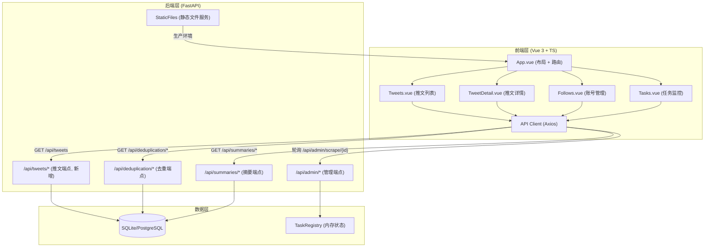
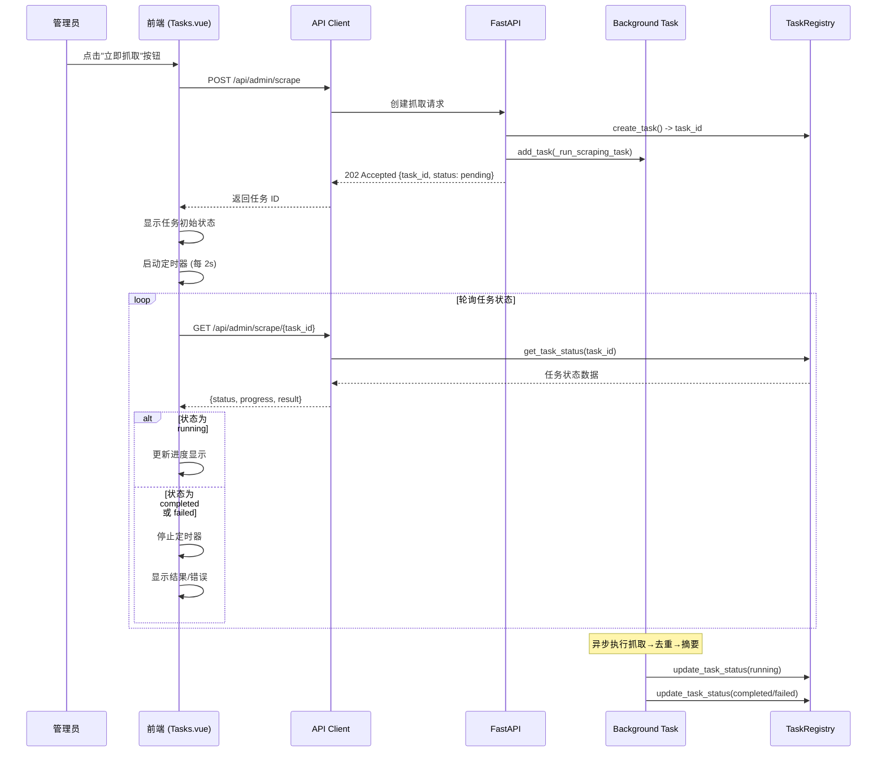
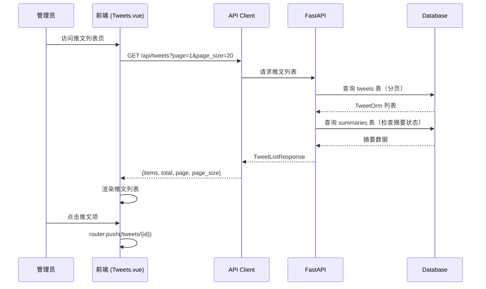
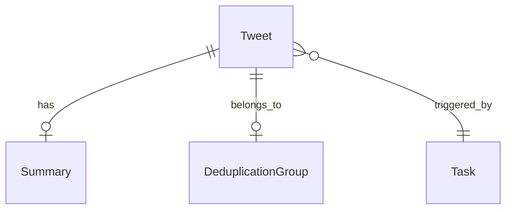
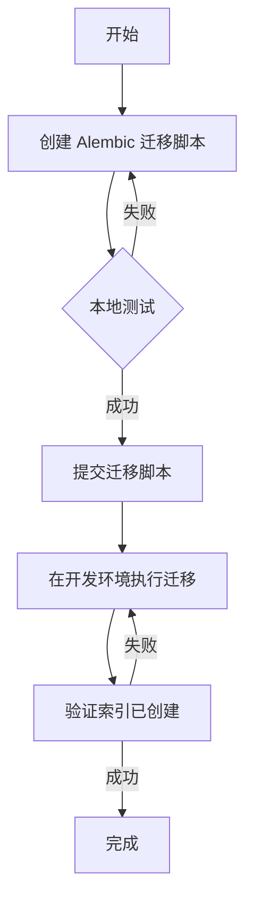

# Design Document

## Overview

Web 管理界面为 X-watcher 项目提供可视化管理后台，使管理员能够浏览推文、查看 AI 摘要、管理抓取账号、监控抓取任务。该功能通过 FastAPI 静态文件服务部署，采用 Vue 3 + TypeScript + Element Plus 技术栈，与现有 RESTful API 集成，不改变后端业务逻辑。

### Goals

- 提供推文列表浏览和详情查看功能，支持分页和筛选
- 提供抓取账号管理界面（CRUD 操作）
- 提供手动触发抓取工作流功能，实时显示任务状态
- 支持查看历史抓取任务列表和执行结果
- 确保类型安全和代码可维护性

### Non-Goals

- 不实现用户推送通知功能（抓取工作流不包含推送）
- 不实现多用户权限管理（仅管理员单用户）
- 不实现实时 WebSocket 推送（使用轮询方案）
- 不修改现有后端业务逻辑（仅复用现有 API）

## Architecture

### Existing Architecture Analysis

**当前架构模式**: 分层架构 + 模块化设计
- **API 层**: FastAPI 路由 (`src/api/routes/`)
- **Service 层**: 业务服务 (`src/*/services/`)
- **Data 层**: SQLAlchemy ORM (`src/database/models.py`)
- **外部集成**: Twitter API, MiniMax/OpenRouter LLM

**现有 API 端点** (已实现，可直接复用):
- `/api/admin/scrape` - 抓取任务管理（POST 创建, GET 查询, DELETE 删除）
- `/api/admin/scraping/follows` - 抓取账号管理（CRUD）
- `/api/deduplication/*` - 去重信息查询
- `/api/summaries/*` - 摘要信息查询

**技术债务**: 无重大技术债务，现有代码遵循 PEP 8 和分层原则

### Architecture Pattern & Boundary Map

**选择的架构模式**: 客户端 SPA + REST API 集成



**架构集成**:
- **选定模式**: 客户端 SPA + REST API，前后端分离
- **域/功能边界**: 前端负责展示和交互，后端提供数据和业务逻辑
- **保留的现有模式**: FastAPI 分层架构、Pydantic 数据验证、BackgroundTasks 异步执行
- **新增组件理由**:
  - 前端层：提供可视化管理界面
  - 推文 API：补充推文列表查询端点（当前仅有单条查询）
- **Steering 合规性**: 遵循项目分层架构原则，工具函数独立可测试

### Technology Stack

| Layer | Choice / Version | Role in Feature | Notes |
|-------|------------------|-----------------|-------|
| Frontend / CLI | Vue 3.5+ | 渐进式框架，组件化 UI | Composition API, `<script setup>` |
| Frontend / CLI | TypeScript 5.7+ | 类型安全 | 严格模式，禁用 `any` |
| Frontend / CLI | Vite 6.0+ | 构建工具和开发服务器 | HMR, 代理配置 |
| Frontend / CLI | Element Plus 2.9+ | UI 组件库 | 企业级组件，中文友好 |
| Frontend / CLI | Vue Router 4.5+ | 路由管理 | history 模式 |
| Frontend / CLI | Pinia 2.2+ | 状态管理 | 轻量级，TypeScript 友好 |
| Frontend / CLI | Axios 1.7+ | HTTP 客户端 | 拦截器处理认证和错误 |
| Backend / Services | FastAPI (现有) | API 服务 | 复用现有端点 |
| Backend / Services | Pydantic (现有) | 数据验证 | 后端类型定义 |
| Data / Storage | SQLAlchemy (现有) | ORM | 复用现有模型 |
| Infrastructure / Runtime | Python 3.11+ | 后端运行时 | 现有环境 |

## System Flows

### 抓取工作流触发与状态轮询



**流程决策**:
- **轮询间隔**: 2 秒，平衡实时性和服务器负载
- **停止条件**: 任务状态为 `completed` 或 `failed`
- **失败处理**: 显示错误详情和失败阶段

### 推文列表查询流程



**流程决策**:
- **分页参数**: `page` (从 1 开始), `page_size` (默认 20, 最大 100)
- **筛选参数**: `author` (可选，按作者用户名筛选)
- **摘要状态检查**: 后端查询时联合查询 `summaries` 表，设置 `has_summary` 标志

## Requirements Traceability

| Requirement | Summary | Components | Interfaces | Flows |
|-------------|---------|------------|------------|-------|
| 1.1-1.9 | 推文列表浏览 | TweetListAPI, Tweets.vue, TweetCard | GET /api/tweets | 推文列表查询流程 |
| 2.1-2.12 | 推文详情查看 | TweetDetailAPI, TweetDetail.vue, SummaryCard | GET /api/tweets/{id} | - |
| 3.1-3.10 | 抓取账号管理 | Follows.vue, FollowForm | /api/admin/scraping/follows | - |
| 4.1-4.4 | API 认证集成 | API Client (Axios 拦截器) | X-API-Key header | - |
| 5.1-5.5 | 静态文件服务 | FastAPI StaticFiles | - | - |
| 6.1-6.6 | 响应式布局与导航 | App.vue, Vue Router | - | - |
| 7.1-7.10 | 手动触发抓取工作流 | Tasks.vue, TaskPollingService | POST /api/admin/scrape, GET /api/admin/scrape/{id} | 抓取工作流触发与状态轮询 |
| 8.1-8.8 | 任务历史与监控 | Tasks.vue | GET /api/admin/scrape | - |
| 9.1-9.6 | 错误处理与用户反馈 | API Client (错误拦截器), UI (Message 组件) | - | - |

## Components and Interfaces

### 组件概览

| Component | Domain/Layer | Intent | Req Coverage | Key Dependencies | Contracts |
|-----------|--------------|--------|--------------|------------------|-----------|
| TweetListAPI | Backend | 推文列表查询端点 | 1.1-1.9 | TweetOrm, SummaryOrm | API |
| TweetDetailAPI | Backend | 推文详情查询端点 | 2.1-2.12 | TweetOrm, SummaryOrm, DeduplicationRepository | API |
| Tweets.vue | Frontend | 推文列表页面 | 1.1-1.9 | API Client, Element Plus | State, UI Props |
| TweetDetail.vue | Frontend | 推文详情页面 | 2.1-2.12 | API Client, SummaryCard | UI Props |
| Follows.vue | Frontend | 抓取账号管理页面 | 3.1-3.10 | API Client, FollowForm | State, UI Props |
| Tasks.vue | Frontend | 任务监控页面 | 7.1-7.10, 8.1-8.8 | API Client, TaskPollingService | State, UI Props |
| API Client | Frontend | HTTP 客户端（Axios 拦截器） | 4.1-4.4, 9.1-9.6 | Axios, localStorage | Service |
| App.vue | Frontend | 根组件（布局 + 导航） | 6.1-6.6 | Vue Router | UI Props |

### Backend Layer

#### TweetListAPI

| Field | Detail |
|-------|--------|
| Intent | 提供推文列表分页查询 API，支持按作者筛选和摘要状态标记 |
| Requirements | 1.1-1.9 |
| Owner / Reviewers | Backend Team |

**Responsibilities & Constraints**
- 处理分页参数验证（page ≥ 1, page_size 1-100）
- 联合查询 `tweets` 和 `summaries` 表，设置 `has_summary` 标志
- 按创建时间倒序排列推文
- 计算总页数

**Dependencies**
- Inbound: 前端调用 — 请求推文列表 (P0)
- Outbound: TweetOrm — 推文数据模型 (P0), SummaryOrm — 摘要数据模型 (P0)
- External: 无

**Contracts**: API [x]

##### API Contract
| Method | Endpoint | Request | Response | Errors |
|--------|----------|---------|----------|--------|
| GET | /api/tweets | `page: int, page_size: int, author?: str` | `TweetListResponse` | 400, 500 |

**Implementation Notes**
- **分页计算**: `total_pages = ceil(total / page_size)`
- **筛选逻辑**: `WHERE author_username = :author` (如果提供)
- **摘要状态**: `LEFT JOIN summaries` 检查是否存在记录
- **数据库索引**: 需为 `tweets.author_username` 添加索引以优化筛选性能（见 Migration Strategy）

#### TweetDetailAPI

| Field | Detail |
|-------|--------|
| Intent | 提供单条推文详情查询 API，包含摘要和去重信息 |
| Requirements | 2.1-2.12 |
| Owner / Reviewers | Backend Team |

**Responsibilities & Constraints**
- 根据 `tweet_id` 查询推文
- 联合查询摘要和去重信息
- 404 错误处理（推文不存在）

**Dependencies**
- Inbound: 前端调用 — 请求推文详情 (P0)
- Outbound: TweetOrm, SummaryOrm, DeduplicationRepository (P0)
- External: 无

**Contracts**: API [x]

##### API Contract
| Method | Endpoint | Request | Response | Errors |
|--------|----------|---------|----------|--------|
| GET | /api/tweets/{tweet_id} | - | `TweetDetailResponse` | 404, 500 |

**Implementation Notes**
- **去重信息查询**: 使用 `DeduplicationRepository.find_by_tweet(tweet_id)`
- **摘要信息查询**: 使用 `SummarizationRepository.get_summary_by_tweet(tweet_id)`

### Frontend Layer

#### Tweets.vue

| Field | Detail |
|-------|--------|
| Intent | 推文列表页面，展示推文卡片、分页控件、筛选器 |
| Requirements | 1.1-1.9 |
| Owner / Reviewers | Frontend Team |

**Responsibilities & Constraints**
- 加载推文列表（分页）
- 按作者筛选
- 点击推文跳转详情页
- 显示加载状态和空状态

**Dependencies**
- Inbound: Vue Router — 路由导航 (P0)
- Outbound: TweetCard — 推文卡片组件 (P1), API Client — 请求推文列表 (P0)
- External: Element Plus (ElTable, ElPagination, ElSkeleton)

**Contracts**: State [x], UI Props [x]

##### State Management
- **State model**:
  ```typescript
  interface State {
    tweets: TweetListItem[]
    total: number
    page: number
    pageSize: number
    loading: boolean
    filters: { author?: string }
  }
  ```
- **Persistence**: 无（仅前端状态）
- **Concurrency**: 单组件状态，无需并发控制

##### UI Props Definition
```typescript
interface TweetsProps {
  // 无外部 props，使用内部状态
}
```

**Implementation Notes**
- **组件模式**: `<script setup lang="ts">` + Composition API
- **加载状态**: 使用 `ElSkeleton` 或 `ElLoading`
- **空状态**: 使用 `ElEmpty`
- **分页**: 使用 `ElPagination`，监听 `@current-change` 和 `@size-change` 事件

#### TweetDetail.vue

| Field | Detail |
|-------|--------|
| Intent | 推文详情页面，展示完整推文、AI 摘要、去重信息 |
| Requirements | 2.1-2.12 |
| Owner / Reviewers | Frontend Team |

**Responsibilities & Constraints**
- 根据 `route.params.id` 加载推文详情
- 显示/隐藏摘要卡片（条件渲染）
- 显示/隐藏去重卡片（条件渲染）
- 返回按钮导航

**Dependencies**
- Inbound: Vue Router — 路由参数和导航 (P0)
- Outbound: API Client — 请求推文详情 (P0), SummaryCard — 摘要卡片 (P1)
- External: Element Plus (ElCard, ElDescriptions, ElTag)

**Contracts**: UI Props [x]

##### UI Props Definition
```typescript
interface TweetDetailProps {
  // 无外部 props，使用路由参数
}
```

**Implementation Notes**
- **数据加载**: `onMounted` 时调用 `API.getTweetDetail(route.params.id)`
- **条件渲染**: `v-if="tweet.summary"` 显示摘要卡片
- **返回**: `router.back()` 或导航到列表页

#### Tasks.vue

| Field | Detail |
|-------|--------|
| Intent | 任务监控页面，触发抓取任务、实时显示状态、查看任务历史 |
| Requirements | 7.1-7.10, 8.1-8.8 |
| Owner / Reviewers | Frontend Team |

**Responsibilities & Constraints**
- 显示"立即抓取"按钮
- 点击按钮触发抓取任务，启动状态轮询
- 显示任务历史列表
- 点击任务显示详情对话框

**Dependencies**
- Inbound: 无
- Outbound: API Client — 创建任务/查询状态 (P0), TaskPollingService — 轮询服务 (P0)
- External: Element Plus (ElButton, ElTable, ElProgress, ElDialog)

**Contracts**: State [x], UI Props [x]

##### State Management
- **State model**:
  ```typescript
  interface State {
    tasks: TaskStatusResponse[]
    currentTask: TaskStatusResponse | null
    polling: boolean
  }
  ```
- **Persistence**: 无
- **Concurrency**: 轮询定时器管理

##### UI Props Definition
```typescript
interface TasksProps {
  // 无外部 props
}
```

**Implementation Notes**
- **轮询服务**: 使用 `TaskPollingService` 封装轮询逻辑
- **定时器清理**: `onUnmounted` 时停止轮询
- **状态映射**: `pending` → 等待中, `running` → 执行中, `completed` → 已完成, `failed` → 失败

#### API Client

| Field | Detail |
|-------|--------|
| Intent | 封装 Axios 实例，统一处理认证、错误、超时 |
| Requirements | 4.1-4.4, 9.1-9.6 |
| Owner / Reviewers | Frontend Team |

**Responsibilities & Constraints**
- 请求拦截器：注入 `X-API-Key` 头（从 localStorage 读取）
- 响应拦截器：统一处理错误，显示用户友好提示
- 超时设置：30 秒
- 类型安全：使用 TypeScript 泛型

**Dependencies**
- Inbound: 前端组件 — 发起 HTTP 请求 (P0)
- Outbound: Axios — HTTP 库 (P0)
- External: 无

**Contracts**: Service [x]

##### Service Interface
```typescript
interface APIClient {
  get<T>(url: string, config?: AxiosRequestConfig): Promise<T>
  post<T>(url: string, data?: any, config?: AxiosRequestConfig): Promise<T>
  put<T>(url: string, data?: any, config?: AxiosRequestConfig): Promise<T>
  delete<T>(url: string, config?: AxiosRequestConfig): Promise<T>
}
```
- **Preconditions**: localStorage 中存在 `admin_api_key`（用于管理端点）
- **Postconditions**: 返回类型化响应数据
- **Invariants**: 所有错误通过拦截器统一处理，组件无需 try-catch

**Implementation Notes**
- **认证拦截器**:
  ```typescript
  config.headers['X-API-Key'] = localStorage.getItem('admin_api_key')
  ```
- **错误拦截器**: 根据状态码显示不同提示
  - 403: "认证失败，请检查 API Key"
  - 404: "资源不存在"
  - 500: "服务器错误，请稍后重试"
- **日志记录**: `console.error` 记录详细错误

#### TaskPollingService

| Field | Detail |
|-------|--------|
| Intent | 封装任务状态轮询逻辑，管理定时器生命周期 |
| Requirements | 7.5-7.9 |
| Owner / Reviewers | Frontend Team |

**Responsibilities & Constraints**
- 启动轮询：返回可取消的轮询句柄
- 停止轮询：清理定时器
- 轮询间隔：2 秒
- 停止条件：任务状态为 `completed` 或 `failed`

**Dependencies**
- Inbound: Tasks.vue — 启动/停止轮询 (P0)
- Outbound: API Client — 查询任务状态 (P0)
- External: 无

**Contracts**: Service [x]

##### Service Interface
```typescript
interface TaskPollingService {
  startPolling(taskId: string, onStatusUpdate: (status: TaskStatusResponse) => void): PollingHandle
  stopPolling(handle: PollingHandle): void
}

interface PollingHandle {
  cancel(): void
}
```

**Implementation Notes**
- **定时器实现**: `setInterval(() => fetchStatus(), 2000)`
- **清理逻辑**: `clearInterval()` + 取消 pending 的 Promise
- **错误处理**: 当 API 返回 404 时，停止轮询并显示"任务不存在（服务可能已重启）"提示

## Data Models

### Domain Model

**聚合根**:
- `Tweet`: 推文实体，包含内容、作者、时间、媒体
- `Summary`: 摘要实体，关联推文，包含摘要文本、翻译、模型信息
- `DeduplicationGroup`: 去重组，包含代表推文、相似度、成员推文列表
- `ScrapingTask`: 抓取任务，包含状态、进度、结果、错误

**实体关系**:


**业务规则 & 不变量**:
- 推文 ID 全局唯一
- 每条推文最多一条摘要（1:1）
- 每条推文最多属于一个去重组（N:1）
- 任务状态流转：pending → running → completed/failed

### Logical Data Model

**Structure Definition**:
- **Tweet 表**: 主键 `tweet_id` (string), 外键 `deduplication_group_id` (nullable)
- **Summary 表**: 主键 `summary_id` (uuid), 外键 `tweet_id` (string)
- **DeduplicationGroup 表**: 主键 `group_id` (uuid), 关联多个 `tweet_id`
- **Task**: 内存对象（TaskRegistry），非持久化

**Consistency & Integrity**:
- **事务边界**: 无跨表事务需求（各功能独立）
- **级联规则**: 删除推文时级联删除关联摘要
- **时态**: 任务状态仅在内存中，服务重启丢失

### Physical Data Model

**现有表结构** (复用，需添加索引):
- `tweets` - 推文表
- `summaries` - 摘要表
- `deduplication_groups` - 去重组表
- `scraper_follows` - 抓取账号表

**索引优化**:
- **新增索引**: `tweets.author_username` - 优化按作者筛选查询性能
- **原因**: Requirement 1.3 支持按作者筛选，无索引会导致全表扫描
- **实现方式**: 通过 Alembic 数据库迁移添加（见 Migration Strategy）

### Data Contracts & Integration

**API Data Transfer**:
- **序列化格式**: JSON
- **验证规则**: Pydantic 模型（后端），TypeScript 接口（前端）
- **类型同步策略**: 初期手动维护前后端类型一致性；后期引入 `openapi-ts` 从 OpenAPI 规范自动生成前端类型定义

**关键数据结构**:
```typescript
// 前端类型定义（需与后端 Pydantic 模型同步）
interface TweetListItem {
  tweet_id: string
  text: string
  author_username: string
  author_display_name: string | null
  created_at: string  // ISO 8601
  reference_type: string | null
  referenced_tweet_id: string | null
  has_summary: boolean
  has_deduplication: boolean
  media_count: number
}

interface TweetDetailResponse extends TweetListItem {
  media: Array<Record<string, unknown>> | null
  summary: Summary | null
  deduplication: DeduplicationInfo | null
}

interface Summary {
  summary_id: string
  summary_text: string
  translation_text: string | null
  model_provider: string
  model_name: string
  cost_usd: number
  cached: boolean
  is_generated_summary: boolean
  created_at: string | null
}

interface DeduplicationInfo {
  group_id: string
  representative_tweet_id: string
  deduplication_type: 'exact_duplicate' | 'similar_content'
  similarity_score: number | null
  tweet_ids: string[]
  created_at: string | null
}

interface TaskStatusResponse {
  task_id: string
  status: 'pending' | 'running' | 'completed' | 'failed'
  result: Record<string, unknown> | null
  error: string | null
  created_at: string
  started_at: string | null
  completed_at: string | null
  progress: { current: number; total: number; percentage: number }
  metadata: Record<string, unknown>
}
```

## Error Handling

### Error Strategy

| 错误类型 | 处理方式 | 用户提示 |
|---------|---------|---------|
| 网络超时 | Axios 拦截器捕获 | "请求超时，请检查网络连接" |
| 403 认证失败 | Axios 拦截器捕获 | "认证失败，请检查 API Key 配置" |
| 404 资源不存在 | 组件级处理 | "推文不存在" / "任务不存在" |
| 500 服务器错误 | Axios 拦截器捕获 | "服务器错误，请稍后重试" |
| 业务逻辑错误 | 后端返回 4xx | 显示后端错误详情 |

### Error Categories and Responses

**用户错误 (4xx)**:
- 字段级验证: 前端表单验证 + 后端 Pydantic 验证
- 未授权: 引导用户配置 API Key
- 未找到: 导航回列表页

**系统错误 (5xx)**:
- 基础设施故障: 显示"服务暂时不可用"
- 超时: 显示"请求超时"，提供重试按钮
- 耗尽: 显示"服务繁忙，请稍后再试"

**业务逻辑错误**:
- 规则违反: 显示后端返回的错误详情
- 状态冲突: 显示"相同的任务正在执行中"（409）

### Monitoring

**错误跟踪**:
- 控制台日志: `console.error` 记录错误堆栈
- 后端日志: FastAPI `logger.exception()`

**健康监控**:
- 前端: Sentry (可选)
- 后端: Prometheus 指标（已集成）

## Testing Strategy

### Unit Tests

**后端**:
- `test_tweets_routes.py`:
  - 测试推文列表 API（分页、筛选）
  - 测试推文详情 API（存在/不存在）
  - 测试摘要和去重信息查询
- `test_schemas.py`: Pydantic 模型验证

**前端**:
- `test_api_client.ts`: Axios 拦截器、认证注入
- `test_task_polling.ts`: 轮询服务启动/停止逻辑
- `test_Tweets.vue`: 组件挂载、数据加载、分页

### Integration Tests

- `test_api_integration.py`: API 端点集成测试
- `test_workflow_e2e.ts`: 抓取工作流端到端测试（触发→轮询→完成）

### E2E/UI Tests

- 手动测试关键路径:
  1. 浏览推文列表，点击详情
  2. 管理抓取账号（添加/编辑/删除）
  3. 触发抓取任务，查看状态变化
  4. 查看任务历史和详情

### Performance/Load

- 无特殊性能要求（管理后台，低并发）
- 推文列表分页避免一次性加载过多数据
- 轮询间隔合理设置（2 秒）

### Migration Strategy

需要为 `tweets.author_username` 添加索引以优化按作者筛选的查询性能。



**迁移步骤**:
1. **创建迁移脚本**: `alembic revision -m "add_index_tweets_author_username"`
2. **定义升级操作**:
   ```python
   def upgrade():
       op.create_index(
           'ix_tweets_author_username',
           'tweets',
           ['author_username']
       )
   ```
3. **定义降级操作**:
   ```python
   def downgrade():
       op.drop_index('ix_tweets_author_username', 'tweets')
   ```
4. **验证**: 执行迁移后，检查数据库索引是否创建成功

**验证检查点**:
- 开发环境迁移成功
- 索引名称: `ix_tweets_author_username`
- 查询计划验证: `EXPLAIN QUERY PLAN` 确认使用索引

## Optional Sections

### Security Considerations

- **认证**: API Key 认证（管理员专用），存储在 localStorage
- **数据保护**: 生产环境使用 HTTPS，API Key 不在代码中硬编码
- **输入验证**: 前端表单验证 + 后端 Pydantic 验证（双重防护）
- **XSS 防护**: Vue 3 自动转义插值内容
- **CSRF 防护**: API Key 认证天然防护

### Performance & Scalability

- **前端性能**:
  - 路由懒加载: `component: () => import('@/views/Tweets.vue')`
  - 组件按需加载: 使用 Element Plus 按需导入（可选）
- **后端性能**:
  - 数据库查询优化: 分页查询，避免 `SELECT *`
  - 索引: `tweets.created_at` 索引确保排序性能
- **扩展性**:
  - 任务注册表: 当前为内存单机，如需集群可迁移到 Redis
  - WebSocket: 后续可升级为实时推送，减少轮询开销

## Supporting References

**TypeScript 类型定义**: 见 Data Contracts & Integration 章节，所有关键接口已在正文中定义。

**Element Plus 组件文档**: https://element-plus.org/zh-CN/component/overview.html

**Vue 3 文档**: https://cn.vuejs.org/

**Axios 拦截器文档**: https://axios-http.com/docs/interceptors
